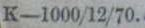
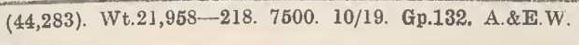

# Evolution of the British Rainfall Organization's Daily Rainfall Form

Notes on how British Rainfall Organization's Daily Rainfall form evolved over time. The notes are based on samples from 
the ['DRain' volumes](https://digital.nmla.metoffice.gov.uk/index.php?name=SO_9903efdf-7f99-4cae-a723-8b3f426eea20) of scanned Daily Rainfall forms recently added 
to the Met Office Online Archive. 

* [Overview](Daily_Rainfall_Form_Evolution.md) - this page
* [Part 1](Daily_Rainfall_Form_Evolution_part_1.md) covers the period up to 1923, when the Daily Rainfall form changed from single-sided to double-sided
* [Part 2](Daily_Rainfall_Form_Evolution_part_2.md) covers the period from 1924 to 1962, when the Met Office's scanned DRain archive ends 
* [Miscellaneous](Daily_Rainfall_Form_Evolution_misc.md) - some additional details and summaries

## Scope

These notes cover the British Rainfall Organization's full-year Daily Rainfall forms. The DRain online archive also includes some daily forms which only 
cover a single month; examples of these and some other standard rainfall forms in the DRain archive are outlined in a separate [Other Forms](Other_DRain_Forms.md) note.

The period of interest is from the late 1860s, when the first Daily Rainfall form recognisable as being produced by George Symons appears in the DRain archive, to 1962, the final year 
of the DRain online archive contents.

## Related material

Changes to the form often tie in with events and discussions within the British Rainfall Organization and the Met Office, and sometimes the wider world. The notes include some 
related material taken from [*British Rainfall annuals*](https://digital.nmla.metoffice.gov.uk/index.php?name=SO_29627928-7fb1-43b2-b7ad-f63509127917), 
[*Met Office Annual Reports*](https://digital.nmla.metoffice.gov.uk/index.php?name=SO_e75e4cf3-9be6-47f9-9444-0c2debbcef83), 
[*Meteorological Committee Meeting Minutes*](https://digital.nmla.metoffice.gov.uk/index.php?name=SO_4ef61033-663b-4457-8cee-d784ae877507), 
[*Meteorological Magazine*](https://digital.nmla.metoffice.gov.uk/index.php?name=SO_31c4215d-460a-4ce3-bdac-12c775f5c92d)
and other sources available online.

For detailed history of the British Rainfall Organization and the British Rainfall publication see for example these two items:
* [A Short History of the British Rainfall Organization](https://www.rmets.org/sites/default/files/papers/hist05.pdf) by D.E.Pedgley in 2002 [PDF file]
* [British Rainfall 1860-1993](https://www.yumpu.com/en/document/read/25804332/british-rainfall-1860-1993-royal-meteorological-society) by Stephen Burt in 2010 [Online slides]

## Basic form layout

The basic Daily Rainfall form layout is: 

* a main grid of 12 monthly columns x 31 daily rows and then one or more further rows for monthly aggregates
* form headings and station metadata above the grid
* instructions above the grid or to the side of it
* a small footer section, for footnotes and 'Printing codes'
* later on, the sections for detailed metadata and instructions moved to the back of the form

## Form version identifiers and 'Printing codes'

The were changes to the Daily Rainfall form nearly every year. In the absence of anything better, these notes use elements of the 'Printing code' present in the footer of nearly 
every version of the form as the basis for a version identifier. Although no reference document has been found to explain the full meaning of any of the Printing codes, by 
inspection they can be seen to always contain a month and year value, and up to 1950 there was also a neighbouring round number that seems to be a print-run size. 

For early forms, the entire Printing code is used as the version identifier. After the British Rainfall Organization became part of the Met Office - within the
Air Ministry as so subject to HMSO's procedures - Printing codes became much longer and more cryptic, and so a version identifier just based on the month/year/print-run parts has been
extracted.

Example early Printing code "K-1000/12/70" from December 1870, used directly as the version identifier: 

Example Printing code from October 1919, at the start of the Met Office period, producing the version identifier "7500 10/19": 

In the few cases where a version of the Daily Rainfall form does not have a Printing code, a descriptive alternative has been assigned as the version identifier.

The 'Printing code year' and the year of the observations entered on the form are not always closely related. It is quite common to see forms with a Printing code year several
years earlier than the observations, where a form has not been used until some time after is was printed. Less common but still seen are cases where the observations are from a year
which is significantly earlier than the Printing code year; in these cases, the forms must be showing re-transcribed (and possibly corrected) figures from an earlier source.

## Gallery

The accompanying [Gallery of Daily Rainfall Forms](Daily_Rainfall_Form_Gallery.md) displays an example of each Daily Rainfall form version discovered in the sample volumes, presented in time order.

There are also [PDF versions of the Gallery](Daily_Rainfall_Form_Gallery_pdfs.md).

## Completeness

There are over 1000 DRain volumes in the Met Office Online Archive, comprising over 360,000 scanned images, most of which are Daily Rainfall forms. These notes have been compiled by sampling a few
volumes for each decade; there is potential for a few more form versions to be found in the other volumes.

