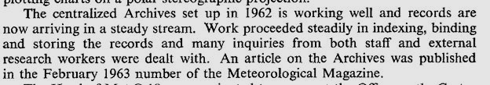
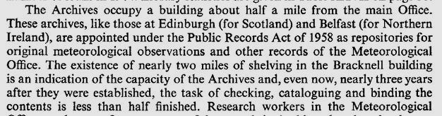

# Daily Rainfall Form Evolution - Miscellaneous

Some additional details and summaries relating to the [Evolution of the British Rainfall Organization's Daily Rainfall Form](Daily_Rainfall_Form_Evolution.md) notes.

Year numbers shown below relate to the year given in the Printing codes on the first version of the Daily Rainfall form to show a particular feature.

## Contents

* [Number of form versions identified](#Number-of-form-versions-identified)
* [Print-run size over time](#Print-run-size-over-time)
* [Major form layout changes](#Major-form-layout-changes)
* [Major organisational changes](#Major-organisational-changes)
* [Addresses](#Addresses)
* [Printers](#Printers)
* [References to the Rainfall Archives](#References-to-the-Rainfall-Archives)
* [The current Daily Rainfall Archive situation ](#The-current-Daily-Rainfall-Archive-situation)
* [Rules pamphlet](#Rules-pamphlet)

## Number of form versions identified

Examining samples of the DRain archive volumes has identified that almost 100 different 'inches' versions of the Daily Rainfall form were printed over the late 1860s-1962 period, 
as well as more than 20 millimetre versions of the form from 1919 onwards.

| |Inches|Millimetres|Total|
|-|------|-----------|-----|
|**Single-sided**|60|5|65|
|**Double-sided**|35|19|54|
|**Total**|95|24|119|

There may be a few more versions to be discovered.

## Print-run size over time

Nearly all Daily Rainfall forms have a 'Printing code' in a footer, which by inspection seem to contain a month/year of printing and 
until 1950, a print-run size. Extracting the year and print-run size and plotting them shows how the number of forms printed varied over time:

If the values extracted from the Printing code really are print-run sizes, it looks like there was a lot of stockpiling of forms in the years just before the Second World War.

Adding up these print-run sizes produces a total around 600,000 Daily Rainfall forms printed up to 1950. This compares to about 388,000 images in the combined DRain volumes, although
that number contains forms from 1951-1962 (and a few very early ones), does not contain any Irish stations, not all images are of Daily Rainfall forms, and some forms 
appear twice, as separate front and back images. So very roughly, perhaps around half of the printed forms ended up being used, returned and stored in the Met Office archives.

## Major form layout changes

**Overall form**:

|Year|Notes|
|:----------|:----|
|1868/69|First version|
|1879|Most instructions removed to a separate pamphlet
|1883|Column of vertical text to the left of the 12x31 grid removed|
|1919|Millimetre versions of the form start|
|1924|First double-sided form, instructions on the back|
|1925|Form split into A/B/C/D sections, with monthly summary, further metadata and instructions on the back|

**12x31 grid**:

|Year|Notes|
|:----------|:----|
|1868/69|First version|
|1876|Second 'Date' column added on the right of 'December'|
|1888|Red grid lines changed to black|
|1906|Second 'Totals' line used for rain days counts instead of cumulative rainfall amounts|
|1914|Pre-printed crosses used in non-day grid cells (e.g. Feb 31st)|
|1920|Third 'Totals' line added, used for further rain days counts|
|1933|'Spare' column added between 'December' and the second 'Date' columns|

## Major organisational changes

|Year|Notes|
|:----------|:----|
|1868/69|First version, George Symons' British Rainfall Organization|
|1900|H. Sowerby Wallis and Hugh Robert Mill take over the running of the British Rainfall Organization|
|1910|Assets of the British Rainfall Organization transferred by Hugh Robert Mill to a Trust| 
|1919|British Rainfall Organization taken over by the Met Office, within the Air Ministry|
|1957|British Rainfall Organization becomes part of the larger Met Office 'British Rainfall and Hydrology' department|

## Addresses

Every version of the Daily Rainfall form has at least one address for the British Rainfall Organization and/or Met Office. In some cases the address was presented 
as being the address to return the completed form to, in others as the address to apply to for a copy of the 'Rules for Rainfall Observers' pamphlet or similar. Initially
a single address is given on the form, but during the Met Office period an Edinburgh address and later a Belfast address were also added.

Changes to the addresses shown on the form were as follows:

|Year|Address|Notes|
|:----------|:----|:----|
|1868/69|[136, Camden Road, London](https://maps.nls.uk/geo/explore/#zoom=18.1&lat=51.54320&lon=-0.13666&layers=117746212&b=osm&o=100&marker=51.543215,-0.136606)|George Symons' address|
|1868/69|[62, Camden Square, London](https://maps.nls.uk/geo/explore/#zoom=18.9&lat=51.54433&lon=-0.13356&layers=117746212&b=osm&o=100&marker=51.544201,-0.134059)|George Symons' new address, becomes British Rainfall Organization HQ|
|1921|[10, Rothesay Place, Edinburgh](https://maps.nls.uk/geo/explore/#zoom=18.0&lat=55.95042&lon=-3.21792&layers=&b=osm&o=100&marker=55.950542,-3.217244)|Met Office Edinburgh address added|
|1922|[Kingsway, London](https://maps.nls.uk/geo/explore/#zoom=17.0&lat=51.51374&lon=-0.11780&layers=173&b=osm&o=100&marker=51.513809,-0.117446)|Camden Square address replaced by Air Ministry HQ at Adastral House|
|1924|London WC2|London address made vague, Kingsway part dropped|
|1925|[6 Drumsheugh Gardens, Edinburgh](https://maps.nls.uk/geo/explore/#zoom=18.3&lat=55.95073&lon=-3.21405&layers=&b=osm&o=100&marker=55.950758,-3.213980)|Change to Edinburgh address|
|1942|[Stonehouse, Glos](https://maps.nls.uk/geo/explore/#zoom=16.1&lat=51.74280&lon=-2.27845&layers=193&b=osm&o=100&marker=51.743190,-2.280856)|London address replaced by the Met Office's wartime address at Wycliffe College|
|1945|[Headstone Drive, Harrow, Middlesex](https://maps.nls.uk/geo/explore/#zoom=17.5&lat=51.59601&lon=-0.34464&layers=258&b=osm&o=100&marker=51.595752,-0.343859)|Move to Harrow from Wycliffe College after the war|
|1950|[26 Palmerston Place, Edinburgh](https://maps.nls.uk/geo/explore/#zoom=17.5&lat=55.94817&lon=-3.21625&layers=&b=osm&o=100&marker=55.947907,-3.216732)|Change to Edinburgh address|
|1960|[Tyrone House, Ormeau Avenue, Belfast](https://www.openstreetmap.org/way/1219767831#map=17/54.592307/-5.924367)|Met Office Belfast address added|
|1961|[London Road, Bracknell, Berkshire](https://maps.nls.uk/geo/explore/#zoom=17.2&lat=51.41704&lon=-0.74325&layers=258&b=7&o=100&marker=51.416565,-0.743400)|Move to Bracknell from Harrow|

See [Meteorological Magazine January 1986](https://digital.nmla.metoffice.gov.uk/IO_05540c5b-a4b4-457b-a074-414e759166c6/) for an account of Met Office war-time arrangements at Stonehouse.

## Printers

The first time the Daily Rainfall form names the printer of the forms is in the 1906 version. The map-maker and retailer [Edward Stanford](https://www.stanfords.co.uk/our-history) is named on forms from 1870-1908 and in a few more cases
up to 1915, but is never identified as being the printer:
* from 1870 to 1882 'Mr Stanford' is named as a source of additional copies of the form, in the vertical column of text on the left of the Form
* from 1883 to 1908, and also 1912 and 1915, 'Edward Stanford' and a Charing Cross or Long Acre address appears in the footer of the form, but with no explicit role given
* from 1906 to 1915, those versions of the form which show 'Edward Stanford' in the footer also identify the printer as [Waterlow and Sons Limited](https://en.wikipedia.org/wiki/Waterlow_and_Sons), London Wall

British Rainfall annuals also showed 'Edward Stanford' and an address near the bottom of its title pages from 1861 to 1918, and identified the printer as 'G.Shield' and later as 'Shield and Spring' - initially 
at 30, Lower Sloane Street and then at other nearby addresses. So G.Shield is a candidate for being the printer of the early versions of the Daily Rainfall form, but this is only speculation. [In the [February 1905 edition
of Meteorological Magazine](https://digital.nmla.metoffice.gov.uk/IO_deebfc86-9d4e-4808-9eba-bc24c2cb4e9c) on p2, there are some reminiscences provided by G.W.C.Shield on working with George Symons, 
but there is no mention of forms.]

After the British Rainfall Organization became part of the Met Office and Air Ministry, its forms and publications come under HMSO - there is no further mention of Edward Stanford:
* the 1919 to 1923 versions of the form (still single-sided) do not name the printer, but include likely printer name abbreviations in the Printing code:
  * "A.&E.W."  - possibly Waterlows again, but not sure what the other initials are
  * "T.S." - probably Jas. Truscott & Son Ltd
* the double-sided versions of the form generally identify the printer in full on the back near the bottom, using wording similar to 'Printed under the authority of HMSO by ...'
* for 1942-1949 the printer was not named on the form, but the Printing code included an identifiable abbreviation "W.H.&S." - William Hobbs & Sons Ltd

Summary of identified Printers

|Period|Printers|Address|Notes|
|:-----|:-------|:------|:----|
|1870-1905|Not marked|||
|1906-1918|Waterlow & Sons Ltd|London Wall|Not always shown|
|1919-1921|A.&E.W||Waterlow again ??|
|1922-1923|T.S.||Truscott & Son ??|
|1924-1925|Jas. Truscott & Son Ltd|Suffolk Lane, Cannon Street, E.C.||
|1926-1927|Waterlow & Sons Ltd|Birchin Lane, London E.C.3||
|1928|Jas. Truscott & Son Ltd|Suffolk Lane, Cannon Street, E.C.||
|1929-1934|John Corah & Son Ltd|Loughborough and London||
|1935-1952|Wm. Hobbs & Sons Ltd.|Stone Street, Maidstone||
|1953|McCorquodale|London, S.E.1||
|1953-1957|Fosh & Cross Ltd|London||
|1958-1960|The Gatwick Press, Ltd|||
|1961|The Kenion Press Ltd|||

## References to the Rainfall Archives

Shown below are a collection of mentions of the physical rainfall forms or their archives in Met Office documents (not an exhaustive search) over the DRain archive period. They show how the 
forms moved around various office locations, starting from British Rainfall Organization's long-term home at 62, Camden Square, and ending in the newly built Met Office archive building in Bracknell,
or in Edinburgh, Belfast or Dublin.

### 62, Camden Square ###

* British Rainfall 1890, p8, where Symons identifies 1872 as the time when large-scale collection of daily rainfall records began
	
	
	
	This coincided with the building of an office in the garden of 62, Camden Square (see British Rainfall 1871 and 1872), and the taking on of the first permanent assistant.
	
* Minutes of Meteorological Committee meeting, 30th July 1919, from the document agreeing the transfer of the British Rainfall Organization to the Met Office:

	

* Minutes of Meteorological Committee meeting, 5th November 1919, describing the assets being tranferred:

	

	

* Met Office Annual Report 1920-1921 (p51)

	

* British Rainfall 1921 p4, a photo of the garden of 62, Camden Square garden, showing the office referred to above

	

### South Kensington ###

* Met Office Annual Report 1921-1922 p41-42

	
	
	

* Met Office Annual Report 1922-1923 p41-42

	

### Edinburgh ###

* Met Office Annual Report 1921-1922 p42

	

* British Rainfall 1921 p xi

	

* British Rainfall 1923 p vii

	

### Gwydyr House, Whitehall ###

* Met Office Annual Report 1925-1926 p49

	

	Presumably this move to [Gwydyr House](https://historicengland.org.uk/images-books/photos/item/DP017303) would have included the archive of Daily Rainfall forms.
	
### Wycliffe College ###

During World War II, the Climatology Division of the Met Office relocated to Wycliffe College, Stonehouse, Gloucestershire. The 2024
[Met Office Library factsheet 21](https://www.metoffice.gov.uk/binaries/content/assets/metofficegovuk/pdf/research/library-and-archive/library/publications/factsheets/factsheet_21-met-office-history-and-timeline_2024.pdf) on the 
history of the Met Office says that the libary and archive was also sent there, but not until at least late 1940.

### Harrow presumably ###

After World War II, the Climatology Division moved to Air Ministry offices in Harrow, and presumably so did the Daily Rainfall archives.

### Dublin ###

The Irish Meteorological Service, now Met Éireann, was set up in December 1936, and at some point the relavant Daily Rainfall records (but not the 10-year rainfall volumes) were transferred 
to its archives in Dublin. 

[Ireland’s pre-1940 daily rainfall records](https://rmets.onlinelibrary.wiley.com/doi/10.1002/gdj3.103) (2020)

### Belfast ###

The 1960 Met Office Annual report describes the setting up of a climatological office at Tyrone House in Belfast, holding the historical records, presumably including the Daily Rainfall archive
for stations in Northern Ireland:

### Bracknell ###

As part of the Met Office move to Bracknell in 1961, its archives that had become separated over various offices were brought together in a new dedicated facility in 
[Eastern Road](https://maps.nls.uk/geo/explore/#zoom=17.6&lat=51.41443&lon=-0.73510&layers=258&b=7&o=100&marker=51.414346,-0.736325). The new archive became an
official 'place of deposit' under the Public Records Act. Met Office Annual Reports from the early 1960s record progress with the Bracknell archive:

* Met Office Annual Report 1961 p18

	

* Met Office Annual Report 1962 p19

	

* Met Office Annual Report 1963 p19

	

* Met Office Annual Report 1964 p56

	

The February 1963 edition of The Meteorological Magazine has a short article about the Bracknell archive, including a photo. 

### Post-DRain period ###

The 2023 [Met Office Library factsheet 12](https://www.metoffice.gov.uk/binaries/content/assets/metofficegovuk/pdf/research/library-and-archive/library/publications/factsheets/factsheet_12-national-meteorological-archive_2023.pdf) 
about the Archive describes further relocations after the initial move to Bracknell:
* in October 1991 the Archive moved to the Stirling Centre in Bracknell
* in March 2005 the Archive moved to Great Moor House in Exeter

## The current Daily Rainfall Archive situation ##

These Met Office web pages detail the current locations of the National Meteorological Archive: 

* [England and Wales](https://www.metoffice.gov.uk/research/library-and-archive/archive/information)
* [Scotland and Northern Ireland](https://www.metoffice.gov.uk/research/library-and-archive/archive/archive-information---scotland-and-northern-ireland)

### Physical records ###

The physical Daily Rainfall forms are held in several archives:

* Met Office Archives, Great Moor House, Exeter

  Holds the archive for stations in England, Wales, Channel Islands, and the Isle of Man. Some photos of the records in the archive are 
  available [here](https://www.zooniverse.org/projects/edh/rainfall-rescue/talk/3143/1358833?comment=5053519&page=343).

* National Records of Scotland, 2 Princes Street, Edinburgh

  Holds the archive for stations in Scotland.

* [potentially] Public Record Office of Northern Ireland, 2 Titanic Boulevard, Belfast

  The Daily Rainfall archive for stations in Northern Ireland was sent to Belfast around 1960 (see above). However, the current location of these records is apparently not known.
  
* Met Éireann, Glasnevin, Dublin

  Holds the [archive](https://www.met.ie/cms/assets/uploads/2017/08/Daily-Rainfall-Registers.pdf) for stations which are now in the Republic of Ireland.

### Digital images ###

Many of the Daily Rainfall forms have now been scanned to produce digital images:

* the Met Office 'DRain' volumes

  PDF files of scanned Daily Rainfall form images were made available on the Met Office's Online Archive in 2024 and 2025.

  * mid-2024: [England, Wales, Channel Islands and the Isle of Man](https://digital.nmla.metoffice.gov.uk/SO_51194883-b9dd-4e27-93db-958f8fbea38b/) - pre-1860 to 1962 in 875 PDF files
  * mid-2024: [Scotland](https://digital.nmla.metoffice.gov.uk/SO_68356e56-2bb7-478f-85b6-08a0ac1aabb5/) - 1922-1960 in 152 PDF files
  * mid-2025: Scotland - 1864-1921 in 57 volumes, with 1870 not yet available online
  * September 2025: 3 of the England and Wales volumes for 1891 were re-arranged into 5 volumes to correctly split them into counties, taking the total to 877 PDF files for the combined England, Wales, Channel Islands and 
  the Isle of Man volumes
  
* Met Éireann have scanned the Daily Rainfall images in their archives - see [Ireland’s pre-1940 daily rainfall records](https://rmets.onlinelibrary.wiley.com/doi/10.1002/gdj3.103)

The missing Northern Ireland records have not been scanned.

### Digitised rainfall values ###

Only a small proportion of the pre-1962 Daily Rainfall forms for the UK have been transcribed into digital form. Figure 1(b) of [this paper](https://rmets.onlinelibrary.wiley.com/doi/full/10.1002/gdj3.78) 
shows the amount of digitised UK daily rainfall data available per year as of 2019, Before 1960, the data from only a few hundred stations has been digitised, compared to about 
4,500 after then (the point at which machine processing of daily rainfall records became standard, meaning all daily rainfall data was routinely digitised by the Met Office very soon after receipt each month).

[Note that the monthly rainfall digitisation situation shown on the same plot is now out-of-date - see the 2020 [Rainfall Rescue project](https://rmets.onlinelibrary.wiley.com/doi/10.1002/gdj3.157).]

Met Éireann have transcribed some of the historical Daily Rainfall forms in their archive - see [Ireland’s pre-1940 daily rainfall records](https://rmets.onlinelibrary.wiley.com/doi/10.1002/gdj3.103)

## Rules pamphlet

In British Rainfall 1878 (p9), Symons describes a pamphlet he has recently written and distributed to two or three thousand observers:

With the arrival of this pamphlet, the daily Rainfall Form from 1879 onwards was changed so that detailed instructions were removed from the form, replaced by a reference to the pamphlet.

The name of the pamphlet as reported on the form changed over time, becoming simply 'Rules for Rainfall Observers' about 25 years later as part of a revision noted in British Rainfall 1903 (p13):

|Version|Pamphlet Title|
|:------|:-------------|
|K/3,000/12/79|Arrangements for the Systematic Observation and Record of the Rainfall of the British Isles|
|K/3,000/12/83|Arrangements respecting the Systematic Observation and Record of the Rainfall of the British Isles|
|K/3,000/12/00|Arrangements respecting the Systematic Observation and Record of the Rainfall|
|K/4,000/11/02|The British Rainfall Organization - Rules for Rainfall Observers|
|K/5000/10/03|Rules for Rainfall Observers|

The introduction to the Meteorological Magazine combined volume for 1903 discusses the reworking of the Rules pamphlet:

