# Evolution of the British Rainfall Organization's Daily Rainfall Form

* [Overview](Daily_Rainfall_Form_Evolution.md) 
* [Part 1](Daily_Rainfall_Form_Evolution_part_1.md) covers the period up to 1923, when the Daily Rainfall form changed from single-sided to double-sided
* **Part 2** - this note - covers the period from 1924 to 1962, when the Met Office's scanned DRain archive ends

## Contents

* [Use of both sides of the Daily Rainfall form](#Use-of-both-sides)
* [1924-1930 Daily Rainfall Forms](#1924-1930)
* [1931-1940 Daily Rainfall Forms](#1931-1940)
* [1941-1950 Daily Rainfall Forms](#1941-1950)
* [1951-1962 Daily Rainfall Forms](#1951-1962)

## Use of both sides of the Daily Rainfall form
Up to 1923, British Rainfall Organization's Daily Rainfall form was single-sided, with the back of the form left blank. From 1924 onwards, the form became two-sided, with the front side continuing
to be used for the main 12x31 daily grid. For 1924 and early 1925, the back was used just for an expanded set of instructions, an area for observer notes, information about the printer, and the Printing code. 
From late 1925 onwards, the form was divided into 4 sections A, B, C, and D, with the front being section A, the main daily form, and the back used for section B (monthly figures), section C (metadata) and section D (instructions), as
well as the printer information and Printing code.

In the tables below which summarise changes between versions of the form, [A], [B], [C], and [D] are used to identify the section of the form related to a particular change.

### Practicalities of following double-sided form evolution

The use of both sides of the form has a few implications for the process used here for following and recording the evolution of the Daily Rainfall form over time, particularly as only the online scanned 
forms are being used (rather than direct inspection of the physical forms in person):

* the front and back of the form both evolve over time, and so are both covered in the sections which follow below
* as the Printing code is only given on the back of the form, this makes assigning a version identifier to the front reliant on making a pairing to its back
* often the online archive just contains an image for either the front or the back of a particular sheet, but not both
* for some reason, the Scottish volumes of the DRain archive more often have paired front and back images of the same sheet, so most of the examples to follow are from Scottish stations
* finding front and back pairings for the much less common millimetre-based form variants is particularly tricky; some examples are presented below, but they are not covered in detail in the rest of this note

## 1924-1930 Daily Rainfall Forms

|Version|Links|Notes|
|:------|:----|:----|
|10000&nbsp;12/24|[Front](page_images/DRain_1924_All_Counties_Part1_p0141.jpg)&nbsp;&middot;&nbsp;[Back](page_images/DRain_1924_All_Counties_Part1_p0142.jpg)|The first double-sided form. 'For Official Use' added to the top of the page (but not always?). Extra metadata fields in top right for 'County No.', 'River Dist.' and 'Station No.'. 'Previous Day' instructions simplified and highlighting changed and 'Rules for Rainfall Observers' section removed, leading to a reduced size Instructions section at the top. No page footer content. Back of the form contains extensive instructions and an area for Observer notes. Detailed HMSO purchasing info on the back, and the name and address of the printer. Printing code is at the bottom of the back of the form.|
|1000&nbsp;2/25|[Front](page_images/DRain_1926_Wigtown_To_Argyll_Part2_p0004.jpg)&nbsp;&middot;&nbsp;[Back](page_images/DRain_1926_Wigtown_To_Argyll_Part2_p0005.jpg)|For just this version, the Printing code on the back of the form has a second line. This version seems to be just a small print run repeat of "10000&nbsp;12/24".|
|11,500&nbsp;12/25|[Front](page_images/DRain_1925_Clackmannan_To_Shetland_Part1_p0071.jpg)&nbsp;&middot;&nbsp;[Back](page_images/DRain_1925_Clackmannan_To_Shetland_Part1_p0072.jpg)|The first form to be divided into sections A (front), and B, C, D (back), with sections identified by a large boxed capital letter. Section A is the normal daily 12x31 form with a few minor changes. [A] Metadata fields moved to the left of the header and reduced in number. [A] right of the header used to point Observers to the back of the form. [A] "Year's Total" cell heading spread over two lines. [A] Signature section added to footer, and 'PTO'. Section B 'Monthly Summary' is a new section, with its own grid of monthly values. New section C 'Particulars of Station' has station metadata, some of which used to be on the front of the old form, but mostly is new information. [C] also has a space for recording 'exceptional rainfall for the year', replacing the 'Notes' area on the back of the previous form. New Section D provides detailed instructions for observers; the instructions themselves are very similar to those provided in the previous version of the form, but are presented in two columns. The HMSO and printer information is presented beneath section D, using less space than previously, followed by the Printing code. The price quoted is now '1d' rather than '2d'.
|13000&nbsp;9-26|[Front](page_images/DRain_1927_Clackmannan_To_Shetland_Part2_p0058.jpg)&nbsp;&middot;&nbsp;[Back](page_images/DRain_1927_Clackmannan_To_Shetland_Part2_p0059.jpg)|[A] 'Air Ministry' banner no longer on its own line. [A] 'Register of Rainfall' title much larger. [A] Right side of the header now blank, text to point Observers to the back of the form is now in the footer area. [A] Vertical grid lines in 12x31 table are more prominent; horiztonal lines between days also more prominent, and now formed of closely spaced dots, with the dividers after days 10, 20 and 31 much wider and darker. [A] "Year's Total" cell heading back to being on a single line. [A] '(144WS)' appears at the left of the footer. [B] and [C] Minor layour changes to introductory wording. [B] The horizontal grid line separating June and July is now the same as the other grid lines, rather than being a thick black line. [C] Hour of observation field given its own line, 'by the clock' added and separate fields for 'in Winter' and 'in Summer'. [D] Instruction 2(a) adds a line to explain that 9 am GMT is 10 am during 'Summer Time Period'. [Back] 28 Abingdon Street removed from the list of HMSO addresses. [Back] Printer changed to Waterlow & Sons from previous Truscott & Son.|
|13000&nbsp;9-27|[Front](page_images/DRain_1928_Wigtown_To_Argyll_Part1_p0017.jpg)&nbsp;&middot;&nbsp;[Back](page_images/DRain_1928_Wigtown_To_Argyll_Part1_p0018.jpg)|[A] Text to point observers to the back of the form moved from the footer to the header area, replacing the previous text about using Form 1091 for records taken in millimetres.  [A] '(144WS)' and '144W)' appear at the left of the footer. [B] Note about records taken in millimetres removed. [B] Typo in column heading - '0.1' instead of '.01'. [C] Introduction shortened by omission of bracketed clause about changes. [C] Latitude and Longitude fields removed. [C] Railway/Church direction field label expanded to 'Direction from gauge'. [C] 'If gauge has been moved' part moved to below the table of nearby objects. [C] Extra line asking for particulars if the gauge is a self-registering type. [D] Section 1 reworded to be about rules for measuring rather than gauge selection advice. [C] Instruction 2(a) split into two paragraphs. [D] Instruction 2(f) refers to 'number of days ...' rather than 'total number of days ...', and is expanded to cover .04 in. as well as .01 in.| HMSO addresses re-ordered, and Belfast added.
|13,000&nbsp;2/28|[Front](page_images/DRain_1928_Wigtown_To_Argyll_Part1_p0041.jpg)&nbsp;&middot;&nbsp;[Back](page_images/DRain_1928_Wigtown_To_Argyll_Part1_p0042.jpg)|[A] '40-9999' appears at the left of the footer. [B] Typo in column heading fixed, now says '.01 in.'. Printer changed to Truscott & Son from previous Waterlow & Sons.|
|14,000&nbsp;5/29|[Front](page_images/DRain_1929_Clackmannan_To_Shetland_Part2_p0014.jpg)&nbsp;&middot;&nbsp;[Back](page_images/DRain_1929_Clackmannan_To_Shetland_Part2_p0015.jpg)|[A] and [B] Partial year number in header is '19....' instead of previous '192..'. [A], [B] and [C] Lines of dots forming the horizontal grid lines use more but smaller dots than previously. [Back] Printer changed to Corah & Son from previous Truscott & Son.|
|14,000&nbsp;6/30|[Front](page_images/DRain_1930_Wigtown_to_Argyll_Part2_p0040.jpg)&nbsp;&middot;&nbsp;[Back](page_images/DRain_1930_Wigtown_to_Argyll_Part2_p0041.jpg)|[A] and [B] Partial year number in header is '193..' instead of previous '19....'. [A] and [B] Asterisks beside the two 'Days with' grid headings, resolved by a footnote saying to see instruction 2(f). [B] Header text reworded to change where 'not' appears.|

### The first two-sided form - "10000&nbsp;12/24"

The "10000&nbsp;12/24" version of the form makes use of the back of the form for the first time. The back of the form is used for:

* expanded instructions, replacing the need for Observers to refer to the separate 'Rules for Rainfall Observers' publication
* a 'Notes' area for the Observer to record details of exceptional rainfall or to pass on details of potential new Observers.
* details of HMSO addresses where the form could be purchased, and price
* name and address of the printer
* the Printing code

A couple of changes to the front of the form tie in with this:
* the instructions in the header of the front of the form are reduced to just the 'previous day' aspect, with this now given extra emphasis
* the footer is blank, the Printing code only appears on the back of the form

<table border="0">
<tr><td>

</td>
<td>

</td>
</tr>
</table>

### Short-lived metadata fields

The "10000&nbsp;12/24" form (and its "1000&nbsp;2/25" reprint) crammed three new metadata fields in the top-left of form header:

These fields were not filled in for the sample forms checked, and they were removed again for the next version of the form. They seem to relate to internal British Rainfall Organization classification of records,
rather than gathering information from the Observer:

* "County No."

	County *names* appear on rainfall forms from the beginning, and were the basis for organising the rainfall volumes and the tables of stations in British Rainfall. The concept of *'County numbers'* 
	doesn't seem to be used anywhere else in relation to rainfall records. Counties were grouped into numbered 'Divisions' (e.g. Division IV, Eastern Counties) by the British Rainfall Organization, so this may be what was intended.

* "River Dist."

	Presumably "River District". British Rainfall 1910 has a chapter explaining a new scheme of assigning rainfall stations to river basins/divisions, and from then on, the main table of stations 
	in British Rainfall was broken down by county-division / county / river-division. The 10-Year Rainfall Sheets gained a 'River Basin' metadata field from the 1910s onwards to tie in with this.

* "Station No."

	The Station number metadata field was restored permanently to the Daily Rainfall forms in the early 1930s, in version "16000 8/32".

### A, B, C, and D Sections introduced - "11,500&nbsp;12/25"

The "11,500&nbsp;12/25" version of the form splits the Daily Rainfall form into 4 main sections, 2 of which have content not previously included on the form. The sections are labelled A, B, C and D, with section A being on the
front of the form, and B, C, and D being on the back. Each section is identified by a large boxed capital letter along with the section title. The back also had sections about HMSO addresses, details of the printer, and the
Printing code.

The 1925-26 Met Office Annual Report p47 mentions that a revision to the forms had resulted in 'considerable simplication':

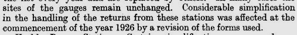

which perhaps indicates that the new version of the Daily Rainfall form was a merger of items which had been separate forms/publications previously.

#### Section A for the entry of Daily Observations

Section A makes up the front of the Daily Rainfall form, and presents the standard 12x31 daily rainfall grid with totals, basic station metadata and form titles.

#### Section B - Monthly Summary

Section B appears as a long thin area in the top-left part of the back of the form. It allows monthly rainfall data to be recorded for stations which do not report daily rainfall. There is a 
separate monthly rainfall form *Form 1093* which this section is modelled on. Generally, an Observer was expected to fill in Section A or Section B, although some did both.

<table border="0">
<tr><td>

</td>
<td>

</td>
</tr>
</table>

#### Section C - Particulars of Station

Section C is used for recording various station and rain gauge metadata, going beyond what used to be recorded on the front of the form. Additional items recorded include:
* the correspondence name and address of observer
* station location relative to the nearest parish church and railway station
* details of any move made by the gauge during the past year
* details of objects near to the gauge
* via a diagram, the 'pattern' of gauge being used

Some of these station details at least must have been already recorded by the British Rainfall Organization:
* presumably names and addresses
* the 10-year rainfall sheets from the 1900s and earlier include details of locations relative to church/railway and nearby objects

So it's possible Section C is based on some other pre-existing type of form, perhaps held elsewhere (offline?) in the Met Office archives

Section C also includes an area for recording details of exceptional rainfall during the year.

#### Section D - Instructions

Section D contains instructions for Observers, very similar to the instructions provided on the back of the previous version of the form, except formatted into two columns, and with some text in italics
to indicate that it applies to both Section A and Section B.

### Front and Back of form "11,500&nbsp;12/25"

The images below shows how section A covered the front of the form, with sections B, C and D set out on the back of the form, along with footer information about HMSO addresses, publisher details and the Printing code.

<table border="0">
<tr><td>

</td>
<td>

</td>
</tr>
</table>

### British Summer Time and Hour of Observation

From the start, the Daily Rainfall form had a 'Time of Observation' field in its header. This moved to Section C on the back in version "11,500&nbsp;12/25" when the ABCD section scheme was introduced, with
the field label changing to 'Hour of Observation' at this point.

The next version of the form, "13000&nbsp;9-26" expands this to have provide separate fields for 'in Winter' and 'in Summer', and adds 'by the clock' to indicate the intended usage of the fields:

At the same time, a sentence was added to instruction 2(a) to clarify that '9 a.m. Greenwich Mean Time is 10 a.m. by the clock during Summer Time Period'.

British Summer Time was first introduced in 1916 and [British Rainfall 1916](https://digital.nmla.metoffice.gov.uk/IO_7a18d373-0737-4d68-a77b-ecbc2255d311/) p11 discusses the confusion this caused: 

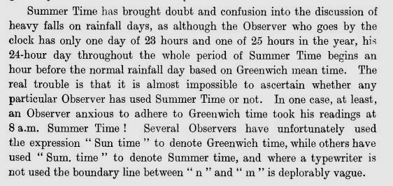

It's a bit surprising that the Daily Rainfall form only reacts to this a decade later.

### Example Millimetre-based double-sided form

The example double-side millimetre-based form below is version "1000 11-27":

<table border="0">
<tr><td>

</td>
<td>

</td>
</tr>
</table>

### End of the 1920s form - "14,000&nbsp;6/30"

<table border="0">
<tr><td>

</td>
<td>

</td>
</tr>
</table>

## 1931-1940 Daily Rainfall Forms

|Version|Links|Notes|
|:------|:----|:----|
|15,000&nbsp;2/31|[Front](page_images/DRain_1931_Clackmannan_To_Shetland_Part1_p0034.jpg)&nbsp;&middot;&nbsp;[Back](page_images/DRain_1931_Clackmannan_To_Shetland_Part1_p0035.jpg)|[A] 'Copy For Official Use' instead of just 'For Official Use' in the header.|
|16000&nbsp;8/32|[Front](page_images/DRain_1933_Clackmannan_To_Shetland_Part2_p0063.jpg)&nbsp;&middot;&nbsp;[Back](page_images/DRain_1933_Clackmannan_To_Shetland_Part2_p0064.jpg)|[A] 'Copy For Official Use' on its own line right at the top of the form. [A] 'Station No' metadata field added at the top-right of the form.|
|15000&nbsp;3/33|[Front](page_images/DRain_1933_Clackmannan_To_Shetland_Part2_p0046.jpg)&nbsp;&middot;&nbsp;[Back](page_images/DRain_1933_Clackmannan_To_Shetland_Part2_p0047.jpg)|[A] 'Spare' column added to the main grid between the 'December' and second 'Date' column, with footnote to explain. [A] The "Year's Total" cell heading in the Totals row is in mixed case rather than upper case, and now appears in the new 'spare' column rather than in the second 'Date' column.|
|16,000&nbsp;5/34|[Front](page_images/DRain_1934_Wigtown_To_Argyll_Part1_p0001.jpg)&nbsp;&middot;&nbsp;[Back](page_images/DRain_1934_Wigtown_To_Argyll_Part1_p0002.jpg)|[D] Point 3 added to Instructions: 'The columns are so spaced that the entries can be made by a typewriter. [Back] Change to HMSO Belfast address.'|
|15,000&nbsp;2/35|[Front](page_images/DRain_1935_Wigtown_To_Argyll_Part2_p0129.jpg)&nbsp;&middot;&nbsp;[Back](page_images/DRain_1935_Wigtown_To_Argyll_Part2_p0130.jpg)|[Back] Some of the text in the HMSO section is capitalised. [Back] Printer changed to Wm. Hobbs & Sons from previous John Corah & Son.|
|26,000&nbsp;4/36|[Front](page_images/DRain_1936_Clackmannan_To_Shetland_Part1_p0218.jpg)&nbsp;&middot;&nbsp;[Back](page_images/DRain_1936_Clackmannan_To_Shetland_Part1_p0219.jpg)|[A] and [B] Asterisk footnotes refer to Instruction 3(f) instead of 2(f). [A] '40-9999' removed from footer (goes to the back of the form). [D] New Instruction 1 inserted, describing when to fill in sections A, B and C, and where to send the completed form to. [D] Other instructions renumbered accordingly. [D] Instruction 2 (previously 1) shortened to not repeat addresses. [D] Instruction 3(c) (previously 2(c)) expanded. [D] Text indentation/wrapping adjusted to accomodate the other changes. [Back] The price appears on its own line, separate from the HMSO section. [Back] Footer adds 'S.O. Code No. 40-9999' at the bottom right.|
|25,500&nbsp;12/37|[Front](page_images/DRain_1938_Clackmannan_To_Shetland_Part2_p0010.jpg)&nbsp;&middot;&nbsp;[Back](page_images/DRain_1938_Clackmannan_To_Shetland_Part2_p0011.jpg)|[Back] Adjustment to Manchester address in the HMSO section.|
|21,000&nbsp;10/38|[Front](page_images/DRain_1940_Wigtown_To_Argyll_Part1_p0087.jpg)&nbsp;&middot;&nbsp;[Back](page_images/DRain_1940_Wigtown_To_Argyll_Part1_p0088.jpg)|No changes|

### Additional 'spare' column

From Daily Rainfall version "15000&nbsp;3/33" onwards, the main 12x31 grid has an additional column on the left-hand side, between the 'December' and second 'Date' columns. A &dagger; dagger symbol near the top of 
the column refers to a footnote which says 'Spare column, no entries required'. There are no daily entries in this column, but the "Year's Total" cells at the bottom of the grid move under the new column rather than
being under the second 'Date' column.

<table border="0">
<tr>
<td align=center>

 &vellip;
 

 16000&nbsp;8/32
</td>
<td align=center>

 &vellip;
 

 15000&nbsp;3/33
</td>
</tr>
</table>

Later in the decade, the millimetre version of the form modified the footnote text to 'Spare column, no entries required, except year's total.', but the inch version of the form kept the original footnote text for
a while longer:

It's not clear why the 'spare' column was added to the form - it remained unused apart from the year totals at the bottom. The next version of the form after it first appeared included a change to 
the Instructions on the back of the form to say that 'The columns are so spaced that the entries can be made by a typewriter.' - could that be part of the reason ?

### End of the 1930s form - "21,000&nbsp;10/38"

<table border="0">
<tr><td>

</td>
<td>

</td>
</tr>
</table>

## 1941-1950 Daily Rainfall Forms

|Version|Links|Notes|
|:------|:----|:----|
|10,000&nbsp;4/41|[Front](page_images/DRain_1941_Clackmannan_To_Shetland_Part1_p0051.jpg)&nbsp;&middot;&nbsp;[Back](page_images/DRain_1941_Clackmannan_To_Shetland_Part1_p0052.jpg)|[A and B] Partial year number pre-printed as '194' instead of '19'.|
|10,000&nbsp;7/42|[Front](page_images/DRain_1942_Wigtown_To_Argyll_Part1_p0006.jpg)&nbsp;&middot;&nbsp;[Back](page_images/DRain_1942_Wigtown_To_Argyll_Part1_p0007.jpg)|[A] "except year's total" added to 'Spare column' footnote. [D] Instruction 1 Air Ministry address is Stonehouse, Glos, instead of London. [D] Instruction 3(a) adds a line to explain that 9 am GMT is 11 am during Double Summer Time. [Back] HMSO addresses, price, and printer's details removed, replaced by a simple London/HMSO/1942 block. [Back] 'S.O. Code No. 40-9999' removed from footer.|
|10,000&nbsp;4/43|[Front](page_images/DRain_1944_Clackmannan_To_Shetland_Part2_p0012.jpg)&nbsp;&middot;&nbsp;[Back](page_images/DRain_1944_Clackmannan_To_Shetland_Part2_p0013.jpg)|[B] Instruction 3(b) 'receiving can' changed to 'bottle'.|
|10,000&nbsp;3/44|[Front](page_images/DRain_1944_Clackmannan_To_Shetland_Part2_p0049.jpg)&nbsp;&middot;&nbsp;[Back](page_images/DRain_1944_Clackmannan_To_Shetland_Part2_p0050.jpg)|No changes.|
|10,000&nbsp;10/45|[Front](page_images/DRain_1945_Wigtown_To_Argyll_Part2_p0114.jpg)&nbsp;&middot;&nbsp;[Back](page_images/DRain_1945_Wigtown_To_Argyll_Part2_p0115.jpg)|[C] Rain gauge pattern diagrams updated, and ground level line now included. [D] Instruction 1 Air Ministry address is Headstone Drive, Harrow, Middlesex, instead of Stonehouse, Glos. [Back] Year in the HMSO block changed to 1945 from 1942.|
|15,000&nbsp;10/46|[Front](page_images/DRain_1946_Clackmannan_To_Shetland_Part2_p217.jpg)&nbsp;&middot;&nbsp;[Back](page_images/DRain_1946_Clackmannan_To_Shetland_Part2_p0218.jpg)|[A] 'Copy for Offical Use' banner removed. [D] Instruction 3a) Reference to Double Summer Time removed. [Back] HMSO block condensed onto a single line, year changed to 1946. [Back] Price line restored, with extra '(exclusive of purchase tax)' clause. [Back] 40-9999 code restored to footer.|
|7,000&nbsp;10/47|[Front](page_images/DRain_1948_Clackmannan_To_Shetland_Part1_p0158.jpg)&nbsp;&middot;&nbsp;[Back](page_images/DRain_1948_Clackmannan_To_Shetland_Part1_p0159.jpg)|No changes.|
|10,000&nbsp;8/48|[Front](page_images/DRain_1948_Clackmannan_To_Shetland_Part1_p0001.jpg)&nbsp;&middot;&nbsp;[Back](page_images/DRain_1948_Clackmannan_To_Shetland_Part1_p0002.jpg)|No changes.|
|10,000&nbsp;9/49|[Front](page_images/DRain_1950_Clackmannan_To_Shetland_Part1_p0142.jpg)&nbsp;&middot;&nbsp;[Back](page_images/DRain_1950_Clackmannan_To_Shetland_Part1_p0143.jpg)|[A and B] Partial year number pre-printed as '19' instead of '194'.|[Back] HMSO line has no year number.|
|2/50|[Front](page_images/DRain_1950_Clackmannan_To_Shetland_Part1_p0146.jpg)&nbsp;&middot;&nbsp;[Back](page_images/DRain_1950_Clackmannan_To_Shetland_Part1_p0147.jpg)|[A and B] Partial year number pre-printed as '195' instead of '19'. [A and B] Capitalisation removed from some words in metadata labels: Funnel/Gauge/Ground/Sea Level/Top. [B] '&c.' changed to 'etc.'. [D] Instruction 1) 'in the case of Scottish stations' inserted, Edinburgh address changed to 26 Palmerston Place. [D] Instruction 3(b)(B) is all in the right-hand column rather than split between columns. [D] Instruction 3(c) 'a' inserted before 'graduation'. [D] Instruction 4) on typewriter formatting has been removed. [Back] HMSO section expanded to a list of HMSO addresses. [Back] Printers details restored. [Back] Print-run size removed from Printing code in footer.|

### Wartime changes

The basics of the Daily Rainfall form were unchanged throughout the 1940s, but there were a few, mostly temporary, changes that relate to the wartime environment.

#### Met Office Address

The address given in the Instructions for the Director of the Meteorological Office change from London to Stonehouse, Gloucestershire, during the war, and then to Headstone Drive, Harrow, 
north-west London immediately afterwards. The Stonehouse location was Wycliffe College.

#### Summer Time and Double Summer Time

For several years in the 1940s, the UK operated on Double Summer Time - 2 hours ahead of GMT during the summer, and 1 hour ahead during the rest of the year. The Daily Rainfall form instructions for the period
reflected this:

The details of when the UK switched between GMT+0, GMT+1, and GMT+2 over the period 1940 to 1947 are a bit messy. See the [British Summer Time](https://en.wikipedia.org/wiki/British_Summer_Time) Wikipedia article. The [Met Office
Glossary](https://digital.nmla.metoffice.gov.uk/IO_311dce15-970f-498d-9cbb-a53efe386e15/) also has a useful summary:

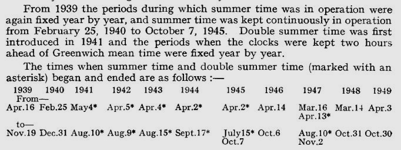

Note that Double Summer Time was re-introduced in 1947, just for that year, after the UK returned to the 'normal' Summer Time regime for 1946.

#### Purchase Tax

Before the war, the Daily Rainfall Form price was shown on the back:

The price disappeared from the form during the war. When it reappeared in the "15,000&nbsp;10/46" version of the form, an extra clause was present: '*(exclusive of purchase tax)*'. 

[Purchase Tax](https://en.wikipedia.org/wiki/Purchase_Tax) was a 33.3% sales tax introduced on 'luxury goods' in October 1940 to try to reduce wastage of raw materials. Purchase Tax was replaced 
by VAT in 1973 when the UK joined the EEC.

### Gauge pattern diagrams

Section C on the back of the Daily Rainfall form has a set of five rain gauge diagrams, A-E, with observers expected to indicate which gauge pattern matched their own gauge. The diagrams were updated
and a line indicating ground level was added for the "10,000&nbsp;10/45" version of the form onwards:

<table border="0">
<tr>
<td align=center>

 10,000&nbsp;3/44
</td>
<td align=center>

 10,000&nbsp;10/45
</td>
</tr>
</table>

### Printing code Print-run size

Up to and including the "10,000&nbsp;9/49" version of the Daily Rainfall form, the Printing code at the bottom of the form included a print-run size. The print-run size combined with the month/year indicator in the Printing
code has been used in these notes as an identifier for a specific version of a form. 

However, the Printing code for all subsequent versions of the form has no explicit print-run size. A 'K' number appears in its place, but has no obvious meaning: 

From this point on, form version numbers assigned here are just based on the month/year, so "2/50" for the example above.

### End of the 1940s form - "2/50"

<table border="0">
<tr><td>

</td>
<td>

</td>
</tr>
</table>

## 1951-1962 Daily Rainfall Forms

|Version|Links|Notes|
|:------|:----|:----|
|2/51|[Front](page_images/DRain_1952_Wigtown_To_Argyll_Part1_p0048.jpg)&nbsp;&middot;&nbsp;[Back](page_images/DRain_1952_Wigtown_To_Argyll_Part1_p0049.jpg)|[Back] Additional HMSO addresses: Oxford Street, London and P.O. Box 569. [Back] Price increased to 2d from 1d.|
|2/52|[Front](page_images/DRain_1952_Wigtown_To_Argyll_Part1_p0152.jpg)&nbsp;&middot;&nbsp;[Back](page_images/DRain_1952_Wigtown_To_Argyll_Part1_p0153.jpg)|[D] 3(e) Change to wording about checking copied-in totals. [Back] 'Her Majesty' instead of 'His Majesty' in HMSO section.|
|11/53|[Front](page_images/DRain_1955_Wigtown_To_Argyll_Part1_p0308.jpg)&nbsp;&middot;&nbsp;[Back](page_images/DRain_1955_Wigtown_To_Argyll_Part1_p0309.jpg)|[A] 'Height of ground above sea level' written out in full instead of using ditto marks. [A] Different 'Previous day' instruction word wrapping. [Front] '(P.T.O.)' instead of '[P.T.O' at bottom right. [C] Different 'pattern of gauge' word wrapping. [D] Different word-wrapping for instructions 3, 3(b)(B) and 3(c). [Back] HMSO Oxford Street address number changed. [Back] Different word-wrapping for HMSO section. [Back] Printer changed to Fosh & Cross Ltd.|
|9/54|[Front](page_images/DRain_1955_Clackmannan_To_Shetland_Part2_p0318.jpg)&nbsp;&middot;&nbsp;[Back](page_images/DRain_1955_Clackmannan_To_Shetland_Part2_p0319.jpg)|No changes.|
|11/55|[Front](page_images/DRain_1959_Wigtown_To_Argyll_Part1_p0197.jpg)&nbsp;&middot;&nbsp;[Back](page_images/DRain_1959_Wigtown_To_Argyll_Part1_p0198.jpg)|[A] 'Please read ..' sentence moved to share line with the 'previous day' instruction. [A] More compact pre-printed 'X' for non-days (e.g. Feb 31st). [A and B] Footnote refers to 3(g) instead of 3(f). [C] Gauge pattern section removed. [C] New blank section for 'Notes on Snowfall'. [D] 3(b)(A) and (B), 3(c) and 3(d) instructions shortened. [D] New section inserted as 3(e) with instructions for recording snow, with subsequent instructions re-labelled. [D] 3(f, was e) instructions shortened. [Back] HMSO address section removed. [Back] Wording of Printers line adjusted, and moved above the price line. [Back] Price increased to 3d from 2d. [Back] Price line 'exclusive of' changed to 'excluding'. |
|10/56|[Front](page_images/DRain_1958_Clackmannan_to_Shetland_Part2_p0198.jpg)&nbsp;&middot;&nbsp;[Back](page_images/DRain_1958_Clackmannan_to_Shetland_Part2_p0199.jpg)|[A] 'British Rainfall Organization' and 'Air Ministry' switch positions in header. [C] 'and also the space for notes' removed from initial instructions. [C] National Grid Reference field added on its own line above the nearest railway/church fields.|
|6/58|[Front](page_images/DRain_1960_Clackmannan_To_Shetland_Part1_p0017.jpg)&nbsp;&middot;&nbsp;[Back](page_images/DRain_1960_Clackmannan_To_Shetland_Part1_p0018.jpg)|[A] 'British Rainfall Organization' dropped from the header. [A] Different 'Previous day' instruction word wrapping. [A] 'Please read Notes ..' instead of 'Please read the Notes ..'.  [C] Nearest railway station and parish church fields removed. [D] 1) refers to the 'Director General' of the Met Office instead of just 'Director', and adds 'M.O.3b.'. [Back] Printer changed to The Gatwick Press Ltd from previous Fosh & Cross Ltd.|
|4/60|[Front](page_images/DRain_1951-1962_RainNos_3405-3435_p0082.jpg)&nbsp;&middot;&nbsp;[Back](page_images/DRain_1951-1962_RainNos_3405-3435_p0104.jpg)|[A and B] Partial year number pre-printed as '19' instead of '195'. [A and B] '(Revised March, 1960)' added underneath 'Form 1090'. [A] Different 'Previous day' instruction word wrapping. [A] 'Please read the Notes ..' instead of 'Please read Notes ..'. [A] "years' total" instead of "year's total" in footnote. [C] 'and also the space for notes' restored to initial instructions. [C] 'National Grid Reference' changed to just 'Grid Reference', and slash sub-divider removed. [D] 1) Northern Ireland address added. [D] 3) Minor word-wrapping adjustments to several entries. [Back] '40-9999' removed from footer. |
|2/61|[Front](page_images/DRain_1951-1962_RainNos_0901-0953_p0042.jpg)&nbsp;&middot;&nbsp;[Back](page_images/DRain_1951-1962_RainNos_0167-0215_p0512.jpg)|[A and B] Partial year number pre-printed as '196' instead of '19'. [A and B] Revision date indicators changed to '(Rev. Feb, 1961)' and '(Revised Feb, 1961)'. [A] Different 'Previous day' instruction word wrapping. [A] 'Please read Notes ..' instead of 'Please read the Notes ..'. [A] "year's total" restored in footnote instead of "years' total". [C] 'and also the space for notes' removed from initial instructions again. [C] 'Grid Reference' changed back to 'National Grid Reference', and slash sub-divider restored. [D] 1) Met Office address changed to Bracknell from Harrow, and 'Air Ministry' dropped, and '2' post code added to Belfast address. [D] (B) paragraph wraps over two columns.  [Back] Printer changed to The Kenion Press Ltd from previous The Gatwick Press Ltd.|

### Change of Monarch

The HMSO section of the "2/52" version of the Daily Rainfall form reflected the very recent (6th February 1952) change of monarch from George VI to Elizabeth II:

<table border="0">
<tr>
<td align=center>

 2/51
</td>
<td align=center>

 2/52
</td>
</tr>
</table>

### Recording Snowfall

The "11/55" version of the Daily Rainfall form introduced two prominent snow-related changes to the back of the form (with space created for this by removal of the 'gauge pattern' part of section C):

* a 'Notes on Snowfall' area in section C for the observer to fill In

	

* a long new instruction in section D about recording snow 

	

Entries in British Rainfall 1953-1955 relate to these changes

<table border="0">
<tr>
<td align=center valign=bottom>
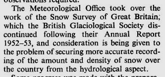
 BR 1953 p3
</td>
<td align=center valign=bottom>

 BR 1954 p3
</td>
<td align=center valign=bottom>
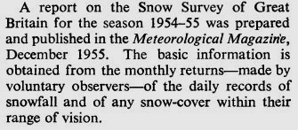
 BR 1955 p3
</td>
</tr>
</table>

 

### The British Rainfall Organization passes into history

Since the early 1920s, soon after the British Rainfall Organization became part of the Met Office, the Daily Rainfall form listed its three-level organisational hierarchy at
the top of the form, in the order Air Ministry / Meteorological Office / British Rainfall Organization. In line with this, the "9/54" version of the form showed:

In the the "10/56" version of the form, this changed to list the hierarchy in the opposite order, with British Rainfall Organization first:

but this proved to be its final mention. From the "6/58" version onwards, the British Rainfall Organization reference was removed:

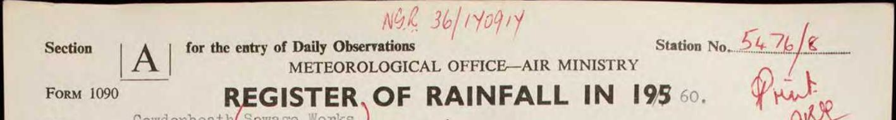

This ties in with the creation of a 'British Rainfall and Hydrology' department within the Climatological Services directorate of the Met Office, as part 
of a 1957 reoganisation (Met Office Annual Report 1957-58 p13).

References to the British Rainfall Organization were also removed from the British Rainfall annuals over the same period (allowing for publication delays).

British Rainfall 1955 (published in 1957) shows:

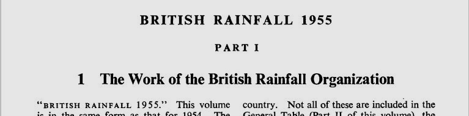

British Rainfall 1956 (published in 1958) shows:

Perhaps no coincidence, Dr John Glasspoole retired from the Met Office at the end of 1957. He had originally joined the British Rainfall Organisation in 1916, and was the last remaining employee from
the British Rainfall Organisation's days as an independent body.

### Grid References

The second half of the 1950s saw a move to obtain grid references for all rainfall stations. Section C of the "10/56" Daily Rainfall form added a field to record the station's national grid reference:

The next version of the form, "6/58", removed the 'Nearest Railway Station' and 'Nearest Parish Church' fields:

British Rainfall 1956 (p1) notes that grid references are now being collected, with this being part of a move to using 'punched cards and machine methods of analysis'.  British Rainfall 1957 (p1-2) 
gives a progress report and goes into these plans in more detail: 
* collecting and checking grid references was a very large task
* grid references had so far been determined for about 80% of stations
* the target accuracy was 100m [i.e. 6-figure grid references] 
* all mapping techniques were being reviewed

British Rainfall 1957 presents grid references in its generall rainfall tables for the first time (instead of gauge dimensions and height above ground level):

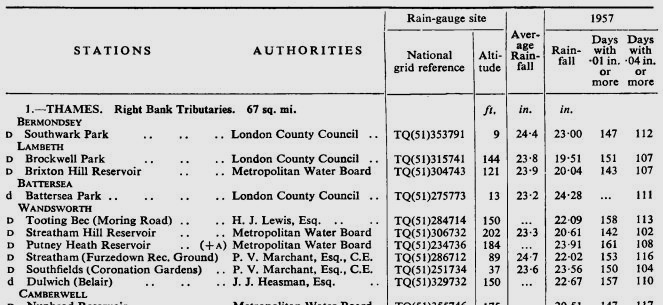

British Rainfall 1958 (p1) notes that the collection and checking of grid references has been completed.

### Met Office Department M.O.3

The "6/58" version of the Daily Rainfall form adds 'M.O.3b' to the forwarding address for completed forms given in section D part 1) on the back of the form:

"M.O.3" was the Climatological Services department of the Met Office, as shown on this organisation chart from Appendix I of the 1957-58 Met Office Annual Report:

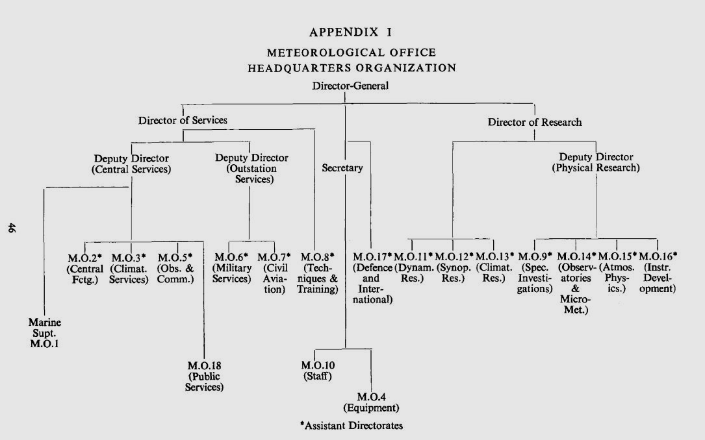

The Climatological Services part of the same annual report (p13-17) describes its three sections:
* British Climatography
* British Rainfall and Hydrology
* Agricultural Meteorology

So the 'b' in 'M.O.3b' presumably reflects the ordering of 'British Rainfall and Hydrology' in the above list.

### Bracknell

The Met Office started occupying its new headquarters buildings in Bracknell, Berkshire from February 1961. The move to Bracknell allowed the Met Office to bring its HQ staff 
together in a single site (from London, Harrow, and Dunstable) for the first time since the end of WWII.

The "2/61" version of the Daily Rainfall form uses Bracknell for the first time (replacing Harrow) as the address to which completed forms were to be sent:

The Met Office HQ remained in Bracknell until 2003, when it moved to its current location in Exeter.

### Northern Ireland

The "4/60" version of the Daily Rainfall adds a Northern Ireland address (Tyrone House, Ormeau Avenue, Belfast) to which completed forms could be be sent:

British Rainfall 1959-60 (p2) notes that the Met Office opened a branch in Belfast in June 1960. 

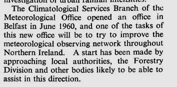

and the Met Office's 1960 Annual Report (p19) has a bit more information, including that historical records were held at the new office:

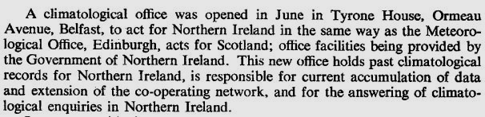

The current day location of the Daily Rainfall records from Northern Ireland is unknown - they are not part of the Met Office DRain volumes.

[Records from the Republic of Ireland were collected by the British Rainfall Organization and the Met Office until 1940, and are now held in Met Éireann's archives. See 
[*Ireland’s pre-1940 daily rainfall records*](https://rmets.onlinelibrary.wiley.com/doi/10.1002/gdj3.103).]

### Revision Dates

The "4/60" and "2/61" versions of the Daily Rainfall form belatedly include a 'Revised Date' indicator on the front and back, just under the 'Form 1090' form type indicator, to
show when the form was last changed.

<table border="0">
<tr>
<td align=center valign=bottom>

 
 

 4/60
</td>
<td align=center valign=bottom>

 
 

 2/61
</td>
</tr>
</table>

### End of the scanned DRain Volume period

The scanned DRain volumes in the Met Office Online Archive include Daily Rainfall forms up to the end of 1962 (1960 for Scotland). After that, it seems that 
following smaller scale experiments in the preceding years, annual reporting of daily rainfall switched to monthly reporting, with observations digitised 
onto punched cards. The Met Office's 1963 Annual Report says:

### End of the DRain period form - "2/61"

<table border="0">
<tr><td>

</td>
<td>

</td>
</tr>
</table>

