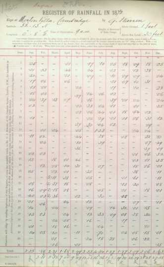
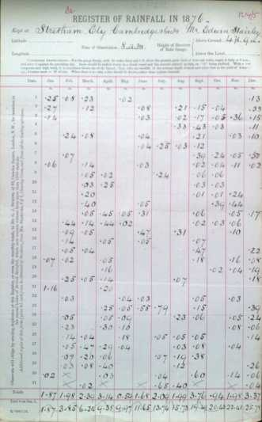
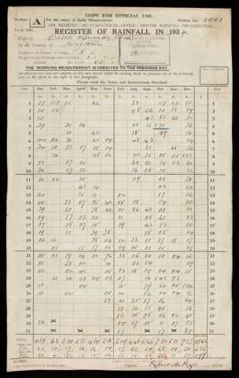
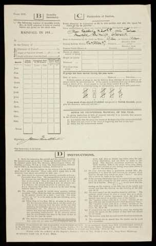
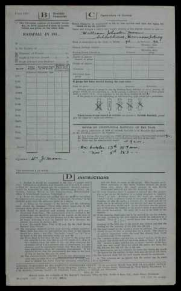
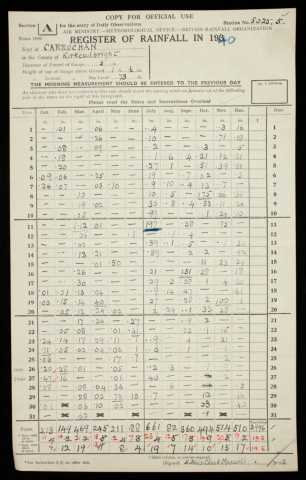
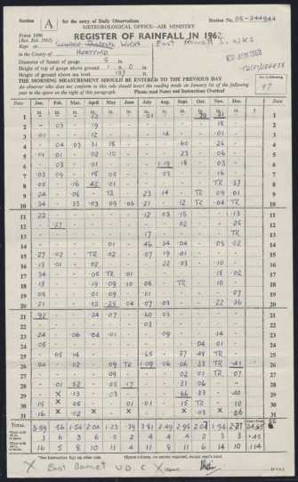

# Gallery of Daily Rainfall Form Versions

## Single-sided form versions

<table border="0">
<tr>
<td align=center>

 136&nbsp;Camden&nbsp;Road
</td>
<td align=center>

 62&nbsp;Camden&nbsp;Square
</td>
<td align=center>

 K-1000/12/70
</td>
<td align=center>

 K-1000/12/70
</td>
<td align=center>

 K-1500/12/71
</td>
<td align=center>

 K/1000/9/72
</td>
</tr>
<tr>
<td align=center>

 K/1000/12/72
</td>
<td align=center>

 K/1000/1/73
</td>
<td align=center>

 K/1500/12/73
</td>
<td align=center>

 K/3000/11/74
</td>
<td align=center>

 K/3000/12/75
</td>
<td align=center>

 K/3000/12/76
</td>
</tr>
<tr>
<td align=center>

 K/3000/1/78
</td>
<td align=center>

 K/3,000/12/78
</td>
<td align=center>

 K/3,000/12/79
</td>
<td align=center>

 K/3,000/12/81
</td>
<td align=center>

 K/3,000/12/82
</td>
<td align=center>

 K/3,000/12/83
</td>
</tr>
<tr>
<td align=center>

 K/3,000/11/84
</td>
<td align=center>

 K/3,000/12/85
</td>
<td align=center>

 K/3,000/11/86
</td>
<td align=center>

 K/3,000/11/87
</td>
<td align=center>

 K/3,000/11/88
</td>
<td align=center>

 K/3,000/1/90
</td>
</tr>
<tr>
<td align=center>

 K/3,000/12/90
</td>
<td align=center>

 K/3,000/12/90
</td>
<td align=center>

 K/3,000/11/91
</td>
<td align=center>

 K/3,000/10/92
</td>
<td align=center>

 K/3,000/10/93
</td>
<td align=center>

 K/3,000/12/94
</td>
</tr>
<tr>
<td align=center>

 K/4,000/9/95
</td>
<td align=center>

 K/4,000/12/96
</td>
<td align=center>

 K/4,000/10/97
</td>
<td align=center>

 K/4,000/12/98
</td>
<td align=center>

 K/4,000/1/99
</td>
<td align=center>

 K/3,000/12/00
</td>
</tr>
<tr>
<td align=center>

 K/3,000/12/00
</td>
<td align=center>

 K/4,000/12/01
</td>
<td align=center>

 K/4,000/11/02
</td>
<td align=center>

 K/5000/10/03
</td>
<td align=center>

 K/4000/12/04
</td>
<td align=center>

 K/5000/11/05
</td>
</tr>
<tr>
<td align=center>

 <1906>
</td>
<td align=center>

 6,000&nbsp;XI&nbsp;'07
</td>
<td align=center>

 6,000&nbsp;XI&nbsp;'08
</td>
<td align=center>

 6,000&nbsp;V&nbsp;'09
</td>
<td align=center>

 7,000&nbsp;X&nbsp;'09
</td>
<td align=center>

 9,000&nbsp;IX&nbsp;'10
</td>
</tr>
<tr>
<td align=center>

 9,000&nbsp;IX&nbsp;'10
</td>
<td align=center>

 W&nbsp;8,000&nbsp;X&nbsp;'11
</td>
<td align=center>

 1,000&nbsp;I&nbsp;'12
</td>
<td align=center>

 W&nbsp;7,500&nbsp;XI&nbsp;12
</td>
<td align=center>

 W&nbsp;7,000&nbsp;XI&nbsp;13
</td>
<td align=center>

 W&nbsp;8,000&nbsp;X&nbsp;14
</td>
</tr>
<tr>
<td align=center>

 W&nbsp;8,000&nbsp;X&nbsp;15
</td>
<td align=center>

 W&nbsp;1,000&nbsp;X&nbsp;15
</td>
<td align=center>

 W&nbsp;8,000&nbsp;VIII&nbsp;16
</td>
<td align=center>

 W&nbsp;8,000&nbsp;IX&nbsp;17
</td>
<td align=center>

 W&nbsp;6,500&nbsp;VII&nbsp;18
</td>
<td align=center>

 7500&nbsp;10/19
</td>
</tr>
<tr>
<td align=center>

 500&nbsp;10/19&nbsp;(mm)
</td>
<td align=center>

 10,000&nbsp;7/20
</td>
<td align=center>

 1000&nbsp;7/20&nbsp;(mm)
</td>
<td align=center>

 7000&nbsp;11/21
</td>
<td align=center>

 750&nbsp;11/21&nbsp;(mm)
</td>
<td align=center>

 8,000&nbsp;9/22
</td>
</tr>
<tr>
<td align=center>

 375&nbsp;9/22&nbsp;(mm)
</td>
<td align=center>

 9,000&nbsp;8/23
</td>
<td align=center>

 375&nbsp;8/23&nbsp;(mm)
</td>
</table>

## Double-sided form versions

<table border="0">
<tr>
<td align=center>

 10000&nbsp;12/24
</td>
<td align=center>

 10000&nbsp;12/24
</td>
<td align=center>

 500&nbsp;12/24&nbsp;(mm)
</td>
<td align=center>

 500&nbsp;12/24&nbsp;(mm)
</td>
<td align=center>

 1000&nbsp;2/25
</td>
<td align=center>

 1000&nbsp;2/25
</td>
</tr>
<tr>
<td align=center>

 11,500&nbsp;12/25
</td>
<td align=center>

 11,500&nbsp;12/25
</td>
<td align=center>

 1000&nbsp;12/25&nbsp;(mm)
</td>
<td align=center>

 1000&nbsp;12/25&nbsp;(mm)
</td>
<td align=center>

 13000&nbsp;9-26
</td>
<td align=center>

 13000&nbsp;9-26
</td>
</tr>
<tr>
<td align=center>

 1625&nbsp;11-26&nbsp;(mm)
</td>
<td align=center>

 1625&nbsp;11-26&nbsp;(mm)
</td>
<td align=center>

 13000&nbsp;9-27
</td>
<td align=center>

 13000&nbsp;9-27
</td>
<td align=center>

 1000&nbsp;11-27&nbsp;(mm)
</td>
<td align=center>

 1000&nbsp;11-27&nbsp;(mm)
</td>
</tr>
<tr>
<td align=center>

 13,000&nbsp;2/28
</td>
<td align=center>

 13,000&nbsp;2/28
</td>
<td align=center>

 14,000&nbsp;5/29
</td>
<td align=center>

 14,000&nbsp;5/29
</td>
<td align=center>

 1,000&nbsp;10/29&nbsp;(mm)
</td>
<td align=center>

 1,000&nbsp;10/29&nbsp;(mm)
</td>
</tr>
<tr>
<td align=center>

 14,000&nbsp;6/30
</td>
<td align=center>

 14,000&nbsp;6/30
</td>
<td align=center>

 15,000&nbsp;2/31
</td>
<td align=center>

 15,000&nbsp;2/31
</td>
<td align=center>

 1,000&nbsp;2/31&nbsp;(mm)
</td>
<td align=center>

 1,000&nbsp;2/31&nbsp;(mm)
</td>
</tr>
<tr>
<td align=center>

 16000&nbsp;8/32
</td>
<td align=center>

 16000&nbsp;8/32
</td>
<td align=center>

 15000&nbsp;3/33
</td>
<td align=center>

 15000&nbsp;3/33
</td>
<td align=center>

 16,000&nbsp;5/34
</td>
<td align=center>

 16,000&nbsp;5/34
</td>
</tr>
<tr>
<td align=center>

 1000&nbsp;5/34&nbsp;(mm)
</td>
<td align=center>

 1000&nbsp;5/34&nbsp;(mm)
</td>
<td align=center>

 15,000&nbsp;2/35
</td>
<td align=center>

 15,000&nbsp;2/35
</td>
<td align=center>

 1000&nbsp;8/35&nbsp;(mm)
</td>
<td align=center>

 1000&nbsp;8/35&nbsp;(mm)
</td>
</tr>
<tr>
<td align=center>

 26,000&nbsp;4/36
</td>
<td align=center>

 26,000&nbsp;4/36
</td>
<td align=center>

 1,000&nbsp;4/36&nbsp;(mm)
</td>
<td align=center>

 1,000&nbsp;4/36&nbsp;(mm)
</td>
<td align=center>

 25,500&nbsp;12/37
</td>
<td align=center>

 25,500&nbsp;12/37
</td>
</tr>
<tr>
<td align=center>

 21,000&nbsp;10/38
</td>
<td align=center>

 21,000&nbsp;10/38
</td>
<td align=center>

 1,000&nbsp;1/39&nbsp;(mm)
</td>
<td align=center>

 1,000&nbsp;1/39&nbsp;(mm)
</td>
<td align=center>

 1,500&nbsp;10/39&nbsp;(mm)
</td>
<td align=center>

 1,500&nbsp;10/39&nbsp;(mm)
</td>
</tr>
<tr>
<td align=center>

 10,000&nbsp;4/41
</td>
<td align=center>

 10,000&nbsp;4/41
</td>
<td align=center>

 10,000&nbsp;7/42
</td>
<td align=center>

 10,000&nbsp;7/42
</td>
<td align=center>

 10,000&nbsp;4/43
</td>
<td align=center>

 10,000&nbsp;4/43
</td>
</tr>
<tr>
<td align=center>

 1,000&nbsp;12/43&nbsp;(mm)
</td>
<td align=center>

 1,000&nbsp;12/43&nbsp;(mm)
</td>
<td align=center>

 10,000&nbsp;3/44
</td>
<td align=center>

 10,000&nbsp;3/44
</td>
<td align=center>

 10,000&nbsp;10/45
</td>
<td align=center>

 10,000&nbsp;10/45
</td>
</tr>
<tr>
<td align=center>

 1,000&nbsp;6/46&nbsp;(mm)
</td>
<td align=center>

 1,000&nbsp;6/46&nbsp;(mm)
</td>
<td align=center>

 15,000&nbsp;10/46
</td>
<td align=center>

 15,000&nbsp;10/46
</td>
<td align=center>

 7,000&nbsp;10/47
</td>
<td align=center>

 7,000&nbsp;10/47
</td>
</tr>
<tr>
<td align=center>

 625&nbsp;7/48&nbsp;(mm)
</td>
<td align=center>

 625&nbsp;7/48&nbsp;(mm)
</td>
<td align=center>

 10,000&nbsp;8/48
</td>
<td align=center>

 10,000&nbsp;8/48
</td>
<td align=center>

 10,000&nbsp;9/49
</td>
<td align=center>

 10,000&nbsp;9/49
</td>
</tr>
<tr>
<td align=center>

 2/50
</td>
<td align=center>

 2/50
</td>
<td align=center>

 1,375&nbsp;5/50&nbsp;(mm)
</td>
<td align=center>

 1,375&nbsp;5/50&nbsp;(mm)
</td>
<td align=center>

 2/51
</td>
<td align=center>

 2/51
</td>
</tr>
<tr>
<td align=center>

 800&nbsp;7/51&nbsp;(mm)
</td>
<td align=center>

 800&nbsp;7/51&nbsp;(mm)
</td>
<td align=center>

 2/52
</td>
<td align=center>

 2/52
</td>
<td align=center>

 800&nbsp;9/52&nbsp;(mm)
</td>
<td align=center>

 800&nbsp;9/52&nbsp;(mm)
</td>
</tr>
<tr>
<td align=center>

 10/53&nbsp;(mm)
</td>
<td align=center>

 10/53&nbsp;(mm)
</td>
<td align=center>

 11/53
</td>
<td align=center>

 11/53
</td>
<td align=center>

 9/54
</td>
<td align=center>

 9/54
</td>
</tr>
<tr>
<td align=center>

 11/55
</td>
<td align=center>

 11/55
</td>
<td align=center>

 11/55&nbsp;(mm)
</td>
<td align=center>

 11/55&nbsp;(mm)
</td>
<td align=center>

 10/56
</td>
<td align=center>

 10/56
</td>
</tr>
<tr>
<td align=center>

 6/58
</td>
<td align=center>

 6/58
</td>
<td align=center>

 4/60
</td>
<td align=center>

 4/60
</td>
<td align=center>

 2/61
</td>
<td align=center>

 2/61
</td>
</tr>
</table>

… tbc …
