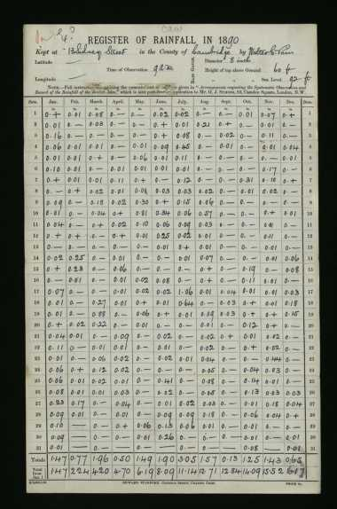
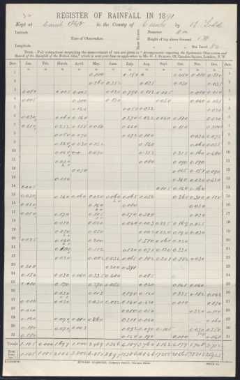

# Gallery of Daily Rainfall forms over time

## Single-sided forms

<table border="0">
<tr>
<td align=center>

 136 Camden Road
</td>
<td align=center>

 62 Camden Square
</td>
<td align=center>

 K-1000/12/70
</td>
<td align=center>

 K-1000/12/70
</td>
<td align=center>

 K-1500/12/71
</td>
<td align=center>

 K/1000/9/72
</td>
<td align=center>

 K/1000/12/72
</td>
<td align=center>

 K/1000/1/73
</td>
</tr>
<tr>
<td align=center>

 K/1500/12/73
</td>
<td align=center>

 K/3000/11/74
</td>
<td align=center>

 K/3000/12/75
</td>
<td align=center>

 K/3000/12/76
</td>
<td align=center>

 K/3000/1/78
</td>
<td align=center>

 K/3,000/12/78
</td>
<td align=center>

 K/3,000/12/79
</td>
<td align=center>

 K/3,000/12/81
</td>
</tr>
<tr>
<td align=center>

 K/3,000/12/82
</td>
<td align=center>

 K/3,000/12/83
</td>
<td align=center>

 K/3,000/11/84
</td>
<td align=center>

 K/3,000/12/85
</td>
<td align=center>

 K/3,000/11/86
</td>
<td align=center>

 K/3,000/11/87
</td>
<td align=center>

 K/3,000/11/88
</td>
<td align=center>

 K/3,000/1/90
</td>
</tr>
<tr>
<td align=center>

 K/3,000/12/90
</td>
<td align=center>

 K/3,000/12/90
</td>
<td align=center>

 K/3,000/11/91
</td>
<td align=center>

 K/3,000/10/92
</td>
<td align=center>

 K/3,000/10/93
</td>
<td align=center>

 K/3,000/12/94
</td>
<td align=center>

 K/4,000/9/95
</td>
<td align=center>

 K/4,000/12/96
</td>
</tr>
<tr>
<td align=center>

 K/4,000/10/97
</td>
<td align=center>

 K/4,000/12/98
</td>
<td align=center>

 K/4,000/1/99
</td>
<td align=center>

 K/3,000/12/00
</td>
<td align=center>

 K/3,000/12/00
</td>
<td align=center>

 K/4,000/12/01
</td>
<td align=center>

 K/4,000/11/02
</td>
<td align=center>

 K/5000/10/03
</td>
</tr>
<tr>
<td align=center>

 K/4000/12/04
</td>
<td align=center>

 K/5000/11/05
</td>
<td align=center>

 1906
</td>
<td align=center>

 6,000 XI '07
</td>
<td align=center>

 6,000 XI '08
</td>
<td align=center>

 6,000 V '09
</td>
<td align=center>

 7,000 X '09
</td>
<td align=center>

 9,000 IX '10
</td>
</tr>
<tr>
<td align=center>

 9,000 IX '10
</td>
<td align=center>

 W 8,000 X '11
</td>
<td align=center>

 1,000 I '12
</td>
<td align=center>

 W 7,500 XI 12
</td>
<td align=center>

 W 7,000 XI 13
</td>
<td align=center>

 W 8,000 X 14
</td>
<td align=center>

 W 8,000 X 15
</td>
<td align=center>

 W 1,000 X 15
</td>
</tr>
<tr>
<td align=center>

 W 8,000 VIII 16
</td>
<td align=center>

 W 8,000 IX 17
</td>
<td align=center>

 W 6,500 VII 18
</td>
<td align=center>

 7500 10/19
</td>
<td align=center>

 500 10/19 (mm)
</td>
<td align=center>

 10,000 7/20
</td>
<td align=center>

 1000 7/20 (mm)
</td>
<td align=center>

 7000 11/21
</td>
</tr>
<tr>
<td align=center>

 750 11/21 (mm)
</td>
<td align=center>

 8,000 9/22
</td>
<td align=center>

 375 9/22 (mm)
</td>
<td align=center>

 9,000 8/23
</td>
<td align=center>

 375 8/23 (mm)
</td>
</table>

## Double-sided forms

<table border="0">
<tr>
<td align=center>

 10000 12/24
</td>
<td align=center>

 10000 12/24
</td>
<td align=center>

 1000 2/25
</td>
<td align=center>

 1000 2/25
</td>
<td align=center>

 11,500 12/25
</td>
<td align=center>

 11,500 12/25
</td>
<td align=center>

 1000 12/25 (mm)
</td>
<td align=center>

 1000 12/25 (mm)
</td>
</tr>
<tr>
<td align=center>

 13000 9-26
</td>
<td align=center>

 13000 9-26
</td>
<td align=center>

 1625 11-26 (mm)
</td>
<td align=center>

 1625 11-26 (mm)
</td>
<td align=center>

 13000 9-27
</td>
<td align=center>

 13000 9-27
</td>
<td align=center>

 1000 11-27 (mm)
</td>
<td align=center>

 1000 11-27 (mm)
</td>
</tr>
<tr>
<td align=center>

 13,000 2/28
</td>
<td align=center>

 13,000 2/28
</td>
<td align=center>

 14,000 5/29
</td>
<td align=center>

 14,000 5/29
</td>
<td align=center>

 1,000 10/29 (mm)
</td>
<td align=center>

 1,000 10/29 (mm)
</td>
<td align=center>

 14,000 6/30
</td>
<td align=center>

 14,000 6/30
</td>
</tr>
</table>
