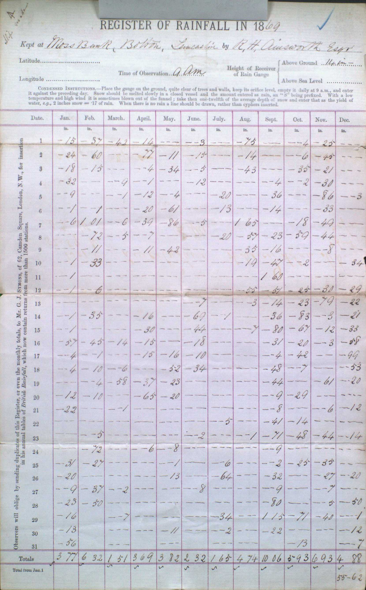

# Evolution of the British Rainfall Organisation's Daily Rainfall Form

Notes on how British Rainfall Organization's Daily Rainfall form has evolved over time. The basic form layout is 
* a main grid of 12 monthly columns x 31 daily rows + one or more rows for monthly aggregates
* form headings and station metadata above the grid
* there can also be instructions above the grid or to the side of it.
* later on, the sections for detailed metadata and instructions moved to the back of the form

These notes are based on samples from the ['DRain' PDF volumes](https://digital.nmla.metoffice.gov.uk/index.php?name=SO_9903efdf-7f99-4cae-a723-8b3f426eea20) of scanned rainfall sheets recently added to the Met Office 
Online Archive, supplemented by some material in British Rainfall annuals and similar publications.

In [British Rainfall 1868](https://digital.nmla.metoffice.gov.uk/IO_00c7c826-c473-4a04-9ae6-0390a767efa8), George Symons details the annual cycle of his work collecting rainfall records. 
He says his 'year of rainfall work' begins in December with the posting of blank forms to his 1300 observers. On page 8 he shows a [specimen filled-in form](page_images/British_Rainfall_1868_p8_specimen_monthly_form.jpg). 
This is a monthly form, but includes columns for details of which day of the month was wettest, and the number of days of rain.

## Early British Rainfall Daily Rainfall Forms

Most of daily rainfall records in the Online Archive recording rainfall before 1870 are either handrawn/adhoc forms or later transcriptions of an original source using a form from the later period.

The earliest printed Daily Rainfall forms in the Online Archive which mention 'British Rainfall' are some of those which provide rainfall figures for 1869. 
There are two versions of this form, using different return addresses for Symons:
* for most of the 1860s, Symons lived at 136 Camden Road, Camden Town, London (which was 
actually 129, Camden Road Villas until a renumbering in 1864). 
* sometime between June 1868 and February 1869, Symons moved to 62, Camden Square. 

Neither version has a form 'edition number' printed on it, but one was soon added to the '62, Camden Square' version of the form.

### '136 Camden Road' Form

* the vertical text on the left of the form gives Symons' address as *136, Camden Road*
* and says that British Rainfall covers more than 1000 stations
* the Online Archive contains about 20 stations using this version of the form

### '62 Camden Square' Form

* the vertical text on the left of the form gives Symons' address as *62, Camden Square*
* and says that British Rainfall covers more than 1500 stations
* the Online Archive contains only 4 stations using this version of the form

### '62 Camden Square' Form with K-1000/12/70 'Edition number'

The 'Edition number' **K-1000/12/70** is printed in very small text at the bottom left of the form:

Subsequent forms for the next few decades have a similar Edition number:
* the letter **K**, (possibly meaning Key Plate ????)
* **a number** which is a multiple of 100, in the low thousands. 1000 in this case (possibly meaning the number of forms printed ????) 
* two numbers at the end indicating a **month** and **year**. 12/70 in this case, indicating December 1870

As well as adding the Edition number, the 'K-1000/12/70' version of the form adds an extra line of vertical text on the left-hand side saying 
that additional copies of the form can be bought for 3d each from Mr [Edward] Stanford, and from all the leading opticians.

## 1871-1880 Daily Rainfall Forms

The table below lists the Edition numbers in use in the 1871-1880 period, as determined from the rainfall records in 
the [DRain_1871-1880_Cambridgeshire Daily Rainfall volume](https://digital.nmla.metoffice.gov.uk/IO_7c542050-4993-43f8-876a-2b7bd81590fc). The table also outlines 
notable changes to the form layout over time, with some of these changes covered in more detail following the table. 

|Edition|Notes|
|:------|:----|
|[K-1000/12/70](page_images/DRain_1871-1880_Cambridgeshire_p0143.jpg)|The first form to have an Edition number, as described in the previous section|
|[K-1500/12/71](page_images/DRain_1871-1880_Cambridgeshire_p0019.jpg)|The horizontal red grid lines above and below the Month name row and the Totals row are absent|
|[K/1000/9/72](page_images/DRain_1871-1880_Cambridgeshire_p0020.jpg)|The horizontal red grid lines are restored.|
|[K/1000/12/72](page_images/DRain_1871-1880_Cambridgeshire_p0158.jpg)||
|[K/1000/1/73](page_images/DRain_1871-1880_Cambridgeshire_p0138.jpg)||
|[K/1500/12/73](page_images/DRain_1871-1880_Cambridgeshire_p0010.jpg)||
|[K/3000/11/74](page_images/DRain_1871-1880_Cambridgeshire_p0119.jpg)||
|[K/3000/12/75](page_images/DRain_1871-1880_Cambridgeshire_p0067.jpg)|Rain gauge diameter field added. Different snow-handling instructions. Extra space at the bottom of the form. Slight adjustment to vertical text wording.|
|[K/3000/12/76](page_images/DRain_1871-1880_Cambridgeshire_p0100.jpg)|Diameter field absent. County name field added. Reverts to the original snow-handling instructions. Second 'Date' column added, on the right of the grid. Space at the bottom of the form removed. The vertical text refers to '*Accurate observers of rainfall*' rather than just '*Observers*'. Update to Stanford's address.|
|[K/3000/1/78](page_images/DRain_1871-1880_Cambridgeshire_p0129.jpg)|Diameter field restored. The 'Totals' row heading shifts from under the vertical text to under the day numbers. The number of BR stations in the vertical text is updated from 1500 to 2000.|
|[K/3,000/12/78](page_images/DRain_1871-1880_Cambridgeshire_p0093.jpg)||
|[K/3,000/12/79](page_images/DRain_1871-1880_Cambridgeshire_p0006.jpg)|The 'Condensed Instructions' section is replaced by a 'Note' saying that full instructions are available in a free pamphlet.|

### Red horizontal grid lines

All the early editions of the Daily Rainfall form (up to the late 1880s) use red/dark-red grid lines for the main 12x31 table. They all have red grid lines between each monthly column, and all except K-1500/12/71 
have horizontal red grid lines enclosing the Month Name row and the Totals row. For K-1500/12/71 these horizontal grid lines are printed in a very faint grey/blue instead.

K-1000/12/70 month name row, with dark red horizontal grid lines:

K-1500/12/71 month name row, no red horizontal grid lines (red vertical grid lines are still present):

K/1000/9/72 month name row, red horizontal grid lines restored:

### Second Date column

Before K/3000/12/76, the Daily Rainfall forms all had a single 'Date' (day of the month) column, on the left of the grid. 

From form K/3000/12/76 onwards, there is a repeat of the Date column on the right of the grid too.

### Condensed Instructions pamphlet

Editions before K/3,000/12/79 contain a 'Condensed Instructions' section just above the main grid.

From K/3,000/12/79, this is replaced by a 'Note' directing the reader to a 'little pamphlet' that George Symons had written:

The pamphlet, *Arrangements for the Systematic Observation and Record of the Rainfall of the British Isles*, was included at the 
back of [British Rainfall 1880](https://digital.nmla.metoffice.gov.uk/IO_bb97dedd-9de2-4206-9549-efe4197a1603/). (The Met Office Online Archive 
doesn't seem to have a digitised version of the stand-alone pamphlet.)

### End of the 1870s form - K/3,000/12/79

