# Evolution of the British Rainfall Organisation's Daily Rainfall Form

Notes on how British Rainfall Organization's Daily Rainfall form has evolved over time. The basic form layout is 
* a main grid of 12 monthly columns x 31 daily rows + one or more rows for monthly aggregates
* form headings and station metadata above the grid
* there can also be instructions above the grid or to the side of it.
* later on, the sections for detailed metadata and instructions moved to the back of the form

These notes are based on samples from the ['DRain' PDF volumes](https://digital.nmla.metoffice.gov.uk/index.php?name=SO_9903efdf-7f99-4cae-a723-8b3f426eea20) of scanned rainfall sheets recently added to the Met Office 
Online Archive, supplemented by some material in British Rainfall annuals and similar publications.

## Contents

* [Early British Rainfall Daily Rainfall Forms](#early)
* [1871-1880 Daily Rainfall Forms](#1871-1880)
* [1881-1890 Daily Rainfall Forms](#1881-1890)
* [1891-1900 Daily Rainfall Forms](#1891-1900)
* [1901-1910 Daily Rainfall Forms](#1901-1910)
* tbc ...

## Early British Rainfall Daily Rainfall Forms 

In [British Rainfall 1868](https://digital.nmla.metoffice.gov.uk/IO_00c7c826-c473-4a04-9ae6-0390a767efa8), George Symons details the annual cycle of his work collecting rainfall records. 
He says his 'year of rainfall work' begins in December with the posting of blank forms to his 1300 observers. On page 8 he shows a [specimen filled-in form](page_images/British_Rainfall_1868_p8_specimen_monthly_form.jpg). 
However, this is a monthly not daily form, although it includes columns for details of which day of the month was wettest, and the number of days of rain.

Most of daily rainfall records in the DRain volumes recording rainfall before 1870 are either hand-drawn/adhoc forms or later transcriptions of an original source using a form from the later period.

The earliest Daily Rainfall forms which mention 'British Rainfall' are some of those which provide rainfall figures for 1869. 
There are two versions of this form, using different return addresses for Symons:
* 136 Camden Road, Camden Town, London, which is where Symons lived for most of the 1860s. (This building had the address 129, Camden Road Villas until a renumbering in 1864). 
* 62, Camden Square, where Symons moved to sometime between June 1868 and February 1869.

Neither version has a form 'edition number' printed on it, but one was soon added to the '62, Camden Square' version of the form.

|Edition|Notes|
|:------|:----|
|['136&nbsp;Camden&nbsp;Road'](page_images/DRain_1861-1870_Leicestershire_p0006.jpg)|First *British Rainfall* form|
|['62&nbsp;Camden&nbsp;Square'](page_images/DRain_1861-1870_Lancashire_p0003.jpg)|Symons' address changed to 62 Camden Square|
|[K-1000/12/70](page_images/DRain_1861-1870_Yorkshire_p0017.jpg)|Edition number added bottom-left. Vertical text on the left adds details of where to obtain copies of the form.|

### '136 Camden Road' Form

<a href="page_images/DRain_1861-1870_Leicestershire_p0006.jpg">
	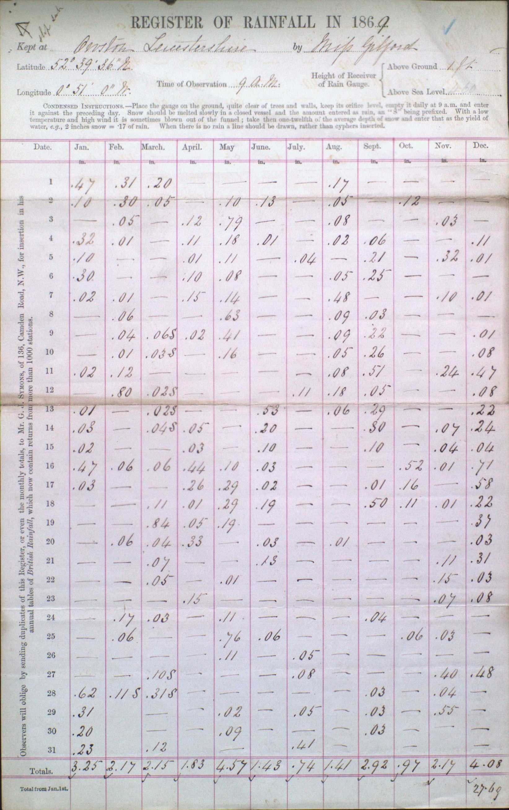
</a>

* the vertical text on the left of the form gives Symons' address as *136, Camden Road*
* and says that British Rainfall covers more than 1000 stations
* the DRain volumes contain about 20 stations using this version of the form

### '62 Camden Square' Form

* the vertical text on the left of the form gives Symons' address as *62, Camden Square*
* and says that British Rainfall covers more than 1500 stations
* the DRain volumes contain only 4 stations using this version of the form

### '62 Camden Square' Form with K-1000/12/70 'Edition number'

<a href="page_images/DRain_1861-1870_Yorkshire_p0017.jpg">
	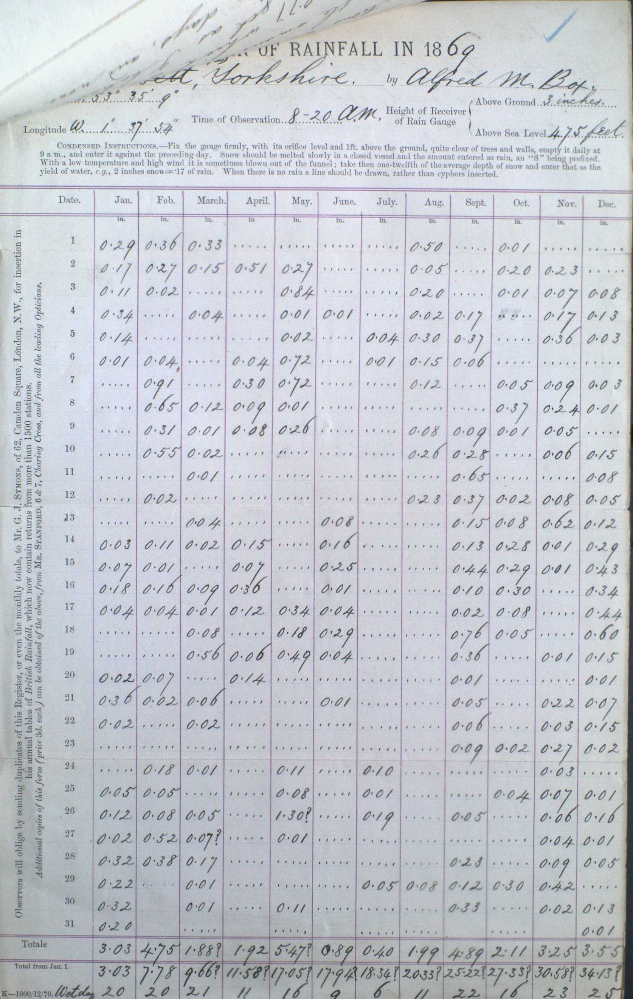
</a>

The 'Edition number' **K-1000/12/70** is printed in very small text at the bottom left of the form:

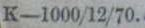

Subsequent forms for the next few decades have a similar Edition number:
* the letter **K**, (possibly meaning Key Plate ????)
* **a number** which is a multiple of 100, in the low thousands. 1000 in this case (possibly meaning the number of forms printed ????) 
* two numbers at the end indicating a **month** and **year**. 12/70 in this case, indicating December 1870

As well as adding the Edition number, the 'K-1000/12/70' version of the form adds an extra line of vertical text on the left-hand side saying 
that additional copies of the form can be bought for 3d each from Mr [Edward] Stanford, and from all the leading opticians.

## 1871-1880 Daily Rainfall Forms

The table below lists Edition numbers in use in the 1871-1880 period, as determined from the rainfall records in 
the [DRain_1871-1880_Cambridgeshire Daily Rainfall volume](https://digital.nmla.metoffice.gov.uk/IO_7c542050-4993-43f8-876a-2b7bd81590fc). The table also outlines 
notable changes to the form layout over time, with some of these changes covered in more detail following the table. 

|Edition|Notes|
|:------|:----|
|[K-1000/12/70](page_images/DRain_1871-1880_Cambridgeshire_p0143.jpg)|The first form to have an Edition number, as described in the previous section|
|[K-1500/12/71](page_images/DRain_1871-1880_Cambridgeshire_p0019.jpg)|The horizontal red grid lines above and below the Month name row and the Totals row are absent|
|[K/1000/9/72](page_images/DRain_1871-1880_Cambridgeshire_p0020.jpg)|The horizontal red grid lines are restored.|
|[K/1000/12/72](page_images/DRain_1871-1880_Cambridgeshire_p0158.jpg)||
|[K/1000/1/73](page_images/DRain_1871-1880_Cambridgeshire_p0138.jpg)||
|[K/1500/12/73](page_images/DRain_1871-1880_Cambridgeshire_p0010.jpg)||
|[K/3000/11/74](page_images/DRain_1871-1880_Cambridgeshire_p0119.jpg)||
|[K/3000/12/75](page_images/DRain_1871-1880_Cambridgeshire_p0067.jpg)|Rain gauge diameter field added. Different snow-handling instructions. Extra space at the bottom of the form. Slight adjustment to vertical text wording.|
|[K/3000/12/76](page_images/DRain_1871-1880_Cambridgeshire_p0100.jpg)|Diameter field absent. County name field added. Reverts to the original snow-handling instructions. Second 'Date' column added, on the right of the grid. Space at the bottom of the form removed. The vertical text refers to '*Accurate observers of rainfall*' rather than just '*Observers*'. Update to Stanford's address.|
|[K/3000/1/78](page_images/DRain_1871-1880_Cambridgeshire_p0129.jpg)|Diameter field restored. The 'Totals' row heading shifts from under the vertical text to under the day numbers. The number of BR stations in the vertical text is updated from 1500 to 2000.|
|[K/3,000/12/78](page_images/DRain_1871-1880_Cambridgeshire_p0093.jpg)||
|[K/3,000/12/79](page_images/DRain_1871-1880_Cambridgeshire_p0006.jpg)|The 'Condensed Instructions' section is replaced by a 'Note' saying that full instructions are available in a free pamphlet.|

### Red horizontal grid lines

All the early editions of the Daily Rainfall form (up to the late 1880s) use red/dark-red grid lines for the main 12x31 table. They all have red grid lines between each monthly column, and all except K-1500/12/71 
have horizontal red grid lines enclosing the Month Name row and the Totals row. For K-1500/12/71 these horizontal grid lines are printed in a very faint grey/blue instead.

K-1000/12/70 month name row, with dark red horizontal grid lines:

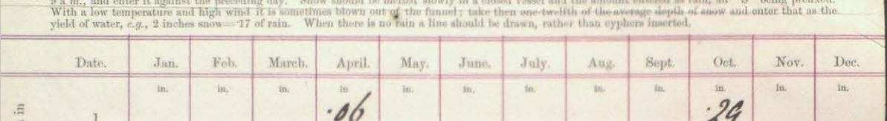

K-1500/12/71 month name row, no red horizontal grid lines (red vertical grid lines are still present):

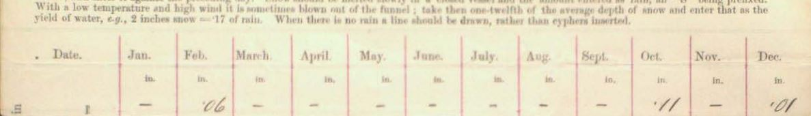

K/1000/9/72 month name row, red horizontal grid lines restored:

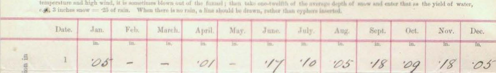

### Second Date column

Before K/3000/12/76, the Daily Rainfall forms all had a single 'Date' (day of the month) column, on the left of the grid. 

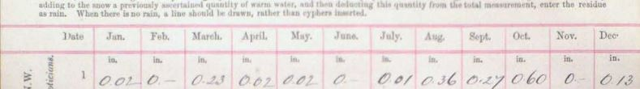

From form K/3000/12/76 onwards, there is a repeat of the Date column on the right of the grid too.

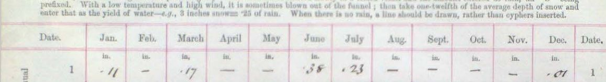

### Condensed Instructions pamphlet

Editions before K/3,000/12/79 contain a 'Condensed Instructions' section just above the main grid.

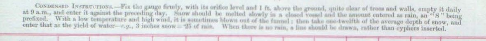

From K/3,000/12/79, this is replaced by a 'Note' directing the reader to a 'little pamphlet' that George Symons had written:

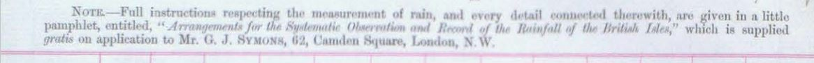

The pamphlet, *Arrangements for the Systematic Observation and Record of the Rainfall of the British Isles*, was included at the 
back of [British Rainfall 1880](https://digital.nmla.metoffice.gov.uk/IO_bb97dedd-9de2-4206-9549-efe4197a1603/). (The Met Office Online Archive 
doesn't seem to have a digitised version of the stand-alone pamphlet.)

### End of the 1870s form - K/3,000/12/79

<a href="page_images/DRain_1871-1880_Cambridgeshire_p0006.jpg">
	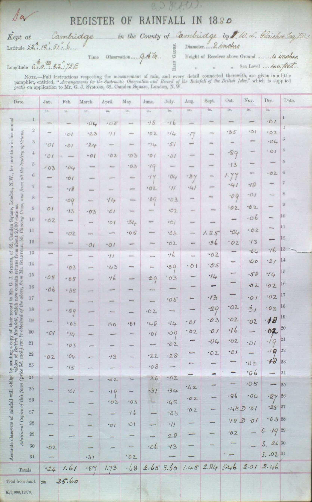
</a>

## 1881-1890 Daily Rainfall Forms

The table below lists Edition numbers in use in the 1881-1890 period, as determined from a sample of the rainfall records in 
the [DRain_1881-1890_Cambridgeshire Daily Rainfall volume](https://digital.nmla.metoffice.gov.uk/IO_7a328b70-3567-42de-b581-138b3b2c0bc4). 

|Edition|Notes|
|:------|:----|
|[K/3,000/12/79](page_images/DRain_1871-1880_Cambridgeshire_p0006.jpg)|Final form from the 1870s, for reference.|
|???? 12/80|[No form located with a late 1880 edition number]|
|[K/3,000/12/81](page_images/DRain_1881-1890_Cambridgeshire_p0066.jpg)||
|[K/3,000/12/82](page_images/DRain_1881-1890_Cambridgeshire_p0003.jpg)||
|[K/3,000/12/83](page_images/DRain_1881-1890_Cambridgeshire_p0004.jpg)|Vertical text on the left of the form removed; Stanford's name and address and the price of the form moved to the footer. 'Date' columns narrower; 'Total from Jan. 1' row label split over two lines. The 'Note' about the full instructions pamphlet has been re-worded, with a slight change to the pamphlet name. 'Height of Receiver' changed to 'Height of top' in the metadata section.|
|[K/3,000/11/84](page_images/DRain_1881-1890_Cambridgeshire_p0092.jpg)||
|[K/3,000/12/85](page_images/DRain_1881-1890_Cambridgeshire_p0070.jpg)||
|[K/3,000/11/86](page_images/DRain_1881-1890_Cambridgeshire_p0053.jpg)||
|[K/3,000/11/87](page_images/DRain_1881-1890_Cambridgeshire_p0062.jpg)||
|[K/3,000/11/88](page_images/DRain_1881-1890_Cambridgeshire_p0031.jpg)|No red grid lines, just black. Prominent dotted grid lines between each row. Date columns thinner, heading in italics. Grid line added at the bottom of the Totals section. 'Total from Jan. 1' row label split over three lines. Street name added to Stanford's address.|
|[K/3,000/1/90](page_images/DRain_1881-1890_Cambridgeshire_p0048.jpg)|Less prominent grid lines between each row.|
|[K/3,000/12/90](page_images/DRain_1881-1890_Cambridgeshire_p0064.jpg)||

### Vertical text

Editions up to K/3,000/12/82 had vertical text on the left of the form asking observers to send returns to Symons, and explaining where to obtains forms from.

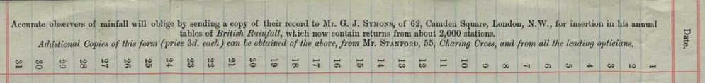

After that, the vertical text is no longer present, allowing the full page width to be used for the table of rainfall readings. Stanford's address and form price move to the bottom of the form.

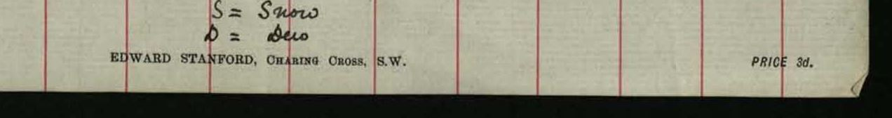

### Grid lines

Editions before K/3,000/11/88 used dark red for the main grid lines. After that all the grid lines are black, and extend to the bottom of the Totals section.

<table border="0">
<tr><td>
<a href="page_images/DRain_1881-1890_Cambridgeshire_p0062.jpg">
	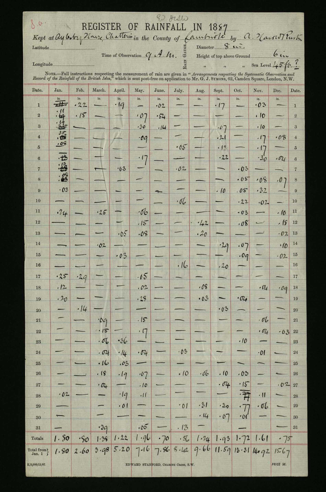
</a>
</td>
<td>
<a href="page_images/DRain_1881-1890_Cambridgeshire_p0031.jpg">
	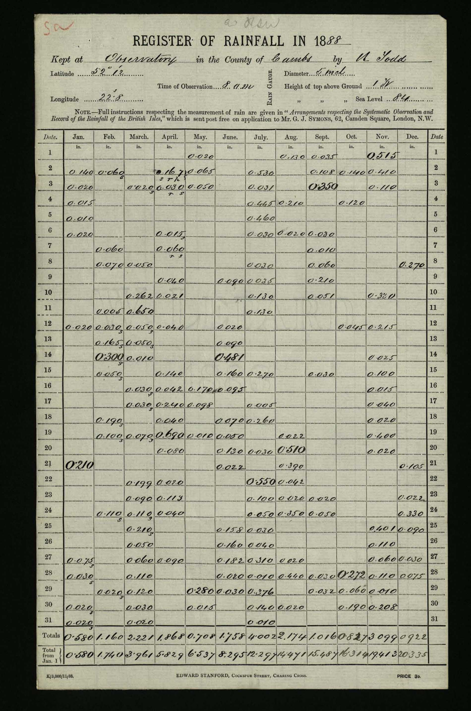
</a>
</td>
</tr>
</table>

### End of the 1880s form - K/3,000/12/90

<a href="page_images/DRain_1881-1890_Cambridgeshire_p0064.jpg">
	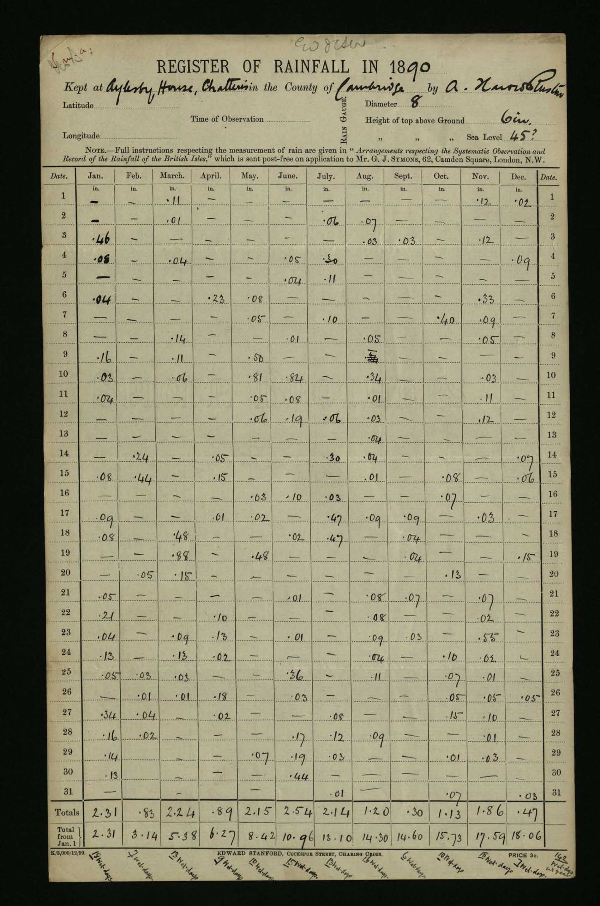
</a>

## 1891-1900 Daily Rainfall Forms

The table below lists Edition numbers in use in the 1891-1900 period, as determined from a sample of the rainfall records in 
the [DRain_1891-1900_RainNos_Cambridgeshire Daily Rainfall volume](https://digital.nmla.metoffice.gov.uk/IO_163110c6-3e00-4a68-a834-04f56e55f2a0). 

|Edition|Notes|
|:------|:----|
|[K/3,000/12/90](page_images/DRain_1891-1900_RainNos_Cambridgeshire_p0016.jpg)||
|[K/3,000/11/91](page_images/DRain_1891-1900_RainNos_Cambridgeshire_p0054.jpg)||
|[K/3,000/10/92](page_images/DRain_1891-1900_RainNos_Cambridgeshire_p0033.jpg)|Positional rearrangements of the station metadata items. 'Latitude' and 'Longitude' labels shortened to 'Lat.' and 'Lon.'|
|[K/3,000/10/93](page_images/DRain_1891-1900_RainNos_Cambridgeshire_p0043.jpg)||
|[K/3,000/12/94](page_images/DRain_1891-1900_RainNos_Cambridgeshire_p0072.jpg)||
|[K/4,000/9/95](page_images/DRain_1891-1900_RainNos_Cambridgeshire_p0086.jpg)||
|[K/4,000/12/96](page_images/DRain_1891-1900_RainNos_Cambridgeshire_p0021.jpg)|'Sea Level' label moved further to the left|
|[K/4,000/10/97](page_images/DRain_1891-1900_RainNos_Cambridgeshire_p0044.jpg)||
|[K/4,000/12/98](page_images/DRain_1891-1900_RainNos_Cambridgeshire_p0088.jpg)|Positional rearrangements of the station metadata items.|
|[K/4,000/1/99](page_images/DRain_1891-1900_RainNos_Cambridgeshire_p0049.jpg)||
|[K/3,000/12/00](page_images/DRain_1891-1900_RainNos_Cambridgeshire_p0090.jpg)|'Mr. G.J.Symons' reference replaced by 'Mr. Sowerby Wallis or Dr. H.R.Mill' in the Note about obtaining the instructions pamphlet. The name of the pamphlet has been slightly shortened.|

### George Symons

George Symons died in March 1900, with H[erbert] Sowerby Wallis and Hugh Robert Mill then taking over the running of British Rainfall Organization. 

The K/4,000/1/99 edition of the rainfall sheet is the last to refer to Symons:

<a href="page_images/K_4000_1_99.Symons.jpg">
	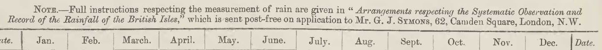
</a>

In K/3,000/12/00, this reference changes to 'Mr. Sowerby Wallis or Dr H.R.Mill':

<a href="page_images/K_4000_1_99.Symons.jpg">
	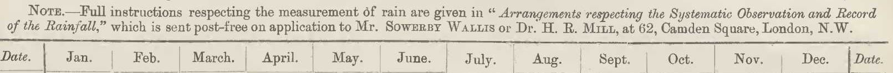
</a>

### End of the 1890s form - K/3,000/12/00

<a href="page_images/DRain_1891-1900_RainNos_Cambridgeshire_p0090.jpg">
	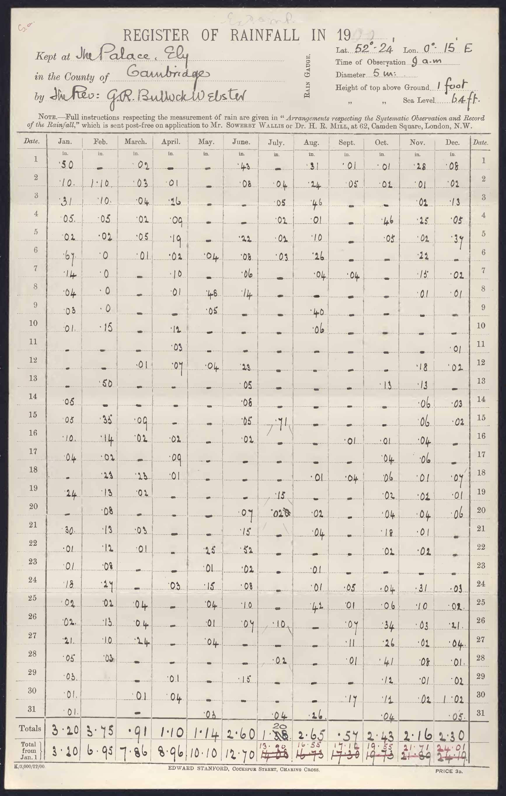
</a>

## 1901-1910 Daily Rainfall Forms

The table below lists Edition numbers in use in the 1901-1910 period, as determined from a sample of the rainfall records in 
the [DRain_1901-1910_RainNos_Cambridgeshire Daily Rainfall volume](https://digital.nmla.metoffice.gov.uk/IO_c3dad7a7-7011-4675-932a-21b66aa39376). 

|Edition|Notes|
|:------|:----|
|[K/3,000/12/00](page_images/DRain_1901-1910_RainNos_Cambridgeshire_p0058.jpg)||
|[K/4,000/12/01](page_images/DRain_1901-1910_RainNos_Cambridgeshire_p0043.jpg)|Stanford's address change in footer|
|[K/4,000/11/02](page_images/DRain_1901-1910_RainNos_Cambridgeshire_p0020.jpg)|'Lon.' metadata label changed to 'Long.'. Full instructions pamphlet name changed to '*The British Rainfall Organization - Rules for Rainfall Observers*'|
|[K/5000/10/03](page_images/DRain_1901-1910_RainNos_Cambridgeshire_p0093.jpg)|Diagonal banner added in top-right corner identifying the form as 'Form A British Rainfall'. 'Nearest Rainfall Station' added to metadata. Units ('ft', 'in') added to Diameter and Height metadata labelling. Large bracket added to group 'Rain Gauge' metadata. Only H.R.Mill named in the Instructions Note; other rewording of the Note; shortening of the pamphlet name to just 'Rules for Rainfall Observers'. Month name headings shown in upper case. In the footer, Standford's address adds street numbers, and the price indicator adds 'on extra tough paper'
|[K/4000/12/04](page_images/DRain_1901-1910_RainNos_Cambridgeshire_p0046.jpg)||
|[K/5000/11/05](page_images/DRain_1901-1910_RainNos_Cambridgeshire_p0028.jpg)|Vertical divider added between the left- and right-hand sides of the metadata section|
|[1906&nbsp;-&nbsp; no edition&nbsp;number](page_images/DRain_1901-1910_RainNos_Cambridgeshire_p0086.jpg)|'Rain Gauge' and bracket grouping removed from metadata section; 'Rain Gauge'/'Gauge' added to Diameter and Height metadata labels. Added a sentence to the instructions Note about taking measurements at 9am and assigning them to the previous day. 'respecting' changed to 'for' in the Note. Month name column headings put back to mixed case. Monthly totals row label changed to 'Total' rather than 'Totals', with 'Total for year' added as a heading to cell on the right of the row. Purpose and labelling changed for the row beneath the monthly totals : 'No. of Rain Days' rather than 'Total from Jan. 1'. Footer changes: no edition number shown; printer's name (Waterlow and Sons Limited) and address added under the Stanford text; price shown as 2d rather than 3d, reference to 'extra tough paper' removed.|
|[6,000 XI '07](page_images/DRain_1901-1910_RainNos_Cambridgeshire_p0105.jpg)|Edition number restored to the footer, but in a modified format.|
|[6,000 XI '08](page_images/DRain_1901-1910_RainNos_Cambridgeshire_p0023.jpg)||
|[6,000 V '09](page_images/DRain_1901-1910_RainNos_Cambridgeshire_p0017.jpg)|Right-hand side of metadata section reorganised. 'Rain Gauge' and bracket re-introduced, Height and Diameter labelling modified, 'Pattern' field introduced. 'Lat' and 'Long' fields removed, 'Nearest Railway Station' split into three: Name, Distance and Direction. 'Note' relabelled as 'Important Note' in larger text, and with 'entered to the previous day' underlined. New sentence added to the note regarding observers not confirming to the previous day rule, with an extra 'Jan 1, following' box for them to fill in. Description of 'Rules' document expanded. Footer removed except for the edition number - no Stanfords or Waterlow reference, or price.|
|[7,000 X '09](page_images/DRain_1901-1910_RainNos_Cambridgeshire_p0076.jpg)|Form name in diagonal banner in the top-right corner modified to 'A2'.|
|[9,000 IX '10](page_images/DRain_1901-1910_RainNos_Cambridgeshire_p0090.jpg)||

### Form name and date-stamp

The K/5000/10/03 edition introduced a diagonal banner in the top-right corner of the form, identifying the form as 'Form A'. From edition "7,000 X '09", this changed to 'Form A2'. A date-stamp often
appears next to the diagonal dividing line, presumably recording when British Rainfall received the form. 
<table border="0">
<tr><td>
<a href="page_images/K_5000_10_03.Form_A_banner.jpg">
	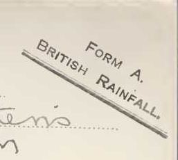
</a>
</td>
<td>
<a href="page_images/7000_X_09.Form_A2_banner.jpg">
	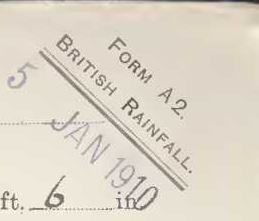
</a>
</td>
</tr>
</table>

### Retirement of H. Sowerby Wallis

H Sowerby Wallis retired in 1903, leaving Hugh Robert Mill to run the British Rainfall Organization alone.

The K/4,000/11/02 edition is the last to refer to Sowerby Wallis:

<a href="page_images/K_4000_11_02.Wallis_or_Mill.jpg">
	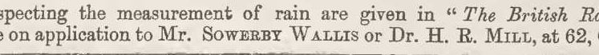
</a>

In K/5000/10/03, only Dr H.R.Mill is referenced:

<a href="page_images/K_5000_10_03.Mill.jpg">
	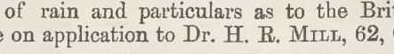
</a>

### Metadata section

Lots of small adjustments to the right-hand side of the metadata section during the 1900s decade, the overall impact being:
* the Latitude/Longitude fields have been replaced by 'Nearest Railway Station' fields
* a rain gauge 'Pattern' field has been added.

<table border="0">
<tr><td>
<a href="page_images/K_3000_12_00.righthand_metadata.jpg">
	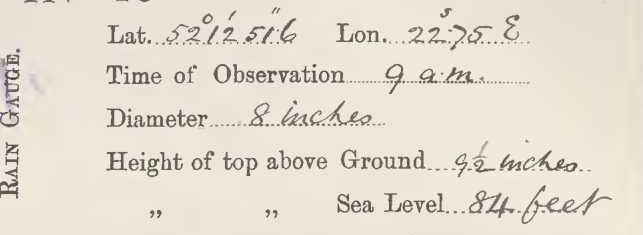
</a>
</td>
<td>
<a href="page_images/9000_IX_10.righthand_metadata.jpg">
	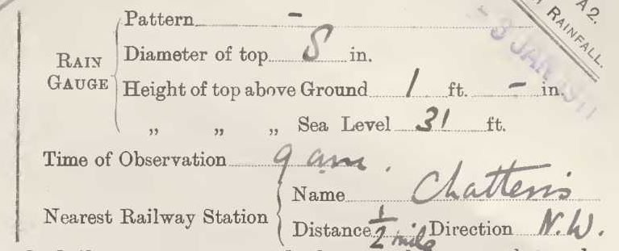
</a>
</td>
</tr>
</table>

### *Rules for Rainfall Observers* 

Up to edition K/4,000/12/01, the Note above the main table referred observers to '*Arrangements respecting the Systematic Observation and Record of the Rainfall*'. This 
was the pamphlet first produced by Symons in the late 1870s (there is a copy appended to [British Rainfall 1880](https://digital.nmla.metoffice.gov.uk/IO_bb97dedd-9de2-4206-9549-efe4197a1603/)).

From edition K/4,000/11/02 onwards, the Note refers to an updated '*Rules for Rainfall Observers*' document. A copy of this is appended to [British Rainfall 2003](https://digital.nmla.metoffice.gov.uk/IO_f8a0cada-be5c-45a4-a045-da9d574e8286/).

### Avoiding 'Wrong day' errors

In the 1860s, British Rainfall standardised its 'recording day' to be 9 am to 9 am, with the rainfall being attributed to the first of the two calendar days involved. 

* this was covered in the 'Condensed Instructions' which formed part of the early Daily Rainfall forms:

	<a href="page_images/1869.preceding_day.jpg">
		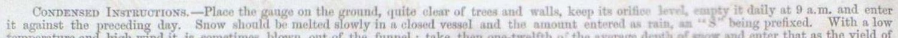
	</a>
* the Condensed Instructions evolved into the separate *Arrangements for the Systematic Observation and Record of the Rainfall of the British Isles* pamphlet referenced from edition K/3,000/12/79, including this text:

	<a href="page_images/BR_1880.recording_day.jpg">
		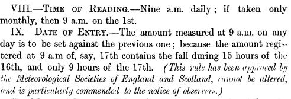
	</a>

* the *Rules for Rainfall Observers* document introduced from edition K/4,000/11/02 stated the recording day as:

	<a href="page_images/BR_1903.recording_day.jpg">
		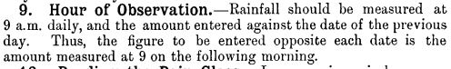
	</a>

In the early 1900s, Hugh Robert Mill realised that some observers were not following the recording day convention, and were recording the rainfall against the 'wrong' day. 

* the 1906 'no edition number' Daily Rainfall form re-introduced a direct reminder of the convention in the Note above the main table:

	<a href="page_images/1906_no_edition_no.recording_day.jpg">
		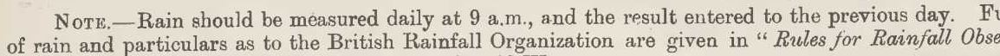
	</a>
* British Rainfall 1908 includes a 'Wrong Day' discussion in its Report section, highlighting the problems that 'wrong day' records had caused when analysing heavy rainfall which fell on August 31st 1908, and explaining
changes to the Daily Rainfall form to help manage the situation.
* the "6,000 V '09" edition of the Daily Rainfall form added further instructions for "*an Observer who prefers not to conform*" to fill in a new box on the form with their reading from 1st January of the following year, [allowing 
an adjusted monthly total for December to be calculated on the conventional reporting day basis].
	<a href="page_images/6000_V_09.preceding_day.jpg">
		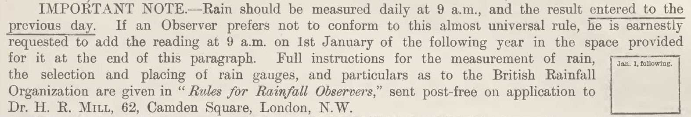
	</a>
* British Rainfall 1909 includes a section called '*The Crusade against "Wrong Day"*' in its Report section, discussing the situation further, including saying that the British Rainfall Organization had written to every observer 
suspected of using the 'Wrong Day' convention.
* some Daily Rainfall forms from this period show adjusted monthly total calculations in red ink, to account for 'Wrong Day' recording. The example below is from the 1909 St Kew [Cornwall] return, showing use of the new 'Jan 1 following' box
by the observer, and adjustments applied in red ink by the British Rainfall Organization.
	<a href="page_images/St_Kew_1909_wrong_day_top.jpg">
		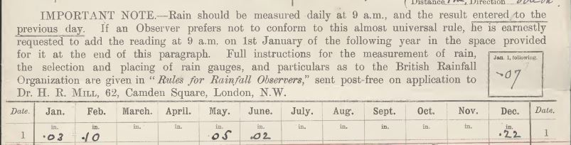
	</a>
	
	<a href="page_images/St_Kew_1909_wrong_day_totals.jpg">
		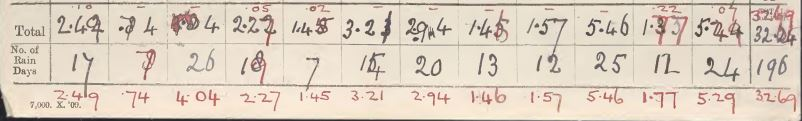
	</a>

### Totals section - Days of Rain

Up to the K/5000/11/05 edition of the Daily Rainfall form, the Totals section had two rows:

* a 'Totals' row to hold the individual monthly totals
* a 'Total from Jan. 1' row to hold cumulative amounts over the year, producing the full year total in the December column

<a href="page_images/K_5000_11_05.totals.jpg">
	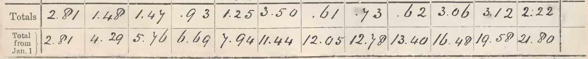
</a>

From the 1906 'no edition number' Daily Rainfall form onwards, the cumulative totals were dispensed with, and the number of days of rain in each month was reported instead:
* the first row, now labelled 'Total' rather than 'Totals', still recorded monthly totals
* the final cell in the first row, under the right-hand 'Date' column, is now used for recording the annual total and has its own mini-heading 'TOTAL for year'
* the re-purposed second row has a new heading: 'No. of Rain Days'

<a href="page_images/1906_no_edition_no.totals.jpg">
	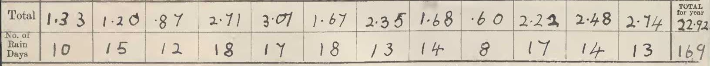
</a>

### Edition numbering and footer changes

For the first few years of the 1900s decade, Daily Rainfall form 'edition numbers' continued the 'K-style' format used for the previous decades, with the rest of the footer giving Stanford's
name and address and the form price. This arrangement ended with the K/5000/11/05 edition of the form:

<a href="page_images/K_5000_11_05.footer.jpg">
	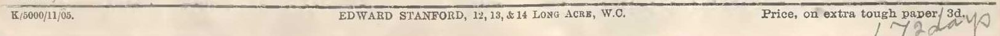
</a>

The 1906 form had no edition number, but added details of the printer (Waterlow and Sons Limited) and reported a reduced price (2d rather than 3d):

<a href="page_images/1906_no_edition_no.footer.jpg">
	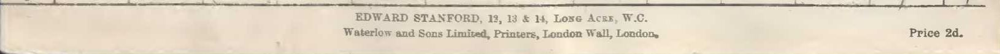
</a>

The next version of the form restored the edition number:

<a href="page_images/6000_XI_07.footer.jpg">
	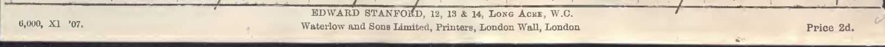
</a>

The format of the edition number, "6,000 XI '07" in this case, has been modified:

<a href="page_images/6000_XI_07.edition_no.jpg">
	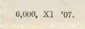
</a>

* there is no leading 'K' 
* the number assumed to be the size of the print-run is retained
* Roman numerals are used for month numbers
* an apostrophe appears before the year number
* the different parts are separated by a space instead of '/'

The form footer changed again for the "6,000 V '09" edition - only the edition number was retained, with no Stanford's or printer reference, or price:

### 1909 Oddity ?

One possible oddity regarding the two 1909 editions of the forms is that for the forms sampled, the earlier "6,000 V '09" edition was only used for recording 1910 rainfall, with the later "7,000 X '09" edition being used
for 1909 records.

This may just be down to a small sample size.

### End of the 1900s decade form - "9,000 IX '10"

<a href="page_images/DRain_1901-1910_RainNos_Cambridgeshire_p0090.jpg">
	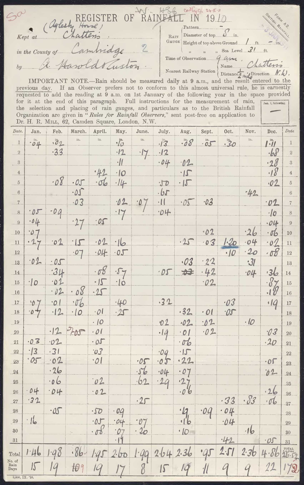
</a>

