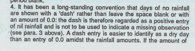
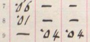
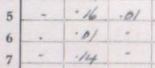
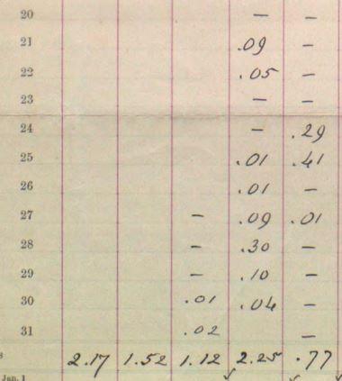
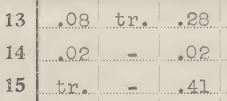

# 'No rainfall' Indicators on Daily Rainfall Forms

The standard Daily Rainfall Form has a 12x31 grid for recording daily rainfall amounts for each day of the year. This note looks at the ways observers have
recorded 'no rain' on the form for dry days, based on samples from a few of the ['DRain' PDF volumes](https://digital.nmla.metoffice.gov.uk/index.php?name=SO_9903efdf-7f99-4cae-a723-8b3f426eea20) scanned rainfall 
sheets in the Met Office Online Archive. These cover the period up to the early 1960s.

## Contents

* [Advice for observers](#advice)
* [Actual usage](#usage)
* [Examples of simple lines and dashes](#example_simple_lines)
* [Examples of line variations](#example_line_variations)
* [Examples of single dots](#example_single_dots)
* [Examples of other marks](#example_other_marks)
* [Examples of zeros](#example_zeros)
* [Examples of nils](#example_nils)
* [Examples of blank entries](#example_blanks)
* [Examples of blank entries not indicating 'no rain'](#example_not_no_rain_blanks)
* [Recording a 'trace' of rain](#trace_of_rain)

## Advice for observers

In various publications over time, observers were advised to use a line or dash to represent 'no rain', rather than using zeros.

### Early Rainfall Sheet Instructions

The instructions at the top of the earliest British Rainfall Daily Rainfall form (and later in a separate pamphlet) state:

> *When there is no rain a line should be drawn, rather than cyphers inserted.*

In this old usage, the word *'cypher'* means a zero digit, so the instruction is saying to draw a line rather than enter zeros. (Apparently 'Cypher/cipher' and 'zero' both derive from the Arabic word 'sifr' meaning zero.)

### British Rainfall 1908

> *The record will be clearer if days without measurable rain are indicated by drawing a short line.*

### Daily Rainfall Sheet Section D 1926

> *When there has been no precipitation the entry in the register should be a dash &mdash; (not &middot;00).*

### Met Office Observer's Handbook 1926

> *When there has been no precipitation the entry in the register should be a dash &mdash; (not 0&middot;0).*

### Daily Rainfall Sheet 1991

This is beyond the period of the DRain volumes, but this text from the rear of a rainfall sheet from 1991 shows how the basic instruction still applied,
now with a little more discussion:

> *It has been a long-standing convention that days of no rainfall are shown with a 'dash' rather than leave the space blank or with an amount of 0.0 &hellip;*

## Actual usage

The consistent advice to observers was to use a line or dash to indicate 'no rain' for a day, rather than using zeros. In practice, observers did their own thing and indicated 'no rain' in various ways:

* entering some sort of definite indicator:
	* a line or dash of various styles and lengths
	* a dot 
	* some other sort of small mark
	* zeros or 'nil's
* or just leaving the entry for the day blank

A survey of 3 sample DRain volumes produced the following very rough breakdown of how daily rainfall forms in these volumes indicated 'no rain':
* 40-60% used a line or dash
* 30-40% used a blank entry
* about 10% used a dot
* one volume had about 10% which used a double quote type mark
* a small number used zeros or 'nil's
* a small number used other indicators

## Examples of simple lines and dashes

Lots of variation in length.

<table border="0">
<tr><td>
	
</td>
<td>
	
</td>
<td>
	
</td>
<td>
	
</td>
</tr>
<tr><td>
	
</td>
<td>
	
</td>
<td>
	
</td>
<td>
	
</td>
</tr>
<tr><td>
	
</td>
<td>
	
</td>
<td>
	
</td>
<td>
	
</td>
</tr>
<tr><td>
	
</td>
<td>
	
</td>
<td>
	
</td>
<td>
	
</td>
</tr>
<tr><td>
	
</td>
<td>
	
</td>
<td>
	
</td>
<td>
	
</td>
</tr>
</table>

## Examples of line variations

Not common, but gives an idea of some of the variety which exists.
<table border="0">
<tr><td>
	
</td>
<td>
	
</td>
<td>
	
</td>
<td>
	
</td>
</tr>
<tr><td>
	
</td>
<td>
	
</td>
<td>
	
</td>
<td>
	
</td>
</tr>
<tr>
<td>
	
</td>
<td>
	
</td>
<td>
	
</td>
<td>
	
</td>
</tr>
</table>

## Examples of single dots

<table border="0">
<tr><td>
	
</td>
<td>
	
</td>
<td>
	
</td>
<td>
	
</td>
</tr>
</table>

## Examples of other marks

<table border="0">
<tr><td>
	
</td>
<td>
	
</td>
<td>
	
</td>
<td>
	
</td>
</tr>
<tr><td>
	
</td>
<td>
	
</td>
<td>
	
</td>
<td>
	
</td>
</tr>
</table>

## Examples of zeros

<table border="0">
<tr><td>
	
</td>
<td>
	
</td>
<td>
	
</td>
<td>
	
</td>
</tr>
<tr><td>
	
</td>
<td>
	
</td>
<td>
	
</td>
<td>
	
</td>
</tr>
</table>

## Examples of nils

<table border="0">
<tr><td>
	
</td>
<td>
	
</td>
<td>
	
</td>
<td>
	
</td>
</tr>
</table>

## Examples of blank entries

For completeness here are a few examples of blank entries indicating 'no rain'.

<table border="0">
<tr><td>
	
</td>
<td>
	
</td>
<td>
	
</td>
<td>
	
</td>
</tr>
</table>

## Examples of blank entries not indicating 'no rain'

In some situations, blank entries in a daily rainfall form do *not* indicate 'no rain' for the day in question.

### At the start or end of a series

Where a rainfall series starts or ends part-way through a year, that year's form will usually have blank entries for the period before or after the record.

In the example below, rainfall recording started on 27th March:

Here, rainfall recording ended on 27th July:

Sometimes a '#' is used to show where a record starts (or ends). Blank entries before and after the '#' mean different things: 'no record' v 'no rain'. In the example below, 
only the blank entries after 10th January indicate 'no rain'.

### Where a set of days are bracketed together

When an observer missed one or more daily observations, they were instructed to enter the combined rainfall for the period with a large bracket grouping the relevant days together.

Depending how the bracket was drawn, for longer missed periods this can produce blank or near-blank entries which just indicate that the amount of the rain for the day (if there was any) was included
in the aggregate value associated with the bracket. 

In the example below, entries for several days (e.g. Jan 3rd, 5th and 6th) are blank except for a slither of the bracket symbol - there may or may not have been rain on these days:

### Non-days

The grid entries for 'non-days' (e.g. some February 29ths, February 30th, 31st, April 31st, etc) were sometimes crossed out, sometimes left blank.

### Summary-only sheets

Daily rainfall sheets were occasionally used for reporting just monthly summary figures rather than detailed daily rainfall values. In the simple case, all the daily entries are blank and only the monthly totals are
filled in. But some summaries also filled in the daily rainfall figure for the wettest day(s) of each month, but left other days blank, for example:

## Recording a 'trace' of rain

As an alternative to recording 'no rain', sometimes observers recorded a 'trace' of rain for a particular day, as directed by the instructions on the back of the 1920s daily rainfall sheet:

Examples:

<table border="0">
<tr><td>
	
</td>
<td>
	
</td>
<td>
	
</td>
<td>
	
</td>
</tr>
<tr><td>
	
</td>
<td>
	
</td>
<td>
	
</td>
<td>
	
</td>
</tr>
</table>

