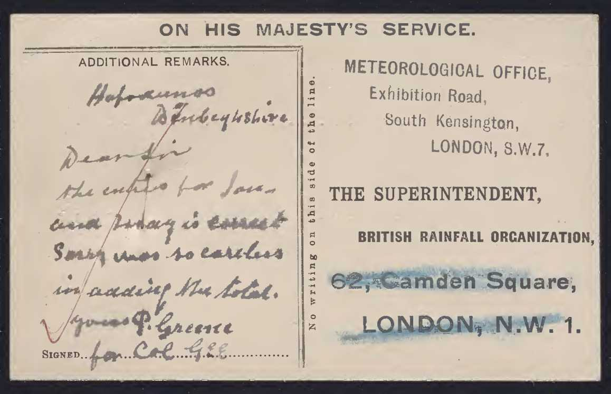

# Other Forms in the DRain Volumes

Most of the images in the [DRain volumes](https://digital.nmla.metoffice.gov.uk/index.php?name=SO_9903efdf-7f99-4cae-a723-8b3f426eea20) are of British Rainfall / Met Office 
Daily Rainfall forms covering a full year. These standard 12x31 forms are described in detail [here](Daily_Rainfall_Form_Evolution.md).

The DRain volumes also contain small amounts of some other items, including: 
* contents sheets at the start of many volumes
* handwritten notes produced by observers
* other standard forms used for recording rainfall or relating to rainfall records
* ad hoc rainfall forms hand-created by particular observers

This note provides examples of some of the 'other standard forms' cases above, discovered while sampling a small subset of the DRain volumes. 

## Forms for daily rainfall reporting over a one month period

Examples of postcard-size forms covering a single month, with 31 daily rows and aggregates for the month. (In practice, some of the examples have been used
to report daily rainfall for two months rather than one, by using the 'Remarks' column as a second values column.) 

### Form C

<table border="0">
<tr><td>

</td>
<td>

</td>
</tr>
</table>

### Form C1

<table border="0">
<tr><td>

</td>
<td>

</td>
</tr>
</table>

### Form 1096

<table border="0">
<tr><td>

</td>
<td>

</td>
</tr>
</table>

### Form 1099

<table border="0">
<tr><td>

</td>
<td>

</td>
</tr>
</table>

### Form 1100

<table border="0">
<tr><td>

</td>
<td>
</td>
</tr>
</table>

### Form 1098

Not located in 'DRain' examples, but Form 1092 is referenced in the Meteorological Magazine of July 1924.

## Forms for monthly rainfall reporting over a one year period

Examples of small forms for recording monthly values for a year, with 12 monthly rows and aggregates for the year.

### 1860s

Not located in 'Drain' examples, but there are example 1860s forms versions:

* Stephen Burt's 2010 Article ["British Rainfall 1860-1993"](https://rmets.onlinelibrary.wiley.com/doi/10.1002/wea.603) includes an image of a Symons form from 1867 
* British Rainfall 1868 p8

### 1870s

<table border="0">
<tr><td>

</td>
<td>

</td>
</tr>
</table>

### Form B

<table border="0">
<tr><td>

</td>
<td>

</td>
</tr>
</table>

### Form B1

<table border="0">
<tr><td>

</td>
<td>
</td>
</tr>
</table>

### Form 1093

<table border="0">
<tr><td>

</td>
<td>

</td>
</tr>
</table>

### Form 1094

<table border="0">
<tr><td>

</td>
<td>
</td>
</tr>
</table>

## Daily Rainfall Duration forms ###

A few stations with automatic rainfall recorders reported daily rainfall duration (in hours) as well as the amount of rainfall. The British Rainfall
Organization provided a dedicated 12x31 form for this on green paper, similar to the normal Daily Rainfall form: 

### Form A.3

<table border="0">
<tr><td>

</td>
<td>
</td>
</tr>
</table>

### Form 1093

<table border="0">
<tr>
<td>

</td>
<td>

</td>
</tr>
</table>

## Miscellaneous other rainfall-related forms

### Negretti and Zambra Daily Rainfall form

<table border="0">
<tr>
<td>

</td>
<td>
</td>
</tr>
</table>

### 'Wrong day' adjustment form 

A standard letter used to request the rainfall reading for January 1st of the current year. This relates to making 'wrong day' adjustments 
for a station in the case where i) the observer assigns rainfall measured at 9 am to the *current* day, rather than following the convention of 
assigning it to the *previous* day, and ii) the observer has not filled in the special 'Jan 1 following' box in the header of the Daily Rainfall form. 

<table border="0">
<tr><td>

</td>
<td>

</td>
</tr>
</table>

### A.M. Form 906 - Query form

<table border="0">
<tr><td>

</td>
<td>
</td>
</tr>
</table>

### Internal record forms

<table border="0">
<tr><td>

</td>
<td>

</td>
</tr>
</table>

## Summary of Form Identifiers

The main British Rainfall Organization / Met Office rainfall forms had letter/number identifiers assigned to them from the early 1900s onwards.

|Rough Period|12x31 daily|1x12 monthly|1x31 daily|
|------------|:----------|:-----------|:---------|
|1903-1919|A or A2|B|C|
|1919-1920|A.1(in) A.2(mm) A.3(hrs)|B.1|C.1|
|1921+|1090(in) 1091(mm) 1092(hrs)|1093(in) 1094(mm)|1096(in) 1097(mm)|
|later|||1098(?) 1099(in) 1100(mm)|

