# Snow Indicators on Daily Rainfall Forms

This note provides examples of the ways observers have indicated snow-based amounts on the Daily Rainfall form, based on samples from a few of 
the ['DRain' PDF volumes](https://digital.nmla.metoffice.gov.uk/index.php?name=SO_9903efdf-7f99-4cae-a723-8b3f426eea20) scanned rainfall sheets in the Met Office Online Archive. 

The note also shows how the instructions for handling snow in relation to daily rainfall reporting changed over time, based on instructions on the Daily Rainfall sheet and articles in
[*British Rainfall annuals*](https://digital.nmla.metoffice.gov.uk/index.php?name=SO_29627928-7fb1-43b2-b7ad-f63509127917).

## Contents

* [Overview](#overview)
* [Instructions for indicating snow-based figures](#instructions-for-indicating-snow-based-figures)
* [Actual indicator usage](#actual-indicator-usage)
	* [Examples of prefixed 'S'](#examples-of-prefixed-s)
	* [Examples of 'S' after the amount](#examples-of-s-after-amount)
	* [Examples of 'S' as a superscript](#examples-of-s-as-a-superscript)
	* [Examples of full word 'Snow'](#examples-of-full-word-snow)
	* [Examples of other snow indicators](#examples-of-other-snow-indicators)
* [Instructions for measuring snow as rainfall](#instructions-for-measuring-snow-as-rainfall)

## Overview

Measurement and reporting of snowfall on the Daily Rainfall forms is a recurring topic in the early years of the British Rainfall Organization. The underlying aim was to 
report snowfall as an equivalent amount of (melted) rainfall. This had two aspects:

* how to report this figure on the Daily Rainfall form
* how best to measure this amount - this was a subject of considerable experiment and debate, and various options were set out in instructions 
for observers over time

After a long period where the handling of snowfall had no further changes, the Daily Rainfall form introduced additional snow handling instructions 
in the mid-1950s, probably as a result of the Met Office taking over the work of the Snow Survey of Great Britain. This aspect is dealt with in a separate
section below.

## Instructions for indicating snow-based figures

Only the first decade or so of Daily Rainfall forms provided explicit instructions about how to indicate snow-based figures (in the 'Condensed Instructions'
section at the top of the form just above the main grid). The instructions simply said to prefix an 'S' to the measured amount of melted snow. 

The original '136 Camden Square' version of the form from the late 1860s illustrates this:

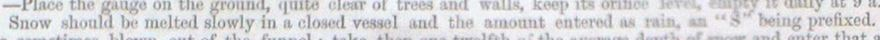

This wording for indicating rainfall measurements derived from snow remained in place until 1878, apart from being absent for one year in 1875. 

From 1879, the Daily Rainfall form changed to refer observers to a separate pamphlet of instructions rather than presenting them on the form. This pamphlet was reproduced 
at the end of British Rainfall 1880. Section XV of the pamphlet lists ways for measuring the rainfall equivalent of snow (see later section) but gives no instructions about how to 
indicate snow on the form.

From then on until the mid-1950s (see later section), there seems to be no further explicit instruction given to observers about how to indicate snow-based rainfall measurements 
on the Daily Rainfall form.

## Actual indicator usage

Although the instruction to early observers was to prefix an 'S' for snow-based rainfall measurements, in practice observers represented snow in a variety of ways, including:
* a prefixed 'S', as requested
* an 'S' after the amount (which can sometimes look like a '5' digit)
* an 'S' as a superscript after the amount
* the full word 'Snow' next to the amount

Observers continued to use these indications long after the last explicit instruction to prefix an 'S' in 1878.

### Examples of prefixed 'S'

<table border="0">
<tr><td>
	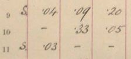
</td>
<td>
	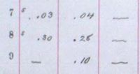
</td>
<td>
	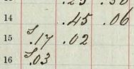
</td>
<td>
	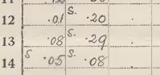
</td>
</tr>
</table>

### Examples of 'S' after the amount

<table border="0">
<tr><td>
	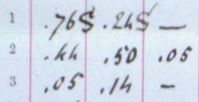
</td>
<td>
	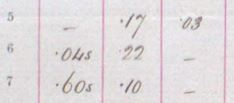
</td>
<td>
	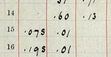
</td>
<td>
	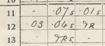
</td>
</tr>
</table>

### Examples of 'S' as a superscript

<table border="0">
<tr><td>
	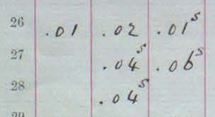
</td>
<td>
	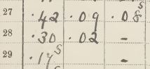
</td>
<td>
	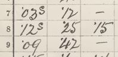
</td>
<td>
	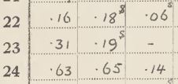
</td>
</tr>
</table>

### Examples of full word 'Snow'

<table border="0">
<tr><td>
	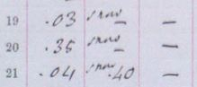
</td>
<td>
	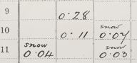
</td>
<td>
	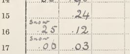
</td>
<td>
	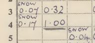
</td>
</tr>
</table>

### Examples of other snow indicators

A few other examples of ways of indicating snow:

<table border="0">
<tr>
<td>
'S' in brackets
</td>
<td>
	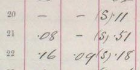
</td>
</tr>
<tr>
<td>
'Snow' in brackets
</td>
<td>
	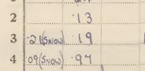
</td>
</tr>
<tr>
<td>
Abbreviated to 'Sn'
</td>
<td>
	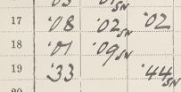
</td>
</tr>
<tr>
<td>
'S' above the amount
</td>
<td>
	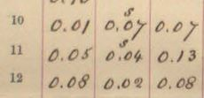
</td>
</tr>
<tr>
<td>
's' for snow combined with 'r' for rain and 'sl' for sleet
</td>
<td>
	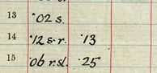
</td>
</tr>
<tr>
<td>
'Snow water'
</td>
<td>
	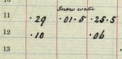
</td>
</tr>
<tr>
<td>
Other symbol with explanatory footnote
</td>
<td>
	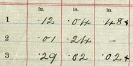
	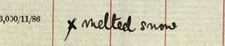
</td>
</tr>
</table>

## Instructions for measuring snow as rainfall

... tbc ...

