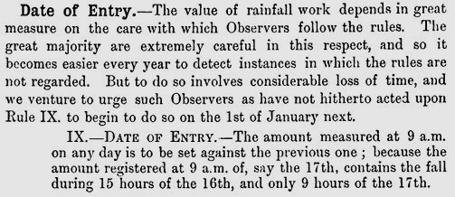

# Daily Rainfall forms and 'Wrong Day' reporting

This note looks at aspects of the 'Wrong Day' scenario, where an observer doesn't follow the normal convention for assigning daily rainfall measurements to a particular
day on the Daily Rainfall form. It is based on articles and instructions in [British Rainfall annuals](https://digital.nmla.metoffice.gov.uk/index.php?name=SO_29627928-7fb1-43b2-b7ad-f63509127917)
and samples from a few of the ['DRain' PDF volumes](https://digital.nmla.metoffice.gov.uk/index.php?name=SO_9903efdf-7f99-4cae-a723-8b3f426eea20) scanned rainfall sheets in the Met Office Online Archive. 

## Contents

* [Overview](#overview)
* [History](#history)
  * [Establishing the 'Rainfall day' conventions](#establishing-the-rainfall-day-conventions)
  * [Rule IX non-conformance I - the Symons era](#rule-ix-non-conformance-i-the-symons-era)
  * [Rule IX non-conformance II - Mill's Campaign](#rule-ix-non-conformance-ii-mills-campaign)

## Overview

Soon after he started collecting and reporting rainfall records, George Symons consulted with his observers to try to standardise the 'rainfall day'. The outcome was that rainfall for the previous
24 hours should be measured each day at 9 a.m. GMT. 

This produced a 24-hour rainfall collection period spanning part of two calendar days, so the convention was established that the 9am-to-9am rainfall amount should be assigned to the first of the two calendar days 
involved when filling in the 12x31 grid of the Daily Rainfall form. Instructions on the Daily Rainfall form and in associated pamphlets and British Rainfall included 
a rule to cover which day to assign rainfall to, for example:

Not all daily observers followed this reporting day convention, however, instead assigning readings to the day on which the measurements were made. This came to be known as '**Wrong day**' recording by the 
British Rainfall Organization.

The rainfall data for stations which used 'Wrong day' recording needed to be adjusted before being combined or compared with data from other stations. Monthly and annual rainfall values for these stations
also had to be adjusted. This was an ongoing irritant to the British Rainfall Organization, leading to Hugh Robert Mill eventually adding an explicit instruction at the top of the Daily Rainfall form from 1909. 

Completed 'Wrong day' forms often have adjustments applied to them in red ink, for example:

This note looks at a few aspects of the 'Wrong day' phenomenon, including:

* ???? 

## History

### Establishing the 'Rainfall day' conventions

George Symons defined the 'rainfall day' (and so the month and year too) in the mid-1860s, after consultation with his observers and the British [later Royal] Meteorological Society.

Detailed references

In British Rainfall 1864 (p12) Symons started a discussion about standardising the rainfall day, in terms of time of day of recording and the 'knotty point' of which date to record the rainfall against:

British Rainfall 1865 spent several pages on further discussions, under the heading '*Date of entry of rainfall, and close of rain month*'. This article described:
* discussions of the subject in the Proceedings of the British Meteorological Society
* the text of a circular sent to all Symon's observers in May 1865 to poll them about their current observing practices:

	

* the results of this polling exercise:
  * 82% took measurements at 9 a.m.
  * and 82% also assigned rainfall to the previous day rather than the day of measurement
* an agreement with James Glaisher, President of the British Meteorological Society) on the recommend approach:

	

British Rainfall 1866 (p4) notes that this question is now settled:

British Rainfall 1868 (p102) presents a list of 'Rules for Rainfall Observers' with Rule VIII (Time of reading) and Rule IX (Date of Entry) covering the rainfall day:

Early versions of the Daily Rainfall form (also from the late 1860s) included equivalent text in the 'Condensed Instructions' above the main 12x31 grid:

In 1879, the Daily Rainfall form changed to refer observers to a separate pamphlet of instructions, which included Rule VIII and Rule IX with the same wording as in British Rainfall 
1868 shown above.

### Rule IX non-conformance I - the Symons era

Inevitably, there were some rainfall observers who did not follow the 'Rainfall day' conventions, particularly Rule IX. Detecting these cases and adjusting these records made extra work for 
Symons and his staff, and this was commented on numerous times in *British Rainfall* editions in the decades after the rule was introduced.

Detailed references

British Rainfall 1868 p7:

In British Rainfall 1869 (p105), and repeated in BR 1870 and 1871, within the list of Rules immediately after Rule IX, Symons again brings up the issue, this time including 
comments from the Scottish Meteorological Society and the Council
of the Meteorological Society to support his case:

British Rainfall 1874:p143:

British Rainfall 1875:p152:

British Rainfall 1883 (p9) discusses 'Neglect of Rules', but Rule IX was not mentioned.

British Rainfall 1885 p117:

British Rainfall 1888 p102:

British Rainfall 1889 p72 (repeated in BR 1890, p102):

British Rainfall 1890 (p10) gives 'illustrative offences' against the rainfall rules, Rule IX being one of those listed:

British Rainfall 1891 p8 had a similar message:

.. but later in the same edition, p119, had something more positive to say:

British Rainfall 1894 p8-9:

 

British Rainfall 1895 p117:

.. with p119 of that edition providing possibly the first occurrence of the term 'wrong day':
 

British Rainfall 1896 p97:

British Rainfall 1898 p196:

.. with p147 of that edition giving a table of Scottish daily rainfall for December with a footnote about Rule IX:

 &vellip; 

British Rainfall 1899 p122:

### Rule IX non-conformance II - Mill's Campaign

George Symons died in 1900, and H. Sowerby Wallis, briefly, and then Hugh Robert Mill took over the running of the British Rainfall Organization. They continued to report 
with growing exasperation on the 'Wrong day' problem in British Rainfall, until in 1909 Mill launched a campaign against 'Wrong day' with an accompanying re-design of the top part 
of the Daily Rainfall form.

Detailed references

British Rainfall 1900 p122-123:

British Rainfall 1901 p10:

.. and from the same edition, p107:

British Rainfall 1902 p10:

.. and from the same edition, p113:

.. and p115:

British Rainfall 1903 p132:

British Rainfall 1904 p12 has a list of explanations determined for discrepencies detected by the British Rainfall Organization. This includes the
situation where a temporary observer may be a cause of 'wrong day' recording (even where the main observer follows Rule IX) :

.. and from the same edition, p119:

British Rainfall 1905 p99:

British Rainfall 1906 p21 made an observation that snowfall could help identify some 'wrong day' stations:

British Rainfall 1907 p37:

.. and from the same edition, p39:

[British Rainfall 1907 (p13) also contains a somewhat-related article on the Hour of Observation, and the potential
impact/confusion that the Daylight Saving Bill would have.]

British Rainfall 1908 (p11-12) describes the problems caused by 'Wrong day' records relating to heavy rain on 31st August 1908 that was mis-attributed to 1st September. As a 
result, Hugh Robert Mill decided to modify the Daily Rainfall form (Form 'A'):

The modifications to the top of the Daily Rainfall form . A low-key change had been introduced to the 1906 version of the form to remind observers of the 
rainfall day definition, but the changes to the 1909 version of the form were much more prominent.

"K/5000/11/05" version of the Daily Rainfall form:

"1906" version of the Daily Rainfall form:

"6,000 V '09" version of the Daily Rainfall form:

Changes introduced in the 1909 form:
* 'Important Note' heading added in large capitals
* 'entered to the previous day' is underlined
* a long additional sentence requesting non-conforming observers to provide their January 1st reading of the following year
* a new box into which the January 1st reading was to be written by the observer

The new box, if used as directed, allowed 'Wrong day' forms to be readily identified, and corrected December and Annual totals to be calculated.

British Rainfall 1909 (p13-14) contains a two page article about Mill's campaign against 'Wrong day', including these excerpts:

 &vellip; 

British Rainfall 1910 p15:

and from the same edition, p17:

[It is not clear whether Mill's hope to correct earlier decades came to pass (yet). My impression for looking at sample DRain
volumes is that red ink 'Wrong day' corrections only appear in any numbers on Daily Rainfall forms after 1900.]

From this point, mention of 'Wrong day' in British Rainfall stop. The top of the Daily Rainfall form retained the essentials of its 'Wrong day' additions for the
rest of the DRain period. For example the '6/58' version from 1958:

When instructions were added to the back of the Daily Rainfall form in the 1920s, one of them related to the rainfall day, for example from the "13000 9-26" version from 1926:

... to be continued ...