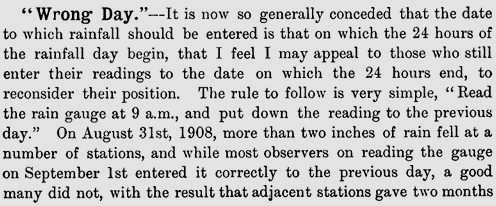
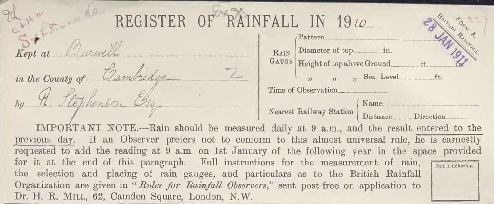
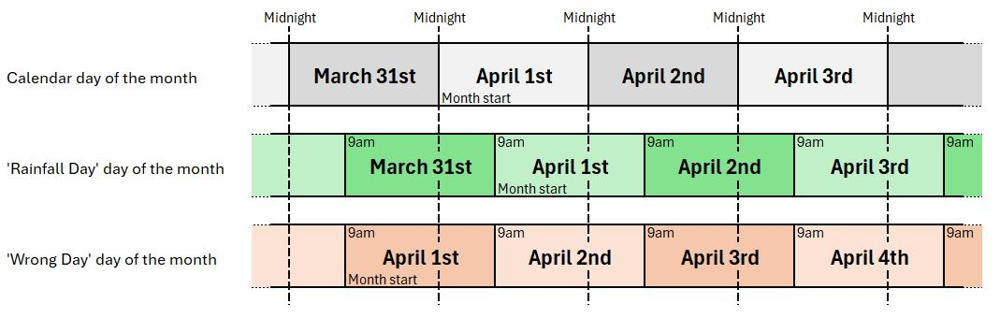
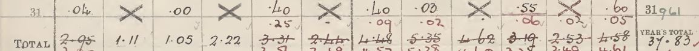

# Daily Rainfall forms and 'Wrong Day' reporting

This note looks at aspects of the 'Wrong Day' situation, where an observer did not follow the normal convention for assigning daily rainfall measurements to a particular
day on the Daily Rainfall form. The note is based on articles and instructions in [British Rainfall annuals](https://digital.nmla.metoffice.gov.uk/index.php?name=SO_29627928-7fb1-43b2-b7ad-f63509127917)
and samples from a few of the ['DRain' PDF volumes](https://digital.nmla.metoffice.gov.uk/index.php?name=SO_9903efdf-7f99-4cae-a723-8b3f426eea20) scanned rainfall sheets in the Met Office Online Archive. 

## Contents

* [Overview](#overview)
* [History](#history)
  * [Establishing the 'Rainfall day' conventions](#establishing-the-rainfall-day-conventions)
  * [Rule IX non-conformance I - the Symons era](#rule-ix-non-conformance-i-the-symons-era)
  * [Rule IX non-conformance II - Mill's Campaign](#rule-ix-non-conformance-ii-mills-campaign)
* [Converting 'Wrong day' to 'Rainfall day'](#converting-wrong-day-to-rainfall-day)
* ['Wrong day' corrections on Daily Rainfall forms](#wrong-day-corrections-on-daily-rainfall-forms)
  * [Amount of correction applied over time](#amount-of-correction-applied-over-time)
  * [A fully corrected, easy-to-read example](#a-fully-corrected-easy-to-read-example)
  * [A more typical example](#a-more-typical-example)
  * [Some variations](#some-variations)
  * [Use of additional forms](#use-of-additional-forms)
  * [The other 'Wrong day'](#the-other-wrong-day)
  * [A candidate uncorrected 'Wrong day' form example](#a-candidate-uncorrected-wrong-day-form-example)

## Overview

Soon after he started collecting and reporting rainfall records, George Symons consulted with his observers to try to standardise the 'rainfall day'. The outcome was that rainfall for the previous
24 hours should be measured each day at 9 a.m. GMT. 

This produced a 24-hour rainfall collection period spanning part of two calendar days, so the convention was established that the 9am-to-9am rainfall amount should be assigned to the first of the two calendar days 
involved when filling in the 12x31 grid of the Daily Rainfall form. Instructions on the Daily Rainfall form and in associated pamphlets and British Rainfall included 
a rule to cover which day to assign rainfall to, for example:

Not all daily observers followed this reporting day convention, however, instead assigning readings to the day on which the measurements were made. This came to be known as '**Wrong day**' recording by the 
British Rainfall Organization.

The rainfall data for stations which used 'Wrong day' recording needed to be adjusted before being combined or compared with data from other stations. Monthly and annual rainfall values for these stations
also had to be adjusted. This was an ongoing irritant to the British Rainfall Organization, leading to Hugh Robert Mill eventually adding an explicit instruction at the top of the Daily Rainfall form from 1909. 

Completed 'Wrong day' forms often have adjustments applied to them in red ink, for example:

<table border="0">
<tr>
<td align=center>

</td>
<td align=center>

</td>
<td align=center>

</td>
</tr>
</table>

This note looks at a few aspects of 'Wrong day', including:

* ???? 

## History

### Establishing the 'Rainfall day' conventions

George Symons defined the 'rainfall day' (and so the month and year too) in the mid-1860s, after consultation with his observers and the British [later Royal] Meteorological Society.

Detailed extracts

In British Rainfall 1864 (p12) Symons started a discussion about standardising the rainfall day, in terms of time of day of recording and the 'knotty point' of which date to record the rainfall against:

British Rainfall 1865 spent several pages on further discussions, under the heading '*Date of entry of rainfall, and close of rain month*'. This article described:
* discussions of the subject in the Proceedings of the British Meteorological Society
* the text of a circular sent to all Symon's observers in May 1865 to poll them about their current observing practices:

	

* the results of this polling exercise:
  * 82% took measurements at 9 a.m.
  * and 82% also assigned rainfall to the previous day rather than the day of measurement
* an agreement with James Glaisher, President of the British Meteorological Society) on the recommend approach:

	

British Rainfall 1866 (p4) notes that this question is now settled:

British Rainfall 1868 (p102) presents a list of 'Rules for Rainfall Observers' with Rule VIII (Time of reading) and Rule IX (Date of Entry) covering the rainfall day:

Early versions of the Daily Rainfall form (also from the late 1860s) included equivalent text in the 'Condensed Instructions' above the main 12x31 grid:

In 1879, the Daily Rainfall form changed to refer observers to a separate pamphlet of instructions, which included Rule VIII and Rule IX with the same wording as in British Rainfall 
1868 shown above.

### Rule IX non-conformance I - the Symons era

Inevitably, there were some rainfall observers who did not follow the 'Rainfall day' conventions, particularly Rule IX. Detecting these cases and adjusting these records made extra work for 
Symons and his staff, and this was commented on numerous times in *British Rainfall* editions in the decades after the rule was introduced.

Detailed extracts

British Rainfall 1868 p7:

In British Rainfall 1869 (p105), and repeated in BR 1870 and 1871, within the list of Rules immediately after Rule IX, Symons again brings up the issue, this time including 
comments from the Scottish Meteorological Society and the Council
of the Meteorological Society to support his case:

British Rainfall 1874:p143:

British Rainfall 1875:p152:

British Rainfall 1883 (p9) discusses 'Neglect of Rules', but Rule IX was not mentioned.

British Rainfall 1885 p117:

British Rainfall 1888 p102:

British Rainfall 1889 p72 (repeated in BR 1890, p102):

British Rainfall 1890 (p10) gives 'illustrative offences' against the rainfall rules, Rule IX being one of those listed:

British Rainfall 1891 p8 had a similar message:

.. but later in the same edition, p119, had something more positive to say:

British Rainfall 1894 p8-9:

 

British Rainfall 1895 p117:

.. with p119 of that edition providing possibly the first occurrence of the term 'wrong day':
 

British Rainfall 1896 p97:

British Rainfall 1898 p196:

.. with p147 of that edition giving a table of Scottish daily rainfall for December with a footnote about Rule IX:

 &vellip; 

British Rainfall 1899 p122:

### Rule IX non-conformance II - Mill's Campaign

George Symons died in 1900, and H. Sowerby Wallis, briefly, and then Hugh Robert Mill took over the running of the British Rainfall Organization. They continued to report 
with growing exasperation on the 'Wrong day' problem in British Rainfall, until in 1909 Mill launched a campaign against 'Wrong day' with an accompanying re-design of the top part 
of the Daily Rainfall form.

Detailed extracts

British Rainfall 1900 p122-123:

 

British Rainfall 1901 p10:

.. and from the same edition, p107:

British Rainfall 1902 p10:

.. and from the same edition, p113:

.. and p115:

British Rainfall 1903 p132:

British Rainfall 1904 p12 has a list of explanations determined for discrepencies detected by the British Rainfall Organization. This includes the
situation where a temporary observer may be a cause of 'wrong day' recording (even where the main observer follows Rule IX) :

.. and from the same edition, p119:

British Rainfall 1905 p99:

British Rainfall 1906 p21 made an observation that snowfall could help identify some 'wrong day' stations:

British Rainfall 1907 p37:

.. and from the same edition, p39:

[British Rainfall 1907 (p13) also contains a somewhat-related article on the Hour of Observation, and the potential
impact/confusion that the Daylight Saving Bill would have.]

British Rainfall 1908 (p11-12) describes the problems caused by 'Wrong day' records relating to heavy rain on 31st August 1908 that was mis-attributed to 1st September. As a 
result, Hugh Robert Mill decided to modify the Daily Rainfall form (Form 'A'):

 

A low-key change had been introduced to the 1906 version of the Daily Rainfall form to remind observers of the 
rainfall day definition, but the changes to the 1909 version of the form were much more prominent.

1905 version of the Daily Rainfall form:

1906 version of the Daily Rainfall form, with brief reminder:

1909 version of the Daily Rainfall form, with very prominent 'Wrong day' instructions:

Changes introduced in the 1909 form:
* 'Important Note' heading added in large capitals
* 'entered to the previous day' is underlined
* a long additional sentence requesting non-conforming observers to provide their January 1st reading of the following year
* a new box into which the January 1st reading was to be written by the observer

The new box, if used as directed, allowed 'Wrong day' forms to be readily identified, and corrected December and Annual totals to be calculated.

[The British Rainfall 1908 extract above also referred to Form C being modified as well as Form A. Form C allowed daily reporting for a particular month rather than
for a full year - here is an [example of form C1](page_images/DRain_1921-1930_RainNos_Denbighshire_p0156.jpg) from the 1920s, showing 'Wrong day' instructions and a 
special triangular corner section to be used for the reading from the first of the following month.]

British Rainfall 1909 (p13-14) contains a two page article about Mill's campaign against 'Wrong day', including these excerpts:

 &vellip; 

British Rainfall 1910 p15:

and from the same edition, p17:

[It is not clear whether Mill's hope to correct earlier decades came to pass (yet). My impression for looking at sample DRain
volumes is that red ink 'Wrong day' corrections only appear in any numbers on Daily Rainfall forms after 1900.]

From this point, mention of 'Wrong day' in British Rainfall stop. The top of the Daily Rainfall form retained the essentials of its 'Wrong day' additions for the
rest of the DRain period. For example the '6/58' version from 1958:

When instructions were added to the back of the Daily Rainfall form in the 1920s, one of them related to the rainfall day, for example from the "13000 9-26" version from 1926:

## Converting 'Wrong day' to 'Rainfall day'

A summary of the normal calendar day, the standard rainfall day and rainfall recorded using 'wrong day':

* for rainfall purposes, the day runs for 24 hours from 9 a.m. to  9 a.m.
* the standard rainfall day is numbered after the calendar day on which the rainfall day starts
* whereas for 'wrong day' recording, the day is numbered after the calendar day on which the rainfall day ends

### Examples

Daily recording, e.g. for rainfall falling between 9 a.m. on April 1st and 9 a.m. on April 2nd::

* for the standard rainfall day, this rainfall is recorded against April 1st
* but when 'wrong day' reporting is being applied, this rainfall is recorded against April ***2nd***
  * .. and the rainfall assigned to April 1st then being the rain between 9 a.m. on March 31st and 9 a.m. on April 1st

Monthly rainfall recording: e.g. for April:

* the standard April rainfall month covers rain which falls between 9 a.m. on April 1st and 9 a.m. on May 1st
* but the 'wrong day' April rainfall month covers rain which falls between 9 a.m. on March 31st and 9 a.m. on April 30th

Annual rainfall recording:

* the standard rainfall year covers rain which falls between 9 a.m. on January 1st and 9 a.m. on January 1st of the following year 
* but the 'wrong day' rainfall year covers rain which falls between 9 a.m. on December 31st of the previous year and 9 a.m. on December 31st

### Converting 'Wrong day' rainfall for a period to standard periods

Where a Daily Rainfall form has been systematically filled in with daily rainfall values using 'wrong day' reporting, the wrong-day (WD) figures can be converted to 
standard daily, monthly and annual values as follows:

* for **daily rainfall**, the 'calculation' is just:

  *Assign the 'Wrong day' daily figure to the preceding day*
  
  For example:
  
  * WD April 2nd rainfall is assigned to April 1st
  * WD January 1st rainfall is assigned to December 31st of the preceding year

* for **monthly rainfall**, standard monthly rainfall is calculated from:

  *[WD monthly rainfall] &minus; [rainfall for WD 1st of the month] + [rainfall for WD 1st of the following month]*

  

  The correction factor to be applied to the 'Wrong day' monthly rainfall is the difference between the 'Wrong day' rainfall figures for the first of the 
  month and the first of the following month. This difference can be zero, most commonly when both those days have no rainfall.

  Examples:
   
  * standard April rainfall = WD April rainfall &minus; WD April 1st rainfall + WD May 1st rainfall
  * standard December rainfall = WD December rainfall &minus; WD December 1st rainfall + WD January 1st next year rainfall

* for **annual rainfall**, standard annual rainfall is calculated in a similar way:

  *[WD annual rainfall] &minus; [rainfall for WD January 1st] + [rainfall for WD January 1st of the following year]*

### January 1st of the following year on the Daily Rainfall form

The 'Wrong day' rainfall for January 1st of the following year is needed for converting December and annual rainfall from 'Wrong day' to standard reporting, but the
January 1st figure belongs to next year's Daily Rainfall form. Because of this, from 1909 the 'Jan. 1 following' box was added to the top of the Daily Rainfall form,
allowing the conversions to be made promptly when the form was received.

The British Rainfall Organization also had a [prepared letter](page_images/DRain_1911-1920_RainNos_Nottinghamshire_p0329.jpg) to send to observers asking for the January 1st reading where necessary.

## 'Wrong day' corrections on Daily Rainfall forms

This section discusses examples of the extra markings applied by British Rainfall Organization staff to Daily Rainfall forms which they found 
had used 'Wrong day' reporting. The added markings are mostly in red, and were applied soon after the rainfall form had been received. 

The markings were used to convert/correct the 'Wrong day' figures into monthly (and annual) rainfall totals based on the standard rainfall day. The 
corrected monthly figures could then be compared and combined with rainfall figures from other stations in the normal way; they could also be recorded 
in the ten-year rainfall sheets which the British Rainfall Organization maintained for each station, and reported in British Rainfall.

Most of the examples presented below were found by browsing through the 'DRain' volumes for rainfall stations in Cumberland, looking for added red markings, and seeing which related to
'Wrong day' (rather than for example being arithmetic errors). 

### Amount of correction applied over time

Browsing through the 'DRain' Daily Rainfall forms for Cumberland gave the following very rough impression of the amount of 'Wrong day' correction being applied to 
by the British Rainfall Organization over the 'DRain' period if the Cumberland 'DRain' volumes are typical:

* before about 1910, no corrections are present
  * as shown in the 'History' sections above, coverage in British Rainfall from the late 1860s onwards confirms that 'Wrong day' reporting existed. It seems that during this 
  period, the British Rainfall Organization were not routinely applying corrections to the original Daily Rainfall forms when they encountered a 'Wrong day' case.
  * in British Rainfall 1910 (see the extract presented above) Hugh Robert Mill expressed the hope that it would eventually be possible to correct 'Wrong day' forms from earlier decades. The 
  Cumberland volumes give no sign that this has happened (yet!).
* around 1910, corrections start to appear
  * this was the period when Hugh Robert Mill introduced his campaign against 'Wrong day', and made related modifications to the top of the Daily Rainfall form as described above
* for 1910 - 1940s, around 4-8 stations each decade were being corrected
  * sometimes corrections were only applied for one specific year
  * but Geltsdale was corrected for the whole period
* for the 1950s, there are almost no corrections
  * it is unclear whether this is because no 'Wrong day' cases exist or because the British Rainfall Organization stopped applying corrections to the forms

### A fully corrected, easy-to-read example

The Daily Rainfall form from Drumochter Lodge, Inverness for 1929 provides a clear example of a complete set of adjustments being applied by the 
British Rainfall Organization to a form whose observer was using 'Wrong day' reporting:

The markings of interest are:

* 'W.D.' added to the form header to indicate why adjustments are being applied.

  

* the value '0.08' in the 'Jan. 1 following' box. This figure is used to calculate adjusted December and annual rainfall figures.

  

* a red horizontal line underneath the original Day 1 figures to exclude them from the main 12x31 grid. As shown later, these figures are repositioned at the bottom as Day 31 figures.

  

* the printed day numbers have been crossed out in both Date columns. For the left-hand side Date Column, they have been replaced by day numbers one day earlier in order to apply standard Rainfall
day numbering.

  

* a Day 31 row has been added at the bottom of the main grid, using the figures from the original Day 1 row but shifted now to the preceding month, so that they are now in effect shifted
back by a day to their standard rainfall day position. The Day 31 figure for December (0.08) comes from the 'Jan. 1 following' box in the form header.

  

* the original monthly totals and 'days of rain' counts under the main grid have been crossed out, and replaced with recalculated values.

  

  The adjusted monthly totals can be added up again as a whole, and/or they can be calculated as shown earlier, from the 'Wrong day' monthly figure
  and the 'Wrong day' readings for the first of the month and the first of the next month. For example:
  
  * the adjusted January total is
  
    WD Jan total - WD reading for Jan 1st + WD reading for Feb 1st 
	
    = 1.86 &minus; 0.00 + 0.26 = **2.12**
  
  * the adjusted August total is
  
    WD August total - WD reading for August 1st + WD reading for Sept 1st 
	
	= 5.03 &minus; 1.26 + 0.56 = **4.33**

### A more typical example

Often the red markings applied are not as neat or as complete as in the previous example. Most of the elements described above are present however, enough to calculate the adjusted monthly totals. 

The Daily Rainfall form from Geltsdale, Cumberland for 1924 illustrates this:

  

The markings of interest are:

* 'corr for WD' added in red to the form header to indicate why adjustments are being applied. There is also another a not-deciphered reference to WD in grey/pencil next to it, dated
25.2.25 (the stamp in the top-right of the form indicates that the form was received by the British Rainfall Organization on 6th January 1925.

  

* the value '0.05' in the 'Jan. 1 following' box.

  

* a thin red horizontal line underneath the original Day 1 figures to exclude them from the main 12x31 grid.

  

* in this case, explicit Date column renumbering has not been applied

* the non-zero figures from the original Day 1 row have been repeated in red in an unlabelled row added between the Day 31 row and the Totals row, with figures shifted to the preceding month. The December figure
in this row comes from the 'Jan. 1 following' box.

  

* some of the original monthly totals and 'days of rain' counts under the main grid have been individually crossed out, and replaced with red recalculated values. For February, March and April, 
the 'Wrong day' totals and 'Days with 0.4' counts are retained unmodified, as these cases need no adjustment (because of the zero rainfall on the 'Wrong day' 1st of February, March, April, and May).

  

  [The 'Days with 0.01 in or more' counts have additional corrections applied, beyond accounting for 'Wrong day'.]

* the red underlining of some individual readings on the sheet is not related to 'Wrong day' - they just highlight the highest reading for each month

### Some variations

The full-form examples described above listed the main elements of Rainfall form markings normally seen in relation to 'Wrong day' adjustments. This section gives an idea
of the sorts of variations that occur in these elements across the sampled Daily Rainfall forms.

#### Header text indicating that there is a 'Wrong day' aspect to the form

There is usually some handwritten text in the form header which includes 'W.D.' or 'wrong day'. It may or may not be in red.

<table border="0">
<tr><td>
	
</td>
<td>
	
</td>
<td>
	
</td>
<td>
	
</td>
</tr>
<tr><td>
	
</td>
<td>
	
</td>
<td>
	
</td>
<td>
	
</td>
</tr>
</table>

#### 'Jan 1 following' box use

The box is usually filled in with a rainfall amount, or a no-rainfall indicator (e.g. '-' or 'nil'). (But sometimes the box
has been filled in for rainfall forms which do not have a 'Wrong day' aspect.

#### Underlining of the Day 1 row

A horizontal red line under the Day 1 row appears on virtually all the Daily Rainfall forms which have 'Wrong day' adjustments, although
sometimes it isn't very obvious. One variation is for cases where the 'Wrong day' scenario only applies for part of a year, in which case
the red line may terminate part-way across the row:

  
  
or

  
 
 

#### Date column renumbering

Not applied in the Cumberland samples, left as an implicit adjustment.

#### Day 1 row figures copied down to the bottom of the main grid

The Day 1 figures are nearly always copied down in red to a new row between the bottom of the main grid and the Totals row. Often written in small figures, 
and usually only the non-zero values are copied.

#### Monthly totals and counts

Where 'Wrong day' adjustments have been applied, this section nearly always ends up looking messy and confusing. Sometimes all the monthly values are written out again in red as
a separate row, which is easier to read, but often individual totals and counts figures are crossed out and an adjusted value written in. Where an adjusted total or count ends up the
same as the original 'Wrong day' value, the original value may just be left as it is, or may be crossed out and replaced by the same value in red.

### Use of additional forms

For the Daily Rainfall forms from Geltsdale in Cumberland, an additional adjustment approach was applied. The original Daily Rainfall forms were adjusted shortly after they were received, 
for example the 1919 form:

But several decades later, separate Daily Rainfall forms were filled in, but with all the daily values shifted to one day earlier, and totals recalculated, to produce a parallel set of forms 
which used the normal rainfall day. The re-transcribed 1919 form shows:

As a result, the DRain archive contains two sets of Daily Rainfall forms for Geltsdale based on a single set of readings.

### The other 'Wrong day'

For the normal 'Wrong day' case (the subject of all the other sections of this note) the observer assigns the daily rainfall reading to the day following the standard day. The Cumberland 
Daily Rainfall forms also contained a very small number of cases where the British Rainfall Organization had identified that the rainfall had been systematically entered to the day *before* the 
standard day instead. In this scenario rainfall which fell for example between 9 a.m. on April 1st and 9 a.m. on April 2nd would be assigned to March 31st rather than to April 1st (standard rainfall day) 
or April 2nd (the normal 'Wrong day').

An example, Stainburn Reservoir 1946:

In this sort of case, the adjustments that were applied in red to the Daily Rainfall form had to be done in a slightly different way to those used in the normal 'Wrong day' case:

* the message used in the header area had an indication of this not being the normal 'Wrong day'

  

* the readings from Day 31 were copied to the top of the 12x31 grid above Day 1, and assigned to the following month

  

* a winding red line was applied at the bottom of the grid to separate off the readings from the last day of the month

  

* adjusted monthly totals and counts were marked as usual

  

### A candidate uncorrected 'Wrong day' form example

It's not too hard to find candidates for uncorrected 'Wrong day' Daily Rainfall forms from the pre-1910 era:

* find a Daily Rainfall form which has been corrected in the early 1910s
* look at Daily Rainfall forms for the same station for a few years earlier (assuming it existed then)
* identify a few days of the year with distinctive rainfall amounts
* see whether the other nearby stations have similar distinctive rainfall amounts, but recorded a day earlier

The Geltsdale station in Cumberland (about 10 miles east of Carlisle), active from 1898, provides an example. 'Wrong day' corrections have been applied to the 
station's Daily Rainfall forms from 1910 onwards.

The 1903 Geltsdale form shows over an inch of rain assigned to September 3rd, with very little rain the day before or after. Most other Cumberland Daily Rainfall forms for 1903 show a 
similar large fall, but assigned to the day before, September 2nd. For example, Newby Grange about 7 miles to the north-west of Geltsdale and Nunwick Hall, about 11 miles to the south. (Geltsdale
is quite a remote site, and so has no near neighbouring stations.)

<table border="0">
<tr>
<td align=center>

 Geltsdale 1903
</td>
<td align=center>

 Newby Grange 1903
</td>
<td align=center>

 Nunwick Hall 1903
</td>
</tr>
</table>

But making a confident assignment of the Geltsdale 1903 Daily Rainfall form as being 'Wrong day' would need more work.

Note that the monthly totals on the 1903 Geltsdale form are used in the [Geltsdale 10-year rainfall sheets](https://github.com/ed-hawkins/rainfall-rescue/blob/master/DATA/GELTSDALE/GELTSDALE.pdf), so
if the Geltsdale Daily Rainfall form is ever confirmed as being 'Wrong day' and corrected, the relevant 10-year rainfall sheet and data transcribed from it would also potentially need updating.