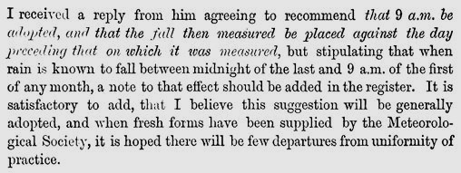
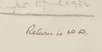
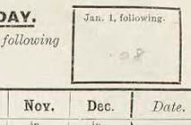
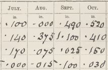

# Daily Rainfall forms and 'Wrong Day' reporting

This note looks at aspects of 'Wrong Day' reporting, where a rainfall observer did not follow the normal convention for choosing which day to assign daily rainfall measurements to in the 
Daily Rainfall form grid. 

The note is based on articles and instructions in [British Rainfall annuals](https://digital.nmla.metoffice.gov.uk/index.php?name=SO_29627928-7fb1-43b2-b7ad-f63509127917)
and examples from some of the ['DRain' volumes](https://digital.nmla.metoffice.gov.uk/index.php?name=SO_9903efdf-7f99-4cae-a723-8b3f426eea20) of Daily Rainfall forms in the Met Office Online Archive. 

## Contents

* [Overview](#overview)
* [Day definition summary](#day-definition-summary)
* [History](#history)
  * [Establishing the 'Rainfall day' conventions](#establishing-the-rainfall-day-conventions)
  * [Rule IX non-conformance I - the Symons era](#rule-ix-non-conformance-i-the-symons-era)
  * [Rule IX non-conformance II - Mill's Campaign](#rule-ix-non-conformance-ii-mills-campaign)
* ['Wrong Day' markings and corrections on Daily Rainfall forms](#wrong-day-markings-and-corrections-on-daily-rainfall-forms)

  * [Form header](#form-header)
  * ['Jan 1 following' box](#jan-1-following-box)
  * [Day 1 row separator](#day-1-row-separator)
  * [Day 1 relocation](#day-1-relocation)
  * [Day renumbering](#day-renumbering)
  * [Corrected totals and counts](#corrected-totals-and-counts)
* [Use of additional forms](#use-of-additional-forms)
* [Corrections over time](#corrections-over-time)
* [A candidate uncorrected 'Wrong Day' form example](#a-candidate-uncorrected-wrong-day-form-example)
* [A different 'Wrong Day'](#a-different-wrong-day)

## Overview

Soon after he started collecting and reporting rainfall records, George Symons consulted with his observers to try to standardise details of the 'Rainfall day'. This produced the recommendation 
that daily rainfall for the previous 24 hours should be measured each day at 9am GMT. As this resulted in a rainfall collection period spanning part of two calendar days, the convention was also 
established that the 24 hour rainfall amount should be assigned to the first of the two calendar days involved in the 12x31 grid of the Daily Rainfall form. 

The Daily Rainfall form and associated instruction pamphlets (and British Rainfall) included a rule to cover which day to assign rainfall to, for example:

Inevitably, not all observers followed this reporting day convention. Instead they systematically assigned readings to one day later, the day on which the measurements were made. This came to be known 
as '**Wrong Day**' reporting by the British Rainfall Organization.

The rainfall data for stations using 'Wrong Day' reporting was still valid, but the date needed to be adjusted before it could be used with data from other stations. Monthly and annual rainfall values 
for these 'Wrong Day' stations also had to be adjusted. 

This was an ongoing irritant to the British Rainfall Organization, leading to director Hugh Robert Mill eventually adding an explicit instruction 
at the top of the Daily Rainfall form from 1909. Completed 'Wrong Day' forms from this point onwards often show corrections applied to them in red ink by the British Rainfall Organization, 
for example (click to enlarge):

<table border="0">
<tr>
<td align=center>

</td>
<td align=center>

</td>
<td align=center>

</td>
</tr>
</table>

This note looks at a few aspects of 'Wrong Day', including:

* some history extracted from British Rainfall of the 'Rainfall Day' and the impact of 'Wrong Day'
* examples of how 'Wrong Day' forms were corrected by the British Rainfall Organization

## Day definition summary

A summary of how the normal calendar day, the standard 'Rainfall Day' and the rainfall 'Wrong Day' relate to each other:

* for rainfall purposes, the day runs for 24 hours from 9am to 9am.
* the standard 'Rainfall Day' is numbered after the calendar day on which the 24-hour period *starts*
* whereas with 'Wrong Day' reporting, the day is numbered after the calendar day on which the 24-hour period *ends*

### Examples

**Daily rainfall**, for rain falling between 9am on April 1st and 9am on April 2nd:

* for the standard Rainfall Day, this rainfall is recorded against April 1st
* but with 'Wrong Day' reporting 
  * this rainfall is recorded against April ***2nd***
  * the rainfall assigned to April 1st is the rain falling one day earlier, between 9am on March 31st and 9am on April 1st

**Monthly rainfall**, for April:

* the standard April rainfall month covers the period between 9am on April 1st and 9am on May 1st
* the 'Wrong Day' April rainfall month covers the period between 9am on March 31st and 9am on April 30th

**Annual rainfall**:

* the standard rainfall year covers the period between 9am on January 1st and 9am on January 1st of the following year
* the 'Wrong Day' rainfall year covers the period between 9am on December 31st of the previous year and 9am on December 31st

## History

### Establishing the 'Rainfall day' conventions

George Symons defined the rainfall day (and so the month and year too) in the mid-1860s, after consultation with his observers and the British [later Royal] Meteorological Society. Thie was
codified in rules VIII (time of reading) and IX (date of entry) in his list of 'Rules for Rainfall Observers'.

Detailed extracts

In British Rainfall 1864 (p12) Symons started a discussion about standardising the rainfall day, in terms of time of day of recording and the 'knotty point' of which date to record the rainfall against:

British Rainfall 1865 spent several pages on further discussions, under the heading '*Date of entry of rainfall, and close of rain month*'. This article described:
* discussions of the subject in the Proceedings of the British Meteorological Society
* the text of a circular sent to all Symon's observers in May 1865 to poll them about their current observing practices:

	

* the results of this polling exercise:
  * 82% took measurements at 9am
  * and 82% also assigned rainfall to the previous day rather than the day of measurement
* an agreement with James Glaisher, President of the British Meteorological Society) on the recommend approach:

	

British Rainfall 1866 (p4) noted that this question was now settled:

British Rainfall 1868 (p102) presented a list of 'Rules for Rainfall Observers' with Rule VIII (Time of reading) and Rule IX (Date of Entry) covering the rainfall day:

Early versions of the Daily Rainfall form (also from the late 1860s) included equivalent text in the 'Condensed Instructions' above the main 12x31 grid:

In 1879, the Daily Rainfall form changed to refer observers to a separate pamphlet of instructions, which included Rule VIII and Rule IX with the same wording as in British Rainfall 
1868 shown above.

### Rule IX non-conformance I - the Symons era

Inevitably, there were some rainfall observers who did not follow the rainfall day conventions, particularly Rule IX. Detecting these cases and adjusting these records made extra work for 
Symons and his staff, and this was commented on numerous times in *British Rainfall* editions in the decades after the rule was introduced.

Detailed extracts

British Rainfall 1868 p7:

In British Rainfall 1869 (p105), within the list of Rules immediately after Rule IX, Symons again brought up the issue, this time including 
comments from the Scottish Meteorological Society and the Council of the Meteorological Society to support his case:

[British Rainfall 1870 and 1871 repeated the above.]

British Rainfall 1874:p143:

British Rainfall 1875:p152:

British Rainfall 1883 (p9) discussed 'Neglect of Rules', but Rule IX was not mentioned.

British Rainfall 1885 p117:

British Rainfall 1888 p102:

British Rainfall 1889 p72 (repeated in BR 1890, p102):

British Rainfall 1890 (p10) contained 'illustrative offences' against the rainfall rules, Rule IX being one of those listed:

British Rainfall 1891 p8 had a similar message:

.. but later in the same edition, p119, had something more positive to say:

British Rainfall 1894 p8-9:

 

British Rainfall 1895 p117:

.. with p119 of that edition providing possibly the first occurrence of the term 'Wrong Day':
 

British Rainfall 1896 p97:

British Rainfall 1898 p196:

.. with p147 of that edition giving a table of Scottish daily rainfall for December with a footnote about Rule IX:

 &vellip; 

British Rainfall 1899 p122:

### Rule IX non-conformance II - Mill's Campaign

George Symons died in 1900, and H. Sowerby Wallis, briefly, and then Hugh Robert Mill took over the running of the British Rainfall Organization. They continued to report 
with growing exasperation on the 'Wrong Day' problem, until in 1909 Mill launched a campaign against 'Wrong Day', with an accompanying repurposing of the top part 
of the Daily Rainfall form.

 
 

Detailed extracts

British Rainfall 1900 p122-123:

 

British Rainfall 1901 p10:

.. and from the same edition, p107:

British Rainfall 1902 p10:

.. and from the same edition, p113:

.. and p115:

British Rainfall 1903 p132:

British Rainfall 1904 p12 had a list of explanations for discrepencies detected by the British Rainfall Organization. This included the
situation where a temporary observer may be a cause of 'Wrong Day' reporting (even where the main observer follows Rule IX) :

.. and from the same edition, p119:

British Rainfall 1905 p99:

British Rainfall 1906 p21 made an observation that snowfall could help identify some 'Wrong Day' stations:

British Rainfall 1907 p37:

.. and from the same edition, p39:

British Rainfall 1908 (p11-12) described the problems caused by 'Wrong Day' records relating to heavy rain on 31st August 1908 that was mis-attributed to 1st September. 
Because of this, Hugh Robert Mill decided to modify the Daily Rainfall form (Form 'A'):

 

A low-key change had already been introduced to the 1906 version of the Daily Rainfall form to remind observers of the 
rainfall day definition, but the changes to the 1909 version of the form were much more prominent.

1905 version of the Daily Rainfall form:

1906 version of the Daily Rainfall form, with brief reminder:

1909 version of the Daily Rainfall form, with very prominent 'Wrong Day' instructions:

Changes introduced in the 1909 form:
* 'Important Note' heading added in large capitals
* 'entered to the previous day' is underlined
* a long additional sentence requesting non-conforming observers to provide their January 1st reading of the following year
* a new box into which the January 1st reading was to be written by the observer

The new box, if used as directed, allowed 'Wrong Day' forms to be readily identified, and allowed corrected December and Annual totals to be calculated.

[The British Rainfall 1908 extract above also referred to Form C being modified as well as Form A. Form C allowed daily reporting for a particular month rather than
for a full year - here is an [example of form C1](page_images/DRain_1921-1930_RainNos_Denbighshire_p0156.jpg) from the 1920s, showing 'Wrong Day' instructions and a 
special triangular corner section to be used for the reading from the first of the following month.]

British Rainfall 1909 (p13-14) contains a two page article about Mill's campaign against 'Wrong Day', including these excerpts:

 &vellip; 

British Rainfall 1910 p15:

and from the same edition, p17:

From this point, mention of 'Wrong Day' in British Rainfall stop. The top of the Daily Rainfall form retained the essentials of its 'Wrong Day' additions for the
rest of the DRain period. For example the '6/58' version from 1958 had this:

When instructions were added to the back of the Daily Rainfall form in the 1920s, one of them related to the rainfall day, for example from the "13000 9-26" version from 1926:

## 'Wrong Day' markings and corrections on Daily Rainfall forms

This section discusses the extra markings applied by British Rainfall Organization staff to Daily Rainfall forms which they found 
had used 'Wrong Day' reporting. The added markings are handwritten, mostly in red, and were applied soon after the rainfall form had been received. 

The markings were used to convert/correct the 'Wrong Day' figures into monthly and annual rainfall totals that were based on the standard rainfall day. The 
corrected monthly figures could then be compared and combined with rainfall figures from other stations in the normal way; they could also be recorded 
in the ten-year rainfall sheets which the British Rainfall Organization maintained for each station, and reported in British Rainfall.

Most of the examples presented below were found by browsing through the 'DRain' volumes for rainfall stations in Cumberland, looking for added red markings and seeing which related to
'Wrong Day' issues. 

The table below summarises the types of markings applied, with detailed sections below providing examples.

|Element|Contents|
|:-----------|:-------------------|
|**Form&nbsp;header**|A brief note or just 'W.D.' to highlight that the form uses 'Wrong Day' reporting|
|**'Jan&nbsp;1&nbsp;following'&nbsp;box**|Holds the reading needed to correct the December and annual rainfall totals|
|**Day&nbsp;1&nbsp;row separator**|A horizontal line to separate the original Day 1 readings from the rest of the grid|
|**Day&nbsp;1&nbsp;relocation**|The Day 1 and 'Jan 1 following' readings copied to the bottom of the main grid but shifted to the previous month, to become Day 31 values|
|**Day&nbsp;renumbering**|Original day number row labels renumbered to be one day earlier|
|**Totals&nbsp;and&nbsp;counts**|Recalculated monthly and annual summaries, with the originals crossed out|

One of the Daily Rainfall forms used in the examples below, from Drumochter Lodge, Inverness for 1929, is very useful as it provides a very clearly presented and complete set of corrections using a bright
red colour. However, most corrected forms are messier than this, and don't normally have the complete set of corrections. The correction markings are harder to read, and 
the 'Day renumbering' markings are usually omitted, as the focus is on correcting the monthly and annual figures.

<table border="0">
<tr>
<td align=center>

</td>
<td align=center>

</td>
<td align=center>

</td>
</tr>
</table>

### Form header

Daily Rainfall forms corrected for 'Wrong Day' usually have some handwritten text added to the form header area, sometimes in red, to identify the form as being 'Wrong Day' and/or to record why
and when it had been corrected. For example:

* 'W.D.'
* 'corr[ected] for WD'
* 'corrected for wrong day'
* 'return is WD'

If the marking is in red, there is sometimes a date written next to it, indicating when the corrections were applied (the date the form was received by the British Rainfall Organization 
may be stamped in the top-right corner of the form).

<table border="0">
<tr>
<td>
  
</td>
<td>
  
</td>
<td>
  
</td>
</tr>
<tr>
<td>
	
</td>
<td>
	
</td>
<td>
	
</td>
</tr>
<tr>
<td>
	
</td>
<td>
	
</td>
<td>
	
</td>
</tr>
</table>

### 'Jan 1 following' box

Observers who deliberately chose to use 'Wrong Day' reporting were expected to fill in the 'Jan. 1 following' box in the Daily Rainfall form header,
supplying their reading for the first day of the following year. Under the standard rainfall day definition, this was actually the December 31st reading, and was needed 
to allow corrected December and annual totals and counts to be calculated.

The box was usually filled in with a rainfall amount, or a no-rainfall indicator (e.g. '-' or 'nil'), similar to a normal cell in the main table. Sometimes observers failed to fill in 
this box, in which case the British Rainfall Organization had to [contact the observer](page_images/DRain_1911-1920_RainNos_Nottinghamshire_p0329.jpg) to obtain the 
value (or wait a year for the next year's form to arrive) and write it in themselves. (And some observers who used the standard rainfall day filled in the box unnecessarily.)

<table border="0">
<tr>
<td>
  
</td>
<td>
  
</td>
<td>
  
</td>
</tr>
<tr>
<td>
  
</td>
<td>
  
</td>
<td>
  
</td>
</tr>
</table>

### Day 1 row separator

For 'Wrong Day' daily rainfall forms, handling the readings in the Day 1 row of the main grid is  key to correcting the monthly totals. In terms of the standard rainfall day, the Day 1 readings
actually belong to the 31st of the previous month, and so are in the wrong month column. The readings for all the other days, 2-31, also have the wrong day number, but relate to
the correct standard rainfall month and so are already in the right column.

As shown in the next sub-section, the Day 1 figures on corrected Daily Rainfall forms were copied to the correct month at the bottom of the main grid, superseding the entries in the Day 1 row. 
A red line was drawn under/through the Day 1 row to separate it off from the rest of the grid, although the line was not always very obvious.

Examples:

 
 

 
 

In some cases, the 'Wrong Day' scenario only applied for part of a year, and the red line separator only covered the relevant month columns:

 
 

### Day 1 relocation

As described in the previous sub-section, the readings in the Day 1 row of a 'Wrong Day' Daily Rainfall form actually belonged to the last day of the previous month. To reflect this, on corrected forms 
the Day 1 figures were copied in red to a new row inserted between the Day 31 row and the Totals row, with each figure shifted to the previous month's column. The reading in the 'Jan. 1 following' box 
wss copied to this new row under the December column. 

The arrow graphics added to the example form image below (click to enlarge) illustrate the Day 1 relocations that were applied:

If the Day 1 value to be copied indicated zero rainfall, in some cases it was copied down to the new row, but in other cases its position in the new row was just left blank. The relocated figures were
often in smaller writing than the figures in the main grid.

Examples, showing both the original Day 1 row and its relocated values:

 
&middot;&middot;&middot;&middot;&middot;&middot;&middot;&middot;&middot;&middot;&middot;&middot;&middot;
 

-----------------

 
&middot;&middot;&middot;&middot;&middot;&middot;&middot;&middot;&middot;&middot;&middot;&middot;&middot;
 

-----------------

 
&middot;&middot;&middot;&middot;&middot;&middot;&middot;&middot;&middot;&middot;&middot;&middot;&middot;
 

### Day renumbering

Some Daily Rainfall forms corrected for 'Wrong Day' show renumbered Day numbers in the Date column, set to one day earlier, in order to apply standard Rainfall
day numbering to the grid. This was not done in any of the Cumberland examples though - it was not an essential step if the purpose of the exercise was correcting the monthly totals.

### Corrected totals and counts

All the corrected 'Wrong Day' Daily Rainfall forms have corrected monthly totals written in red in the bottom part of the form - corrected annual totals too if the form covered a full year. Some different 
approaches to presenting the corrections included:

* crossing out the entire row of 'Wrong Day' totals, with corrected totals written out for every month as a separate row at the bottom of the page [probably the clearest way]
* crossing out each 'Wrong Day' total individually, with the corrected value written next to the crossed out original
* where a 'Wrong Day' total for a month had the same value as the standard rainfall month total (typically because there was no rainfall on the 'Wrong Day' first of the month and also none on the 
first of the following month), the original total was often left in place uncorrected.

This unavoidably produced a confusing and messy appearance, especially considering the relocated Day 1 figures were also inserted just above the Totals row and the monthly counts were often also
corrected too.

Examples:

 
 

 
 

## Use of additional forms

The Daily Rainfall forms from Geltsdale in Cumberland illustrate an additional means of correcting 'Wrong Day' rainfall forms - fill out a blank form with 
using the values from the original form, but assigning them to the standard rainfall day.

The original Geltsdale Daily Rainfall forms were corrected as normal shortly after they were received, for example the 1919 form:

But several decades later, separate Daily Rainfall forms were filled in, with all the daily values shifted to one day earlier, and totals recalculated, producing a parallel set of forms 
which used the standard rainfall day. The retranscribed 1919 form shows:

As a result, the DRain archive contains two sets of Daily Rainfall forms for Geltsdale based on a single set of readings.

## Corrections over time

Scanning through the 'DRain' Daily Rainfall forms for Cumberland gave the following very rough impression of the amount of 'Wrong Day' correction that had being performed by the 
British Rainfall Organization over the 'DRain' period for this example county:

* for forms before about 1910, no corrections are present
  * comments in British Rainfall from the late 1860s onwards confirm that 'Wrong Day' reporting was known about. It seems that during this 
  period, the British Rainfall Organization were not routinely applying corrections to the original Daily Rainfall forms when they encountered a 'Wrong Day' case.
  * in British Rainfall 1910 Hugh Robert Mill expressed the hope that it would eventually be possible to correct 'Wrong Day' forms from earlier decades. The 
  Cumberland volumes give no sign that this happened.
* around 1910, corrections start to appear
  * this was the period when Hugh Robert Mill introduced his campaign against 'Wrong Day', and made related modifications to the top of the Daily Rainfall form
* for 1910 - 1940s, around 4-8 stations were being corrected each decade
  * sometimes corrections to a station were only applied for one specific year
  * but Geltsdale was corrected for the whole period
* for the 1950s, there are almost no corrections
  * it is unclear whether this is because 'Wrong Day' cases no longered existed or because the British Rainfall Organization stopped applying corrections to the forms

## A candidate uncorrected 'Wrong Day' form example

It's not too hard to find candidates for uncorrected 'Wrong Day' Daily Rainfall forms from the pre-1910 era:

* find a Daily Rainfall form which has been corrected in the early 1910s
* look at Daily Rainfall forms for the same station for a few years earlier (assuming it existed then)
* identify a few days of the year with distinctive rainfall amounts
* see whether the other nearby stations have similar distinctive rainfall amounts, but recorded a day earlier

The Geltsdale station in Cumberland (about 10 miles east of Carlisle), active from 1898, provides an example. 'Wrong Day' corrections have been applied by the 
British Rainfall Organization to the station's Daily Rainfall forms from 1910 onwards.

The 1903 Geltsdale form shows over an inch of rain assigned to September 3rd, with very little rain the day before or after. Most other Cumberland Daily Rainfall forms for 1903 show a 
similar large fall, but assigned to the day before, September 2nd. For example, Newby Grange about 7 miles to the north-west of Geltsdale and Nunwick Hall, about 11 miles to the south. (Geltsdale
is quite a remote site, and so has no near neighbouring stations.)

<table border="0">
<tr>
<td align=center>

 Geltsdale 1903
</td>
<td align=center>

 Newby Grange 1903
</td>
<td align=center>

 Nunwick Hall 1903
</td>
</tr>
</table>

But making a confident assignment of the Geltsdale 1903 Daily Rainfall form as being 'Wrong Day' would need more work.

[Note also that the monthly totals on the Geltsdale 1903 Daily Rainfall form are used in the [Geltsdale 10-year rainfall sheets](https://github.com/ed-hawkins/rainfall-rescue/blob/master/DATA/GELTSDALE/GELTSDALE.pdf), so
if the Geltsdale 1903 form is at some point confirmed as being 'Wrong Day' and corrected, the relevant 10-year rainfall sheet and data transcribed from it would also potentially need updating.]

 

## A different 'Wrong Day'

For the normal 'Wrong Day' case (the subject of all the other sections of this note), the cause is that the observer has systematically assigned the daily rainfall reading to the day following the 
one expected. 

The Daily Rainfall forms for Cumberland that were examined while producing this note also contained a very small number of cases where the British Rainfall Organization identified that rainfall had been 
systematically assigned to the day *before* the one expected.

In this scenario, rainfall which fell for example between 9am on April 1st and 9am on April 2nd was assigned to March 31st, rather than to April 1st (the standard rainfall day) 
or April 2nd (the normal 'Wrong Day').

An example, from Stainburn Reservoir 1946:

In this case, the corrections applied in red to the Daily Rainfall form had to be done in a slightly different way to the normal 'Wrong Day' case:

* the message used in the header area had an indication of this not being the normal 'Wrong Day':

  

* the readings from the last day of each month were relocated to the top of the 12x31 grid above Day 1, and assigned to the following month:

  

* a winding red line was applied at the bottom of the grid to separate off the readings for the last day of the month:

  

* the corrected monthly totals and counts were marked as usual:

  

