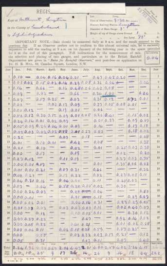

# 'Wrong Day' overflow material

Sections taken out of the main ['Wrong Day' notes](Wrong_day.md) for brevity.

### Converting 'Wrong Day' rainfall for a period to standard periods

Where a Daily Rainfall form has been systematically filled in with daily rainfall values using 'Wrong Day' reporting, the wrong-day (WD) figures can be converted to 
standard daily, monthly and annual values as follows:

* for **daily rainfall**, the 'calculation' is just:

  *Assign the 'Wrong Day' daily figure to the preceding day*
  
  For example:
  
  * WD April 2nd rainfall is assigned to April 1st
  * WD January 1st rainfall is assigned to December 31st of the preceding year

* for **monthly rainfall**, standard monthly rainfall is calculated from:

  *[WD monthly rainfall] &minus; [rainfall for WD 1st of the month] + [rainfall for WD 1st of the following month]*

  

  The correction factor to be applied to the 'Wrong Day' monthly rainfall is the difference between the 'Wrong Day' rainfall figures for the first of the 
  month and the first of the following month. This difference can be zero, most commonly when both those days have no rainfall.

  Examples:
   
  * standard April rainfall = WD April rainfall &minus; WD April 1st rainfall + WD May 1st rainfall
  * standard December rainfall = WD December rainfall &minus; WD December 1st rainfall + WD January 1st next year rainfall

* for **annual rainfall**, standard annual rainfall is calculated in a similar way:

  *[WD annual rainfall] &minus; [rainfall for WD January 1st] + [rainfall for WD January 1st of the following year]*

### January 1st of the following year on the Daily Rainfall form

The 'Wrong Day' rainfall for January 1st of the following year is needed for converting December and annual rainfall from 'Wrong Day' to standard reporting, but the
January 1st figure belongs to next year's Daily Rainfall form. Because of this, from 1909 the 'Jan. 1 following' box was added to the top of the Daily Rainfall form,
allowing the conversions to be made promptly when the form was received.

The British Rainfall Organization also had a [prepared letter](page_images/DRain_1911-1920_RainNos_Nottinghamshire_p0329.jpg) to send to observers asking for the January 1st reading where necessary.

### Corrected totals calculation

The corrected totals for a month could be calculated in two ways from the values present on the original form and the relocated Day 1 figures:

* method (A) : from individual daily rainfall figures in the column for the month:

  Add up all the individual daily rainfall figures in the column for the month, ignoring the original Day 1 row but including the relocated Day 1 value copied into the bottom of the column

or equivalently:

* method (B) : from the original 'Wrong Day' total for the month and the relocated Day 1 values copied into the bottom of the month's column and into the bottom of the preceding month:

  * start with the original 'Wrong Day' total for the month. 
  * subtract the Day 1 value copied into the bottom of the preceding month
  * add in the the Day 1 value copied into the bottom of the target month

The three images below (click on them to enlarge) show how these calculations work for on an example form and its August monthly rainfall. The 'Wrong Day' August monthly 
total entered on the form is 4.80 inches, with the corrected value of 4.75 shown in red at the bottom of the page. 

* the image for method (A) highlights in the green rectangle the 31 values to be added together, including the '.42' copied down from September 1st, producing the corrected value of 4.75
* the image for method (B) highlights the figures used for the correction calculation as described above: 4.80 - 0.47 + 0.42 = 4.75.

<table border="0">
<tr>
<td align=center>
  
   Full form
</td>
<td align=center>
  
   Method (A)
</td>
<td align=center>
  
   Method (B)
</td>
</tr>
</table>

